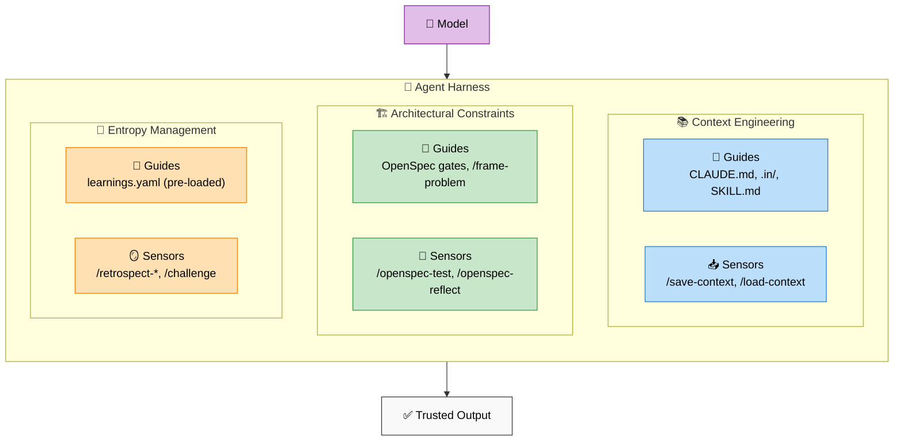
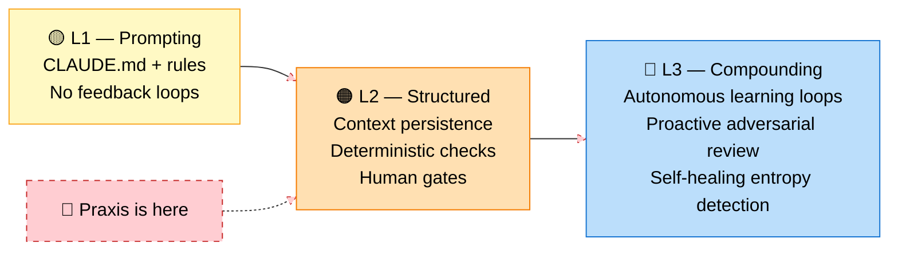
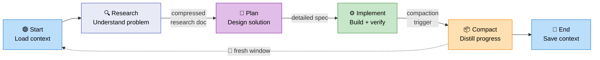

# 🔧 Harness Engineering — How Praxis Steers AI Agents

> **Harness** = everything in an AI agent except the model itself. **Harness engineering** = the practice of building and maintaining that harness so the agent produces reliable, trustworthy output.

📖 **Reading order**: [README](README.md) (what?) → [PHILOSOPHY](PHILOSOPHY.md) (why?) → [PRACTICE](PRACTICE.md) (deep how) → **this file** (the harness) → [README-full](README-full.md) (every skill)

---

## 🧭 The Model

Birgitta Böckeler ([Fowler, April 2026](https://martinfowler.com/articles/exploring-gen-ai/harness-engineering.html)) frames agent harness as two control types across three layers:

- **Guides** (feedforward) — steer the agent *before* it acts, increasing probability of good first attempts
- **Sensors** (feedback) — observe *after* the agent acts, enabling self-correction

Both can be **computational** (deterministic: linters, tests, type checkers) or **inferential** (semantic: LLM-as-judge, code review agents).

---

## 🗺️ Praxis Mapping

How each Praxis skill maps to the harness model:

| Layer | Guides (feedforward) | Sensors (feedback) |
|---|---|---|
| **📚 Context engineering** | CLAUDE.md (project rules), `.in/` (bootstrap context), SKILL.md (per-skill directives), `/frame-problem` (Cynefin routing) | `/save-context` → `/load-context` (session persistence), `summarize-for-context` agent (compaction) |
| **🏗️ Architectural constraints** | OpenSpec gates (human checkpoints), `/openspec-plan` (upfront test strategy), `/pick-model` (model selection) | `/openspec-test` (verification), `/openspec-reflect` (drift detection), `/openspec-replan` (adaptive pivot) |
| **🔄 Entropy management** | `learnings.yaml` (loaded at troubleshoot start), bridge captures (`thinking/bridges/`) | `/retrospect-*` (pattern extraction), `/challenge` + `devil-advocate` (adversarial review), `/troubleshoot` (learning loop) |

**Key insight**: Most frameworks only do context engineering (L1). Praxis covers all three layers, with the entropy management layer creating **compounding returns** — each session improves the next.

---

## 📐 Maturity Levels

A simple model for assessing harness engineering maturity:

| Level | What | Examples | Praxis |
|---|---|---|---|
| 🟡 **L1 — Prompting** | Static instructions, no feedback | CLAUDE.md, system prompts, rules files | ✅ Done |
| 🟠 **L2 — Structured** | Persistent context + deterministic checks + human gates | Session save/load, linters, test suites, gated workflows | ✅ **Here** |
| 🔵 **L3 — Compounding** | **Autonomous** learning loops where each session improves the next | Auto-updating learnings DB, proactive adversarial triggers, self-healing entropy detection | ⚠️ Building blocks exist, loops are human-triggered |

**Most frameworks stop at L1.** The jump to L2 is engineering work. The jump to L3 requires **autonomous feedback loops** — learning artifacts that feed back into future sessions without human intervention, adversarial review that triggers automatically, and entropy detection that self-heals.

**Praxis honest assessment: solid L2, aspiring L3.** The building blocks exist (learnings.yaml, retrospectives, devil-advocate) but feedback loops are still **human-triggered, not autonomous**. `/troubleshoot` loads learnings but doesn't auto-update them. `/retrospect-*` extracts patterns but requires manual invocation. The compounding is real but manual — closer to "disciplined L2" than true L3.

This maps to the [Cognitive ROI tiers](PRACTICE.md#-cognitive-roi-return-on-tokens): L1 ≈ Automation, L2 ≈ Assisted Thinking, L3 ≈ Amplified Judgment.

---

## 🧬 Session Lifecycle

The session lifecycle is the concrete implementation of the harness — how guides and sensors activate across a working session.

### High-level (stable)

**Core principle: Frequent Intentional Compaction** — pause before context saturation, distill progress into structured artifacts (CONTEXT-llm.md, research docs, specs), restart fresh with compressed knowledge. Target 40-60% context utilization.

### Skill mapping (permanent WIP)

How each phase maps to concrete skills — evolves as new tools are added.

```mermaid
flowchart LR
    subgraph START["🟢 Start"]
        load["📥 /load-context"]
        claude["📄 CLAUDE.md"]
        hooks_start["🪝 Hooks"]
    end

    subgraph SENSE["🔍 Sense-Make"]
        frame["🧭 /frame-problem"]
        search["🔍 /search-skill"]
        frame --> brainstorm["🧠 /brainstorm"]
        frame --> investigate["🔬 /investigate"]
    end

    subgraph BUILD["⚙️ Plan + Build"]
        plan["📋 /openspec-plan"]
        risen["✍️ /edit-risen-prompt"]
        plan --> design["🏗️ /openspec-design"]
        design --> review["🔍 /openspec-review"]
        review --> dev["⚙️ /openspec-develop"]
        dev --> test["🧪 /openspec-test"]
        dev --> reflect["🪞 /openspec-reflect"]
        reflect -->|"blocked"| replan["🔀 /openspec-replan"]
        replan --> dev
    end

    subgraph PERSIST["📦 Persist"]
        sync["💾 /openspec-sync"]
        save["💾 /save-context"]
        retro["🪞 /retrospect-*"]
        hooks_stop["🪝 Hooks"]
    end

    START --> SENSE
    brainstorm --> plan
    investigate --> plan
    BUILD --> PERSIST
    PERSIST -->|"🔄 next session"| NEXT["🟢 /load-context"]

    classDef start fill:#BBDEFB,stroke:#1976D2,color:#000
    classDef sense fill:#E8EAF6,stroke:#3F51B5,color:#000
    classDef build fill:#C8E6C9,stroke:#388E3C,color:#000
    classDef persist fill:#FFE0B2,stroke:#F57C00,color:#000
    classDef loop fill:#E8F5E9,stroke:#2E7D32,color:#000,stroke-dasharray:5

    class START start
    class SENSE sense
    class BUILD build
    class PERSIST persist
    class NEXT loop
```

---

## 📚 References

| Source | What | Link |
|---|---|---|
| **Birgitta Böckeler** (Fowler) | Harness engineering for coding agent users — guides/sensors model | [martinfowler.com](https://martinfowler.com/articles/exploring-gen-ai/harness-engineering.html) (Apr 2026) |
| **Birgitta Böckeler** (Fowler) | Harness engineering — first thoughts (memo) | [martinfowler.com](https://martinfowler.com/articles/exploring-gen-ai/harness-engineering-memo.html) (Feb 2026) |
| **Dex Horthy** (HumanLayer) | 7 harness engineering principles for coding agents | [humanlayer.dev](https://www.humanlayer.dev/blog/skill-issue-harness-engineering-for-coding-agents) (2025) |
| **Dex Horthy** (HumanLayer) | Advanced context engineering for agents | [YouTube](https://www.youtube.com/watch?v=VvkhYWFWaKI) · [paper](https://github.com/humanlayer/advanced-context-engineering-for-coding-agents) |
| **Mehdi Mehlah** (Lyon.rb) | Context Engineering FTW — visual walkthrough | [Excalidraw](https://link.excalidraw.com/p/readonly/cz2KRei6ueIPyvbXaThj) |

**Praxis benchmark**: [Harness Engineering Benchmark](benchmarks/2026-04-08-harness-engineering.md) — Praxis vs Fowler model + maturity assessment.

---

🧭 [Philosophy](PHILOSOPHY.md) · 🎯 [Practice](PRACTICE.md) · 📚 [Full Catalog](README-full.md) · 📊 [Benchmarks](benchmarks/)
