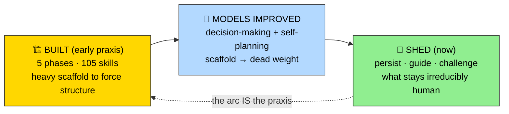
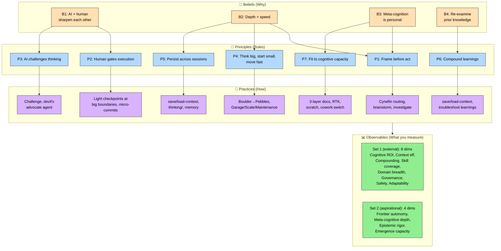
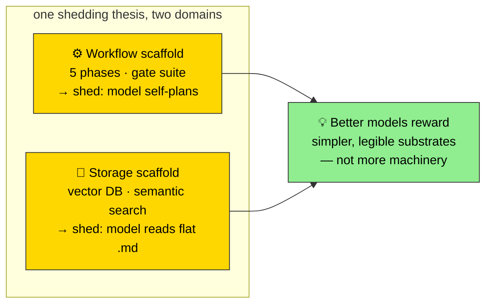

# 🧭 Digital Stoic Praxis — Philosophy & Principles

> Human+AI collaboration as metacognitive practice.

📖 **Reading order**: [README](README.md) (what + how?) → **this file** (why?) → [PRACTICE](PRACTICE.md) (deep how) → [README-full](README-full.md) (every skill)

---

## 🎯 Core Beliefs

Working with AI is a **cognitive discipline**, not a productivity hack. Four beliefs anchor the practice:

1. 🤝 **AI and human sharpen each other** — mutual augmentation, bidirectional. AI doesn't replace thinking, and it isn't a one-way amplifier either. The human directs; the AI pushes back.
2. 🧠 **Cognitive depth and breadth > automation speed** — quality of thinking beats velocity of execution. Tokens spent on deeper reasoning outperform tokens spent on faster rote work.
3. 🪥 **Meta-cognition is personal discipline** — built through habits shaped to your cognitive fingerprint. Not a shared methodology. See [toothbrush principle](#-the-toothbrush-principle).
4. 🔄 **Prior knowledge must be re-examined, not preserved** — adapt to new context rather than fossilize past decisions. Retrospect, challenge, decay.

It's not about making AI do more. It's about **thinking better together**.

---

## 🍂 What months of praxis taught us to drop

The honest story of this toolkit isn't a feature list — it's a subtraction.

A year ago, getting structured, drift-free, well-sequenced work out of an AI took
heavy scaffolding: a 5-phase workflow, 105 skills, a 9-skill gate system to force
structure and stop the model running off. Then **the models got dramatically
better at decision-making and self-planning.** Most of that scaffold was
compensating for limits that no longer exist — so months of real practice wore it
down to its handle. What survived isn't a smaller version of the same thing. It's
what stays **irreducibly human** once the model can plan for itself: **persisting
intent, guiding at the right moments, and challenging the model when it's too
confident.**

This is the [toothbrush principle](#-the-toothbrush-principle) turned on its owner:
even *my* toolkit wasn't precious. Practice — and a better model — told me which
parts were real. The **beliefs** below are window-independent and unchanged. The
**principles** survive as stances. What changed is the *scaffolding around them* —
and that's the part worth being honest about, not hiding.

> The 5-phase model (Frame → Think → Build → Debug → Learn) is no longer a
> lifecycle you march through — it's a set of moves you reach for. A model that
> self-plans doesn't need the phases enforced. The structured-build layer
> (formerly a 9-skill gate suite) is openly **under revamp**: the gate *instinct*
> survives as light human checkpoints at the big boundaries, not section-by-section
> ceremony.

---

## 🏛️ Taxonomy: Beliefs → Principles → Practices → Observables

Four layers connect conviction to measurement. Beliefs justify principles; principles drive practices; practices produce observable properties you can benchmark.

For scoring rubrics on the 8 + 4 observables, see [PRACTICE.md](PRACTICE.md#-benchmarking-dimensions).

---

## 📐 Principles

Each principle is tagged with the belief(s) it derives from.

### 🧭 P1. Frame before act

*(from B3 + B2)* — Don't jump into the first approach that comes to mind. Classify the problem first. Is it clear? Complicated? Complex? Chaotic? The answer determines everything — which tools to use, how much planning is needed, whether to think divergently or converge fast.

`/frame-problem` uses the Cynefin framework to classify constraint type and route you to the right skill chain. Domain classification doesn't just select a skill — it determines the agent pattern: whether to probe safe-to-fail experiments (Complex), apply expertise (Complicated), execute a known process (Clear), or act and sense (Chaotic). The response verbs — `probe`, `analyze`, `execute`, `act`, `decompose` — are agent verbs, not just labels. They encode *how* the agent behaves, not just *what* it does.

### 🧠 P1 (cont.) Think before build

*(from B3 + B2)* — Research exists. Patterns exist. Don't reinvent. Before writing code: brainstorm options, investigate constraints, design alternatives. Cheap thinking prevents expensive building.

`/brainstorm` and `/investigate` encode structured thinking methods — SCAMPER, Issue Trees, Morphological Analysis, Pre-mortem — so you don't skip them under time pressure.

### 🚧 P2 + P3. Human controls execution, AI challenges thinking

*(both derived from B1 — AI and human sharpen each other)* — For *execution*, the human controls the pace. The **gate pattern** ensures this: AI implements a section, stops, human reviews, marks pass, AI continues. No runaway AI building the wrong thing for 20 minutes. Gates also enable crash recovery — checkboxes persist, so you can resume where you left off.

For *thinking*, the relationship is **bidirectional**. The human sets intent and direction — but the AI pushes back on assumptions, surfaces blind spots, and reveals patterns the human can't self-observe. `/challenge` and the devil's advocate agent exist specifically so AI can correct-check the human. Controlling execution while inviting challenge on thinking — that's the balance.

### 📌 P2 (cont.) Micro-commits at every gate

*(from B1)* — Gates and git commits are natural partners. Every time AI completes a section and the human verifies — **commit**. This gives you:

- 🔄 **Rollback granularity** — undo one section without losing others
- 📖 **Readable history** — each commit = one verified unit of work, not a blob of "implemented feature X"
- 🚧 **Gate evidence** — the commit log becomes a record of what was verified and when
- 💾 **Crash safety** — if the session dies, your last verified state is always in git

The pattern: `AI builds section → human reviews at gate → git commit → next section`. Conventional commits (`feat`, `fix`, `refactor`) with scope give you a clean narrative. The commit history tells the story of the build, not just the end result.

### 🪨 P4. Think big, start small, move fast — Boulder → Pebbles

*(from B2 — depth over speed, but iterate fast once framed)* — Not every task needs a plan. Scale your process to the problem:

| Scale | Approach | Example |
|-------|----------|---------|
| 🪨 **Boulder** | Let the model plan, then gate at a few big boundaries (not every section) | New auth system, database migration |
| 🪶 **Pebble** | Just let the model do it | Fix a typo, add a log line |

This isn't a binary — it's **iterative zoom**. Like Epics → User Stories in agile roadmapping: boulders break into pebbles over time. You start at the boulder level to see the whole landscape, then zoom into pebbles for execution. And you can zoom back out when you need to reassess direction.

`/frame-problem` helps you gauge the scale. For a boulder, you don't enforce a
section-by-section workflow anymore — the model sequences the work and you place
human checkpoints where the cost of being wrong is highest.

### 💾 P5. Persist across sessions

*(from B2 — protect cognitive investment)* — Multi-day work needs continuity. `/save-context` serializes your session to a token-optimized markdown file. `/load-context` resumes it. No re-explaining what you were doing yesterday. Long-term knowledge lives in `thinking/` (investigations, bridges, benchmarks); cross-conversation user/project state lives in `MEMORY.md`.

### 🪞 P6. Compound learnings

*(from B4 — re-examine, don't fossilize)* — Every session generates signal. The
practiced compounding is **human-in-the-loop, not autonomous**: `/save-context`
and `/load-context` carry intent forward, and `/troubleshoot` saves debugging
patterns to a learnings file that gets checked first next time. Session events are
auto-captured (the `retrospect-capture` hook), but the *consume* loop that would
feed them back automatically is still under review — so the honest version is
**capture live, consume by hand**, not a self-closing learnings DB.

The goal: **compound learning across sessions**, not just within them — kept by a
human who decides what's worth carrying, not a background process that claims to.

### 🎚️ P7. Fit to cognitive capacity

*(from B3 — meta-cognition is personal, attention is finite)* — Attention fluctuates. Design for context-switching, interruption, fatigue, and variable depth. Right content, right effort, right moment.

- 📄 **3-layer documentation** (scan → deep → LLM) — match reader energy to content density
- 🔇 **RTK token proxying** — filter noise from dev operations so the signal fits in budget
- 🗒️ **`/scratch`** — park side-thoughts to free working memory without losing them
- 🔀 **`/cowork:switch`** — structured project context-switching, not ad-hoc tab-flipping

---

## 🏗️ Garage vs Scale

Three execution modes for different contexts:

| Mode | When | Philosophy |
|------|------|-----------|
| 🏗️ **Garage** | MVP, prototype, exploration | Working > perfect. Smoke tests sufficient. Ship small, iterate fast. |
| 📏 **Scale** | Production, team code, high stakes | Full verification at gates. test.md required. Document decisions. |
| 🔧 **Maintenance** | Existing system, careful changes | Conservative refactoring. Don't break what works. |

Garage is the default. Not waterfall, not chaos. **Structure without ceremony** — a workbench, not AutoCAD.

---

## 📖 Documentation Philosophy

GenAI makes it too easy to generate walls of text → **cognitive overload** for humans.

This toolkit uses three layers of documentation, each optimized for its reader:

| Layer | Reader | Optimization | Example |
|-------|--------|-------------|---------|
| 📄 `README.md` | Human (1 min scan) | Cognitive ease — scan, orient, decide if you care | [README.md](README.md) |
| 📚 `README-full.md` | Human (deep dive) | Comprehensive — find any skill, understand any workflow | [README-full.md](README-full.md) |
| 🤖 `SKILL.md` | LLM | Token-optimized — minimal prose, maximum directive density | Internal to each skill |

**Rule:** Respect the reader's attention. Don't make them scroll through 500 lines to find the one thing they need.

### 🧠 …and a legible substrate, not just legible docs (emerging)

The same logic is starting to extend past the docs to the **knowledge layer
underneath** them. The bet — still being worked out, framed honestly as a
*second brain in progress* — is that a single repo of plain `.md` (notes,
project state, thinking artifacts), hand-curated with deliberately **no
vector/semantic-DB machinery**, beats an indexed store. You can read it, diff it,
grep it, and restructure it by hand, and it never rots behind an index.

It's the same shedding thesis applied to memory. The workflow scaffold shed
because the model can self-plan; the **storage scaffold** sheds because models got
good enough to **navigate flat files directly** — you don't index what the model
can just read. The emerging lesson: **better models reward simpler, more legible
substrates — not more machinery.**

*Status: a live experiment, not a settled principle — surfaced here because it's
the same lesson the rest of this page is about.*

---

## 🪥 The Toothbrush Principle

> **CLAUDE.md and skills are like toothbrushes — personal, not shared.**

This applies at two levels:

**CLAUDE.md** reflects YOUR cognitive fingerprint:
- 🧠 **Cognitive patterns** — how you think through problems
- 💬 **Communication preferences** — emojis? structured data? diagrams?
- 📐 **Project conventions** — commit style, file organization, naming
- ⚠️ **Error handling style** — cautious? move-fast-and-fix?

**Skills** encode YOUR thinking workflows. The skills in this repo reflect how *I* brainstorm, investigate, troubleshoot, and build. They use frameworks that match *my* brain (Cynefin, MECE, SCAMPER, OODA). Your brain might work differently — and that's the point. Fork them, swap the frameworks, change the flow, make them yours.

Copying someone else's CLAUDE.md or skills is like using their toothbrush. See [CLAUDE.md.example](CLAUDE.md.example) for structure and inspiration, then **build your own**.

---

## 🤝 Contributing

This is a personal toolkit shared openly. It may not fit your brain — and that's fine.

1. 🍴 Fork
2. 🌿 Branch
3. 🚀 PR

Issues & ideas: [github.com/digital-stoic-org/agent-skills/issues](https://github.com/digital-stoic-org/agent-skills/issues)

---

📄 **TL;DR:** [README.md](README.md) · 📚 **Full catalog:** [README-full.md](README-full.md) · 🎯 **Practice:** [PRACTICE.md](PRACTICE.md) · 📊 **Benchmarks:** [benchmarks/](benchmarks/)
