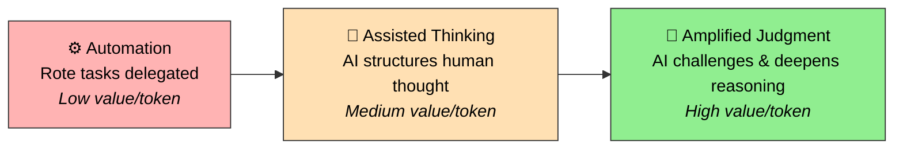
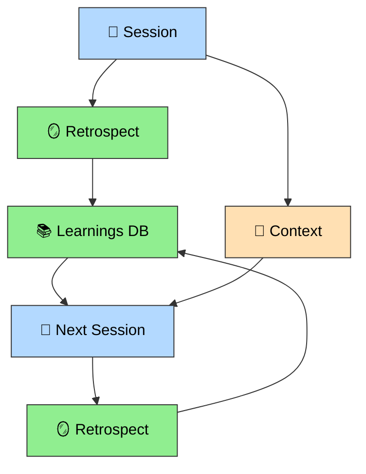
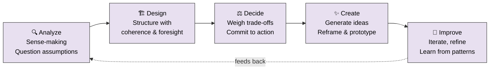

# Digital Stoic Praxis — Practice

> **Praxis** (πρᾶξις): Greek for "practice" — the act of engaging, applying, and realizing ideas. Not theory. Not methodology. A living discipline where knowledge is enacted through doing.

## 📖 How to Read This Documentation

Each document has a distinct job. Read in order, stop when you have what you need:

| # | Document | Job | Time |
|---|----------|-----|------|
| 1 | [README.md](README.md) | **"What + How (TL;DR)"** — GitHub landing page, overview, quick model | 2 min |
| 2 | [PHILOSOPHY.md](PHILOSOPHY.md) | **"Why these choices?"** — Beliefs, 7 principles, execution modes, toothbrush principle | 5 min |
| 3 | **This file** | **"Deep How"** — Cognitive ROI, autonomy model, benchmarking | 10 min |
| 4 | [README-full.md](README-full.md) | **"What's in the toolkit?"** — Every skill, every detail | Reference |

🤖 For LLM consumption (benchmarking, comparison): [PRACTICE-llm.md](PRACTICE-llm.md) — self-contained, token-optimized.

**This file is about the HOW** — how the human-AI collaboration actually works, how to measure its value, and how to benchmark it against other approaches. For the WHY (beliefs, principles), see [PHILOSOPHY.md](PHILOSOPHY.md). For the WHAT (skill catalog), see [README-full.md](README-full.md).

---

## 🎯 Core Position

AI doesn't replace thinking — it **sharpens** it. But sharpening without structure is noise. Working with AI is a **cognitive discipline**, not a productivity hack.

The goal is not to make AI do more. It's to **think better together** — and that means the AI challenges the human as much as the human directs the AI.

---

## 💰 Cognitive ROI: Return on Tokens

Most people measure AI value by time saved. That's the wrong metric. The real question is: **what kind of thinking are your tokens buying?**

### The Three Tiers

| Tier | Description | Examples |
|------|-------------|----------|
| ⚙️ **Automation** | AI handles rote tasks you'd do anyway | File conversions, dependency installs, deployments |
| 🤝 **Assisted Thinking** | AI structures and accelerates your thought process | Troubleshooting with frameworks, brainstorming with SCAMPER, problem framing |
| 🧠 **Amplified Judgment** | AI challenges assumptions, deepens analysis, reveals blind spots | Devil's advocate debiasing, deep investigation, retrospective pattern extraction |

**Maturity means shifting your token budget from ⚙️ toward 🧠 over time.**

A beginner spends 70% of tokens on automation. An advanced practitioner spends 60% on amplified judgment — not because they stopped automating, but because they learned to use tokens where they matter most.

### The Multipliers

Raw tier allocation is only part of the picture. Two multipliers compound the value:

**Context Efficiency** — Don't waste tokens re-explaining. Session persistence (`save-context` / `load-context`) eliminates repeated setup. Token proxying (RTK) filters noise from dev operations. Three-layer documentation (scan → deep → LLM) ensures the right content reaches the right reader.

**Compounding** — Every session generates signal. Retrospectives extract what you learned (WHAT/WHY) and how you worked (HOW). Troubleshooting patterns get saved to a learnings database that's checked first next time. Skills themselves evolve based on usage. The result: **future sessions start smarter**.

---

## 🤝 The Human-AI Blend

### Conscious Cognitive Activation

Before engaging AI, the practitioner activates a deliberate thinking mode. Not "use AI to do X" but "activate my analytical sense, then use AI to both amplify and challenge it."

The protocol:

1. **Clarify**: What's my role? What's my objective? Which cognitive mode am I in?
2. **Engage**: Use AI to sharpen thinking, not outsource it — and **invite it to push back**
3. **Measure**: Quality of questions asked, clarity of reasoning developed, blind spots surfaced — not time saved

> **Posture before technique.** And posture includes the willingness to be challenged.

### Five Cognitive Modes

These patterns existed long before AI. AI now amplifies *and challenges* them when engaged consciously:

These modes map to the toolkit's cognitive flow (Frame → Think → Build → Debug → Learn). See [README-full.md](README-full.md) for which skills map to which mode.

### Autonomy Spectrum

Not everything needs the same level of human involvement — and the direction of influence flows both ways:

| Level | Direction | Description | Examples |
|-------|-----------|-------------|----------|
| 🧑 **Human drives** | Human → AI | AI assists, human decides everything | Brainstorming, investigation |
| 🔄 **Mutual sharpening** | Human ↔ AI | AI actively challenges human reasoning | `/challenge`, devil's advocate, retrospect-collab |
| 🚧 **Gated delegation** | Human → AI → Human | AI executes sections, stops for verification | OpenSpec development, testing |
| 👁️ **Supervised automation** | AI → Human (notify) | AI runs autonomously, human monitors | Background tasks, hook-driven capture |
| 🔥 **Fire & forget** | AI only | Fully autonomous, no human in loop | Tmux notifications, session logging, RTK proxy |

The default for execution is **gated delegation**. The default for thinking is **mutual sharpening** — the human sets direction, but the AI pushes back on assumptions, surfaces blind spots, and reveals patterns the human can't self-observe. See [PHILOSOPHY.md](PHILOSOPHY.md#-human-controls-execution-ai-challenges-thinking).

### Orchestrated Agency

The key distinction: **agency amplified by systems, not replaced by automation**.

An agent isn't magic. It's a structured expression of a thinking posture: Role + Objective + Cognitive Mode + Context + Autonomy Level. Without the human's conscious direction, an agentic system is just automation — fast but hollow.

The anti-pattern is delegating without directing. But the equal-and-opposite anti-pattern is **directing without listening** — orchestrating agents that only execute, never challenge. The most valuable agents are the ones that tell you you're wrong: devil's advocate running 9 debiasing patterns in fresh context, `/challenge` demanding proof for your assumptions, `/retrospect-collab` revealing collaboration patterns you couldn't see from inside the session.

The goal: a human who thinks more clearly *because* they built systems that both extend and correct their reasoning.

---

## 📊 Domain Applicability

The toolkit spans from universal to personal:

| Scope | Description | Count | Examples |
|-------|-------------|-------|----------|
| 🌍 **Domain-agnostic** | Any professional, any field | 27 skills | frame-problem, brainstorm, challenge, retrospect-*, scratch |
| 💻 **Tech (stack-agnostic)** | Any software project | 13 skills | OpenSpec suite, troubleshoot, install-dependency |
| 🔧 **Tech (stack-specific)** | Tied to specific tooling | 6 skills | edit-tool, deploy-surge, dump-output |
| 🏠 **Personal** | Practitioner's life domains | 1+ skills | toshl, GTD plugin, coach plugin |

The core cognitive skills (Frame, Think, Learn) are domain-agnostic. The Build and Debug skills are tech-agnostic. Only a handful are stack-specific or personal.

For the complete skill-by-skill breakdown, see [README-full.md](README-full.md).

---

## 📐 Benchmarking Dimensions

When comparing this practice against other approaches, evaluate across:

1. **Philosophy** — What beliefs drive the approach? → [PHILOSOPHY.md](PHILOSOPHY.md)
2. **Skill coverage** — What's automated/augmented, by cognitive mode? → [README-full.md](README-full.md)
3. **Human-AI blend** — Mutual sharpening or one-way? Does AI challenge the human? → [this file, above](#-the-human-ai-blend)
4. **Conscious activation** — Deliberate mode selection + willingness to be challenged? → [this file, above](#conscious-cognitive-activation)
5. **Orchestrated agency** — Human-directed AND AI-challenges-human, or just automation? → [this file, above](#orchestrated-agency)
6. **Cognitive ROI** — Where do tokens go? (automation → assisted → amplified) → [this file, above](#-cognitive-roi-return-on-tokens)
7. **Context efficiency** — Session persistence, compression, token savings? → [this file, above](#the-multipliers)
8. **Compounding** — Do learnings feed back into future sessions? → [this file, above](#the-multipliers)
9. **Goal types** — What scope? Boulder vs pebble? → [PHILOSOPHY.md](PHILOSOPHY.md#-boulder--pebbles)
10. **Domain applicability** — Generic vs specialized vs personal? → [this file, above](#-domain-applicability)
11. **Personalization** — Adaptable? Toothbrush principle? → [PHILOSOPHY.md](PHILOSOPHY.md#-the-toothbrush-principle)

---

## 🏆 Benchmark Results (April 2026)

Systematically compared against 7 frameworks across the AI coding agent ecosystem. Full details → [benchmarks/](benchmarks/)

| Framework | Focus | Verdict |
|-----------|-------|---------|
| [ECC](benchmarks/2026-04-07-ecc.md) (144K⭐) | Automated learning, instincts, cross-harness | Praxis leads context quality & cognitive depth. ECC leads automation & scale |
| [SuperClaude](benchmarks/2026-04-07-context-format.md) (22K⭐) | Progressive loading, ReflexionMemory | Mostly prompt engineering as framework. Progressive loading worth studying |
| [ACP](benchmarks/2026-04-02-acp.md) (45 patterns) | Pattern language for AI-augmented dev | ~70% coverage. Praxis exceeds on debiasing & compounding |
| [BMAD v6](benchmarks/2026-03-13-bmad.md) (36K⭐) | Role-based agent methodology | **Only framework that edges ahead** — for greenfield teams |
| [HumanLayer](benchmarks/2026-03-18-humanlayer-harness.md) | Harness engineering taxonomy | All 7 harness principles natively covered |
| [Ralph Loop](benchmarks/2026-03-15-ralph-loop.md) | Fully autonomous coding agent | Deliberately rejected. Building controlled equivalent |
| [ICM + QMD](benchmarks/2026-03-19-icm-qmd-memory.md) | Memory architecture (episodic + semantic) | Complementary. Watching — manual discipline reduces urgency |

**Key insight**: Depth > breadth. Manual phase-transition discipline produces higher-quality context than automated capture. The "automation gap" is a philosophical choice, not a missing feature.

---

📄 **TL;DR**: [README.md](README.md) · 🤖 **LLM reference**: [PRACTICE-llm.md](PRACTICE-llm.md) · 🧭 **Philosophy**: [PHILOSOPHY.md](PHILOSOPHY.md) · 📖 **Skill catalog**: [README-full.md](README-full.md)
