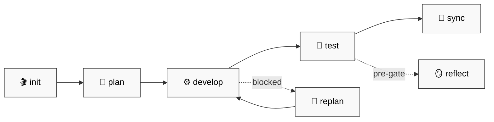
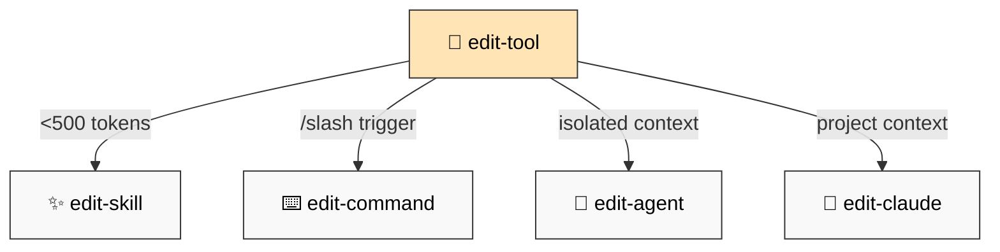

# 📚 dstoic/agent-skills — Full Documentation

> ⚠️ **Live experiment.** Highly personalized to my working style and cognitive traits. Fork it, break it, adapt it to *your* brain.

## 🎯 Philosophy

AI collaboration as **cognitive discipline**:

- 🧠 **Structured thinking** → OpenSpec forces planning before coding
- 💾 **Context continuity** → Sessions persist across conversations
- 🔍 **Reflective practice** → Retrospectives surface patterns

This isn't about productivity. It's about *how you think* when working with AI.

---

## 📦 Installation

```bash
git clone https://github.com/digital-stoic-org/agent-skills.git
```

Add to `.claude/settings.json`:
```json
{"plugins": ["/path/to/agent-skills/dstoic"]}
```

Or install globally in `~/.claude/settings.json`.

---

## 🛠️ Skills (13)

### 📋 OpenSpec Workflow (7)



| Skill | Purpose |
|-------|---------|
| `openspec-init` | 🎬 Initialize OpenSpec in project |
| `openspec-plan` | 📝 Create change proposal with reasoning |
| `openspec-develop` | ⚙️ Implement with task tracking |
| `openspec-test` | 🧪 Layered verification (smoke → integration → manual) |
| `openspec-replan` | 🔀 Adaptive refinement when blocked |
| `openspec-sync` | 🔄 Update docs and context |
| `openspec-reflect` | 🪞 Pre-gate drift detection |

### 🔧 Tool Orchestration (5)



| Skill | When to Use |
|-------|-------------|
| `edit-tool` | 🎯 Decision tree—routes to correct editor |
| `edit-skill` | ✨ Auto-invoked, <500 tokens |
| `edit-command` | ⌨️ User-triggered `/slash` commands |
| `edit-agent` | 🤖 Isolated context, complex tasks |
| `edit-claude` | 📄 Project CLAUDE.md files |

### 🔨 Utilities (1)

| Skill | Purpose |
|-------|---------|
| `dump-output` | 📤 Toggle auto-dump to `.dump/` |

---

## ⌨️ Commands (10)

### 💾 Context Management

| Command | Purpose |
|---------|---------|
| `/save-context` | 💾 Serialize session → CONTEXT-llm.md |
| `/load-context` | 📥 Resume session (optional `--full`) |

### 🔍 Session Analysis ⚠️

> ⚠️ These commands work but need review (migrated from v0.1)

| Command | Purpose | Status |
|---------|---------|--------|
| `/retrospect-domain` | 🎓 Extract learnings (WHAT/WHY) | ⚠️ needs-review |
| `/retrospect-collab` | 🤝 Analyze patterns (HOW) | ⚠️ needs-review |
| `/retrospect-report` | 📊 Aggregate trends | ⚠️ needs-review |

### 🔨 Utilities

| Command | Purpose | Status |
|---------|---------|--------|
| `/brainstorm` | 💡 Divergent-convergent ideation | ⚠️ needs-review |
| `/convert-pdf` | 📄 PDF → markdown | ⚠️ needs-review |
| `/convert-epub` | 📖 EPUB → markdown | ⚠️ needs-review |
| `/edit-risen-prompt` | ✍️ Create/audit RISEN prompts | ✅ |
| `/background` | 🔄 Run tasks in background | ✅ |

---

## 🪝 Hooks

| Hook | Purpose |
|------|---------|
| `notify-tmux.sh` | 🖥️ Visual feedback in tmux |
| `retrospect-capture.sh` | 📝 Auto-log session events |
| `dump-output.sh` | 📤 Debug artifacts |

Configure in `hooks.json`.

---

## 📦 Dependencies

### ❌ Required

| Feature | Requires | Install |
|---------|----------|---------|
| `openspec-*` skills | [OpenSpec CLI](https://github.com/digital-stoic-org/openspec) | `pip install openspec` (TBD) |
| `/convert-pdf` | [Docling](https://github.com/DS4SD/docling) | `pip install docling` |
| `/convert-epub` | [epub-to-markdown](https://github.com/nickvdyck/epub-to-markdown) | `pip install epub-to-markdown` |

### ⚡ Optional

| Feature | Requires | Notes |
|---------|----------|-------|
| `notify-tmux.sh` | [tmux](https://github.com/tmux/tmux) | 🖥️ Visual notifications |
| Hooks | bash | 🐚 All hooks require bash |

---

## 🪥 CLAUDE.md Philosophy

> **CLAUDE.md is like a toothbrush—personal, not shared.**

Your CLAUDE.md reflects YOUR:
- 🧠 Cognitive patterns
- 💬 Communication preferences
- 📐 Project conventions
- ⚠️ Error handling style

See [CLAUDE.md.example](CLAUDE.md.example) for structure, then build your own.

---

## 📄 License

MIT — Fork it, adapt it, make it yours.

---

## 🤝 Contributing

1. 🍴 Fork
2. 🌿 Branch
3. 🚀 PR

Issues: [github.com/digital-stoic-org/agent-skills/issues](https://github.com/digital-stoic-org/agent-skills/issues)
