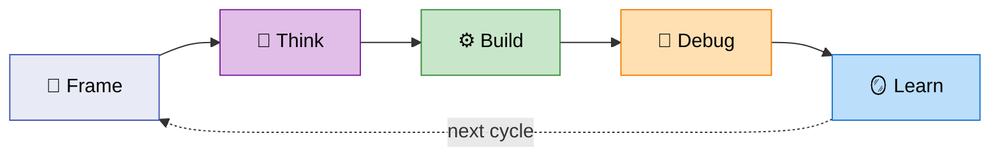
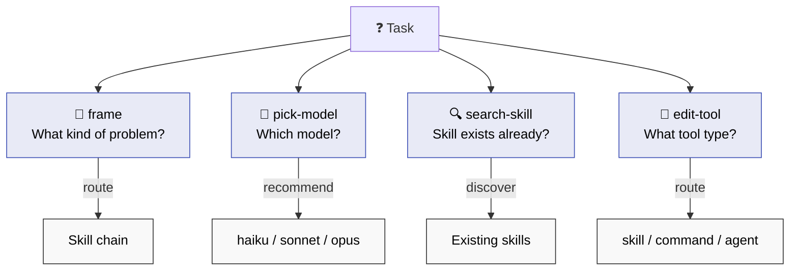
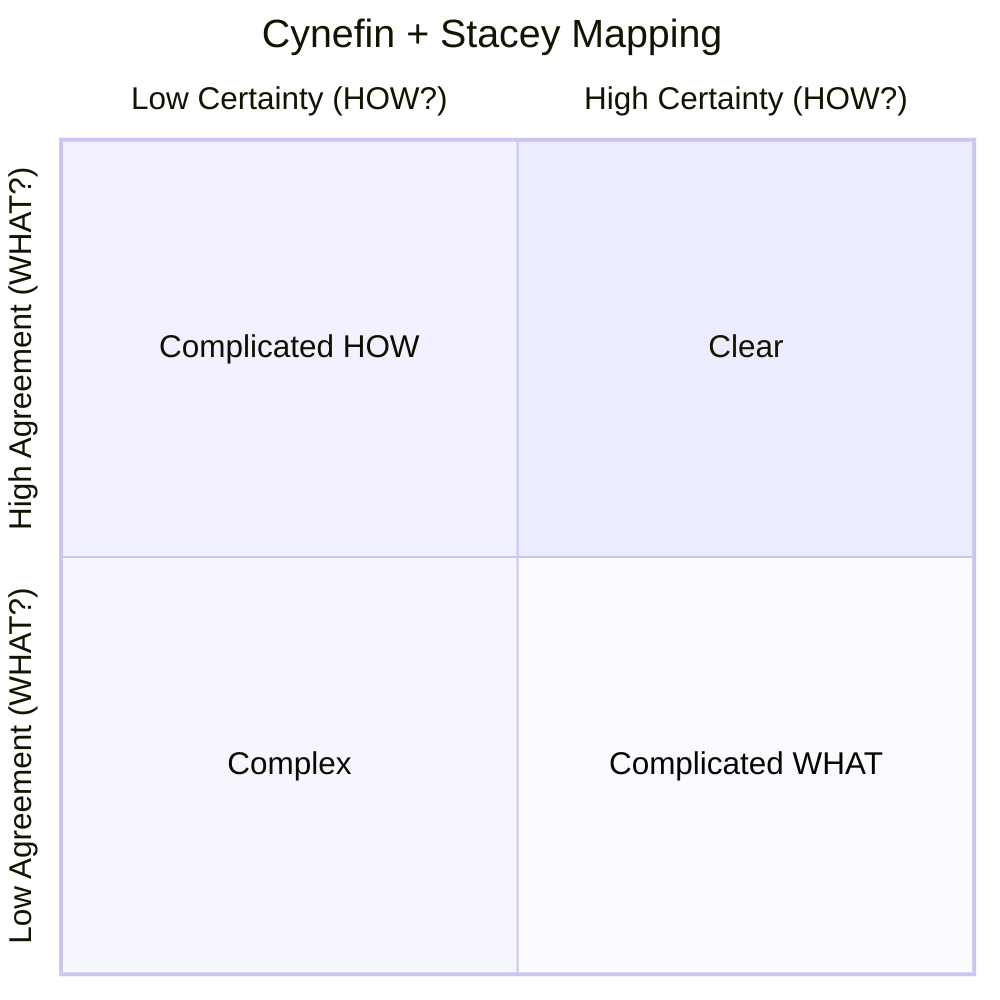
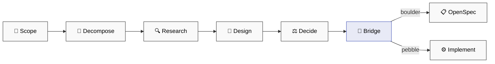
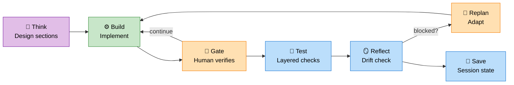
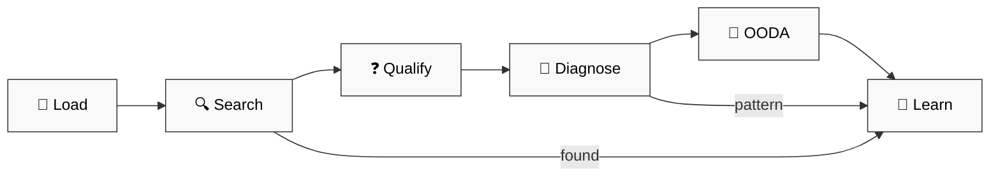
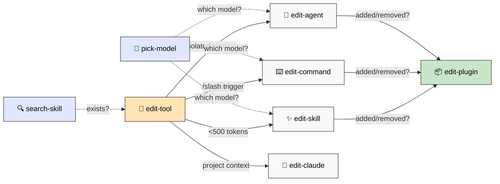

# 📚 Agent Skills — Full Catalog

> ⚠️ Live experiment. Highly personalized to my working style. Fork it, adapt it to *your* brain.

📖 **Principles & mindset:** [PHILOSOPHY.md](PHILOSOPHY.md) · 📄 **TL;DR:** [README.md](README.md)

---

## 🔄 Cognitive Modes

Everything in this toolkit maps to a cognitive mode — a way of engaging with a problem.



You don't always go through every mode. A pebble (small fix) skips straight to Build. A crisis starts at Debug. The point is: **know which mode you're in**.

---

## 🧭 Frame — Sense-Making (4 skills)

*Before acting, understand the problem space.*



| Skill | Purpose |
|-------|---------|
| `frame-problem` | 🧭 Classify problem (Cynefin + Stacey) → route to right skill chain |
| `pick-model` | 🎯 Recommend optimal model (haiku/sonnet/opus) for the task |
| `search-skill` | 🔍 Discover existing skills before building new ones |
| `edit-tool` | 🎯 Decision tree — routes to correct tool editor (skill/command/agent) |

### `/frame-problem` — The Entry Point



| Domain | Route | OpenSpec? |
|--------|-------|-----------|
| **Clear** | Just code it | No |
| **Complicated (HOW?)** | `/investigate` → `/openspec-plan` | Boulder: yes |
| **Complicated (WHAT?)** | `/brainstorm` → decide → code | Boulder: yes |
| **Complex** | `/brainstorm` → `/investigate` → `/openspec-plan` | Yes |
| **Chaotic** | `/troubleshoot` → stabilize → re-frame | No |

Frame asks 2 questions (situation + scale), maps to a domain, suggests the skill chain, and hands off.

---

## 🧠 Think — Ideation & Analysis (2 skills + 1 command)

*Diverge before you converge. Analyze before you design.*

### `/brainstorm` (command, opus)

Structured ideation: research → divergent → convergent → recommendation.

| Phase | What |
|-------|------|
| **Research** | WebSearch for existing solutions (2-3 searches) |
| **Divergent** | SCAMPER + Starbursting → 5-10 distinct options |
| **Convergent** | Auto-select method (Weighted Scoring / Six Thinking Hats / Constraint-Based) |
| **Recommendation** | Top choice + assumptions + boulder/pebble detection |

### `/investigate` (skill, opus)

Deep proactive analysis for complex technical problems.



| Phase | Techniques |
|-------|------------|
| **Decompose** | Issue Trees (MECE), Constraint Mapping, unknowns inventory |
| **Research** | WebSearch, Kepner-Tregoe IS/IS NOT, codebase analysis |
| **Design** | Morphological Analysis (Zwicky), trade-off matrix, Mermaid diagrams |
| **Decide** | Weighted Decision Matrix, Pre-mortem, assumptions list |
| **Bridge** | Handoff → OpenSpec (boulder) or direct implementation (pebble) |

**Key distinction:** Troubleshoot = reactive (error → fix). Brainstorm = divergent (options → pick). Investigate = proactive (complex problem → decompose → design → decide).

---

## ⚙️ Build — Structured Development (7 skills)

*Plan → implement → gate → test → sync. Human-in-the-loop iteration.*



| Skill | Purpose |
|-------|---------|
| `openspec-init` | 🎬 Setup project (set mode: garage/scale/maintenance) |
| `openspec-plan` | 📝 Design proposal + test.md strategy (human reviews test plan upfront) |
| `openspec-develop` | ⚙️ Implement sections, stop at gates for human review |
| `openspec-test` | 🧪 Execute test.md verification, log to test-logs/ (no improvisation) |
| `openspec-reflect` | 🪞 Pre-gate drift check (flags missing test.md in scale/maintenance) |
| `openspec-replan` | 🔀 Pivot when blocked (adapt, don't force) |
| `openspec-sync` | 💾 Save session state (resume tomorrow without context loss) |

**Core innovation:** Gates = human checkpoints between implementation sections. AI stops → you verify → mark pass → AI continues. Enables crash recovery (checkboxes persist), prevents scope drift (section-by-section review), maintains human control (you set the pace).

**Transparent testing:** test.md documents verification strategy at plan time. Human reviews test approach before any execution. Checkpoint reads test.md literally (no improvisation). Logs written to test-logs/ for audit trail.

**Execution modes:**
- **Garage** → Working > perfect. test.md recommended, smoke tests sufficient.
- **Scale** → Production rigor. test.md required, full verification at gates.
- **Maintenance** → Conservative changes, careful refactoring.

---

## 🔧 Debug — Troubleshooting (1 skill)

*Search first. Diagnose second. Learn always.*



| Phase | What |
|-------|------|
| **Load** | Read learnings.yaml for known patterns |
| **Search** | WebSearch SO, GitHub, Docs, Reddit (80% of bugs solved online) |
| **Qualify** | 2-3 questions (stack, env, what changed?) |
| **Diagnose** | Mental models → Isolation → 5 Whys |
| **OODA** | Observe → Orient → Decide → Act |
| **Learn** | Save pattern to learnings.yaml for next time |

**Techniques:** Wolf Fence (binary search), 5 Whys, Fishbone 6 M's, Rubber Duck, OODA loops.

---

## 🪞 Learn — Retrospectives & Session Memory (7 commands)

*Extract patterns from sessions. Persist context across conversations.*

### Session Analysis

| Command | Purpose | Model |
|---------|---------|-------|
| `/retrospect-domain` | 🎓 Extract learnings (WHAT/WHY) from captured sessions | opus |
| `/retrospect-collab` | 🤝 Analyze collaboration patterns (HOW) + compute metrics | opus |
| `/retrospect-report` | 📊 Aggregate trends and visualizations across sessions | opus |

### Context Management

| Command | Purpose | Model |
|---------|---------|-------|
| `/create-context` | 🎬 Create baseline from `.in/` folder (run once per project) | sonnet |
| `/save-context` | 💾 Serialize session → CONTEXT-llm.md (before leaving) | sonnet |
| `/load-context` | 📥 Resume session from CONTEXT-llm.md (optional `--full`) | sonnet |
| `/list-contexts` | 📋 List all contexts across code/ and projects/ with status | haiku |

---

## 🔨 Create — Tool Orchestration (7 skills)

*Build your own skills, commands, and agents.*



| Skill | When to Use |
|-------|-------------|
| `edit-tool` | 🎯 Decision tree — routes to correct editor |
| `edit-skill` | ✨ Auto-invoked capabilities (<500 tokens) |
| `edit-command` | ⌨️ User-triggered `/slash` commands |
| `edit-agent` | 🤖 Isolated context, complex tasks |
| `edit-claude` | 📄 Project CLAUDE.md files |
| `edit-plugin` | 📦 Version bumps and plugin metadata sync |
| `search-skill` | 🔍 Discover & evaluate skills from curated sources |
| `pick-model` | 🎯 Recommend haiku/sonnet/opus for the task |

---

## 🔧 Utilities (5 skills)

| Skill | Purpose |
|-------|---------|
| `anonymize-doc` | 🔒 Detect/anonymize PII + business data (GDPR/HIPAA aware) |
| `install-dependency` | 📦 Monorepo-aware package installation (pip/bun/apt) |
| `convert-md-to-pdf` | 📄 Convert markdown with Mermaid to styled PDF |
| `dump-output` | 📤 Toggle auto-dump to `.dump/` |
| `edit-risen-prompt` | ✍️ Create/audit RISEN prompts |

## 📥 Conversions & Imports (6 commands)

| Command | Purpose | Model |
|---------|---------|-------|
| `/convert-pdf` | 📄 PDF → markdown (Docling) | haiku |
| `/convert-docx` | 📝 Word → markdown (markitdown) | haiku |
| `/convert-pptx` | 📊 PowerPoint → markdown (markitdown) | haiku |
| `/convert-epub` | 📖 EPUB → markdown | haiku |
| `/import-gdoc` | 📥 Import Google Docs with manifest tracking | haiku |
| `/background` | 🔄 Run tasks in background | sonnet |

## 🚀 Deployment (1 command)

| Command | Purpose | Model |
|---------|---------|-------|
| `/deploy-surge` | 🌐 Deploy static sites to Surge.sh with inventory tracking | sonnet |

---

## 🪝 Hooks (3)

| Hook | Purpose |
|------|---------|
| `notify-tmux.sh` | 🖥️ Visual feedback in tmux status bar |
| `retrospect-capture.sh` | 📝 Auto-log session events for retrospective analysis |
| `dump-output.sh` | 📤 Debug artifacts to `.dump/` directory |

Configure in `hooks.json`. See [hooks/README.md](dstoic/hooks/README.md) for details.

---

## 📦 Dependencies

### Required

| Feature | Requires | Install |
|---------|----------|---------|
| `openspec-*` skills | [OpenSpec CLI](https://github.com/digital-stoic-org/openspec) | `pip install openspec` (TBD) |
| `anonymize-doc` | scrubadub, faker, spacy | `pip install scrubadub faker spacy && python -m spacy download en_core_web_sm` |
| `/convert-pdf` | [Docling](https://github.com/DS4SD/docling) | `pip install docling` |
| `/convert-docx` | [markitdown](https://github.com/microsoft/markitdown) | `pip install markitdown` |
| `/convert-pptx` | [markitdown](https://github.com/microsoft/markitdown) | `pip install markitdown` |
| `/convert-epub` | [epub-to-markdown](https://github.com/nickvdyck/epub-to-markdown) | `pip install epub-to-markdown` |

### Recommended

| Feature | Requires | Install |
|---------|----------|---------|
| Token-optimized output | [rtk](https://github.com/pszymkowiak/rtk) | See repo for install |
| Node.js packages | [bun](https://bun.sh) | `curl -fsSL https://bun.sh/install \| bash` |

### Optional

| Feature | Requires | Notes |
|---------|----------|-------|
| `notify-tmux.sh` | [tmux](https://github.com/tmux/tmux) | 🖥️ Visual notifications |
| Hooks | bash | 🐚 All hooks require bash |

---

## 📦 Installation

```bash
git clone https://github.com/digital-stoic-org/agent-skills.git
```

Add to `.claude/settings.json`:
```json
{"plugins": ["/path/to/agent-skills/dstoic"]}
```

Or install globally in `~/.claude/settings.json`.

---

📄 **License:** MIT — Fork it, adapt it, make it yours.

🧭 **Philosophy:** [PHILOSOPHY.md](PHILOSOPHY.md) · 📄 **TL;DR:** [README.md](README.md)
