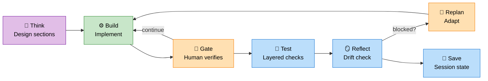
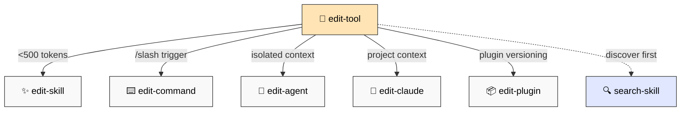
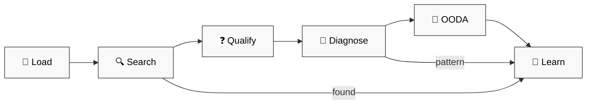
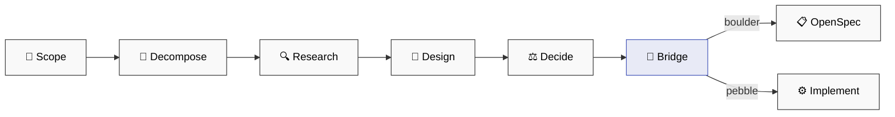

# 📚 dstoic/agent-skills — Full Documentation

> ⚠️ **Live experiment.** Highly personalized to my working style and cognitive traits. Fork it, break it, adapt it to *your* brain.

## 🎯 Philosophy

**Human+AI collaboration as metacognitive practice:**

- 🧠 **Think before build** → OpenSpec forces planning (outcome-centric, not process-heavy)
- 🚧 **Human controls pace** → Gates = verification checkpoints between sections
- 💾 **Session continuity** → Context + progress persist, resume without re-explaining
- 🪞 **Reflective iteration** → Drift detection, adaptive replanning when blocked

**Boulder → Pebbles approach:** Break complex work into checkpointed sections. AI implements, human verifies at gates, continue together.

Not automation. Not micromanagement. **Structured co-thinking for multi-day builds.**

---

## 🪨 Boulder vs Pebbles

| Type | When | Approach |
|------|------|----------|
| 🪨 **Boulder** | Multi-file, architectural, ambiguous | OpenSpec workflow |
| 🪶 **Pebble** | Single file, obvious fix | Direct implementation |

**Garage Mode MVP** (not waterfall, not agile):
- 🎯 Proposal = MVP design, not full spec
- 🔧 Tasks = flexible checklist, not rigid requirements
- 🔀 Replan when blocked, don't force the path
- 🚀 Ship small, iterate fast

Structure without ceremony—garage workbench, not AutoCAD.

---

## 📦 Installation

```bash
git clone https://github.com/digital-stoic-org/agent-skills.git
```

Add to `.claude/settings.json`:
```json
{"plugins": ["/path/to/agent-skills/dstoic"]}
```

Or install globally in `~/.claude/settings.json`.

---

## 🛠️ Skills (22)

### 📋 OpenSpec Workflow (7)



| Skill | Purpose |
|-------|---------|
| `openspec-plan` | 📝 Design proposal + test.md strategy (human reviews test plan upfront) |
| `openspec-develop` | ⚙️ Implement sections, stop at gates for human review |
| `openspec-test` | 🧪 Execute test.md verification, log to test-logs/ (no improvisation) |
| `openspec-reflect` | 🪞 Pre-gate drift check (flags missing test.md in scale/maintenance) |
| `openspec-replan` | 🔀 Pivot when blocked (adapt, don't force) |
| `openspec-sync` | 💾 Save session state (resume tomorrow without context loss) |
| `openspec-init` | 🎬 Setup project (set mode: garage/scale/maintenance) |

**Core innovation:** Gates = human checkpoints between implementation sections. AI stops → you verify → mark pass → AI continues. Enables crash recovery (checkboxes persist), prevents scope drift (section-by-section review), maintains human control (you set the pace).

**Transparent testing (new):** test.md documents verification strategy at plan time. Human reviews test approach before any execution. Checkpoint reads test.md literally (no improvisation). Logs written to test-logs/ for audit trail. Blocks lazy patterns (grep "keyword" → functional verification).

**Garage MVP mode:** Working > perfect. test.md recommended, smoke tests sufficient.
**Scale mode:** Production rigor. test.md required, full verification at gates, document decisions.

Boulder → Pebbles. Think → Build → Verify → Iterate. Human + AI co-thinking.

### 🔧 Tool Orchestration (8)



| Skill | When to Use |
|-------|-------------|
| `edit-tool` | 🎯 Decision tree—routes to correct editor |
| `edit-skill` | ✨ Auto-invoked, <500 tokens |
| `edit-command` | ⌨️ User-triggered `/slash` commands |
| `edit-agent` | 🤖 Isolated context, complex tasks |
| `edit-claude` | 📄 Project CLAUDE.md files |
| `edit-plugin` | 📦 Version bumps and plugin metadata sync |
| `search-skill` | 🔍 Discover & evaluate skills from curated sources |
| `frame` | 🎯 Sense-making—classify problem (Cynefin + Stacey) → route to right skill chain |

**Model selection:** All editors include guidance on choosing `opus` (strategic analysis, multi-framework reasoning), `sonnet` (default workflows), or `haiku` (simple conversions). Use short names only—never version-specific IDs.

### 🔧 Troubleshoot (1)

| Skill | Purpose |
|-------|---------|
| `troubleshoot` | 🔧 Search-first debugging with learnings |



| Phase | What |
|-------|------|
| **Load** | Read learnings.yaml for known patterns |
| **Search** | WebSearch SO, GitHub, Docs, Reddit |
| **Qualify** | 2-3 questions (stack, env, changed) |
| **Diagnose** | Mental models → Isolation → 5 Whys |
| **OODA** | Observe → Orient → Decide → Act |
| **Learn** | Save pattern to learnings.yaml |

**Techniques:** Wolf Fence, 5 Whys, Fishbone 6 M's, Rubber Duck

### 🔬 Investigate (1)

| Skill | Purpose |
|-------|---------|
| `investigate` | 🔬 Deep proactive analysis for complex technical problems |



| Phase | What |
|-------|------|
| **Scope** | Define problem, constraints, success criteria |
| **Decompose** | Issue Trees (MECE), Constraint Mapping, unknowns inventory |
| **Research** | Multi-angle probing, Kepner-Tregoe IS/IS NOT, codebase analysis |
| **Design** | Morphological Analysis (Zwicky), trade-off matrix, Mermaid diagrams |
| **Decide** | Weighted Decision Matrix, Pre-mortem, assumptions list |
| **Bridge** | Handoff → OpenSpec (boulder) or direct implementation (pebble) |

**Techniques:** Issue Trees, MECE, Theory of Constraints, Kepner-Tregoe, Morphological Analysis, Pre-mortem, Weighted Decision Matrix

**Key distinction:** Troubleshoot = reactive (error → fix). Brainstorm = divergent (options → pick). Investigate = proactive (complex problem → decompose → design → decide).

### 🔨 Utilities (4)

| Skill | Purpose |
|-------|---------|
| `pick-model` | 🎯 Recommend optimal model (haiku/sonnet/opus) for tasks |
| `install-dependency` | 📦 Monorepo-aware package installation (pip/bun/apt) |
| `convert-md-to-pdf` | 📄 Convert markdown with Mermaid to styled PDF |
| `dump-output` | 📤 Toggle auto-dump to `.dump/` |

---

## ⌨️ Commands (12)

### 💾 Context Management

| Command | Purpose | Model |
|---------|---------|-------|
| `/create-context` | 🎬 Create baseline from .in/ folder | sonnet |
| `/save-context` | 💾 Serialize session → CONTEXT-llm.md | sonnet |
| `/load-context` | 📥 Resume session (optional `--full`) | sonnet |

### 🔍 Session Analysis

| Command | Purpose | Model |
|---------|---------|-------|
| `/retrospect-domain` | 🎓 Extract learnings (WHAT/WHY) | opus |
| `/retrospect-collab` | 🤝 Analyze patterns (HOW) | opus |
| `/retrospect-report` | 📊 Aggregate trends | opus |

### 🔨 Utilities

| Command | Purpose | Model |
|---------|---------|-------|
| `/brainstorm` | 💡 Divergent-convergent ideation | opus |
| `/convert-pdf` | 📄 PDF → markdown (Docling) | haiku |
| `/convert-epub` | 📖 EPUB → markdown | haiku |
| `/import-gdoc` | 📥 Import Google Docs with manifest | haiku |
| `/edit-risen-prompt` | ✍️ Create/audit RISEN prompts | sonnet |
| `/background` | 🔄 Run tasks in background | sonnet |

---

## 🪝 Hooks

| Hook | Purpose |
|------|---------|
| `notify-tmux.sh` | 🖥️ Visual feedback in tmux |
| `retrospect-capture.sh` | 📝 Auto-log session events |
| `dump-output.sh` | 📤 Debug artifacts |

Configure in `hooks.json`.

---

## 📦 Dependencies

### ❌ Required

| Feature | Requires | Install |
|---------|----------|---------|
| `openspec-*` skills | [OpenSpec CLI](https://github.com/digital-stoic-org/openspec) | `pip install openspec` (TBD) |
| `/convert-pdf` | [Docling](https://github.com/DS4SD/docling) | `pip install docling` |
| `/convert-epub` | [epub-to-markdown](https://github.com/nickvdyck/epub-to-markdown) | `pip install epub-to-markdown` |

### ⚡ Optional

| Feature | Requires | Notes |
|---------|----------|-------|
| `notify-tmux.sh` | [tmux](https://github.com/tmux/tmux) | 🖥️ Visual notifications |
| Hooks | bash | 🐚 All hooks require bash |

---

## 🪥 CLAUDE.md Philosophy

> **CLAUDE.md is like a toothbrush—personal, not shared.**

Your CLAUDE.md reflects YOUR:
- 🧠 Cognitive patterns
- 💬 Communication preferences
- 📐 Project conventions
- ⚠️ Error handling style

See [CLAUDE.md.example](CLAUDE.md.example) for structure, then build your own.

---

## 📄 License

MIT — Fork it, adapt it, make it yours.

---

## 🤝 Contributing

1. 🍴 Fork
2. 🌿 Branch
3. 🚀 PR

Issues: [github.com/digital-stoic-org/agent-skills/issues](https://github.com/digital-stoic-org/agent-skills/issues)
