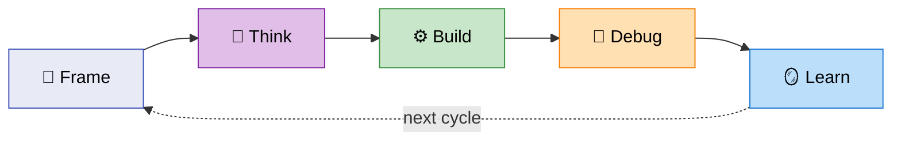
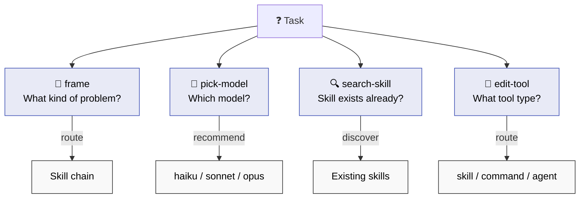
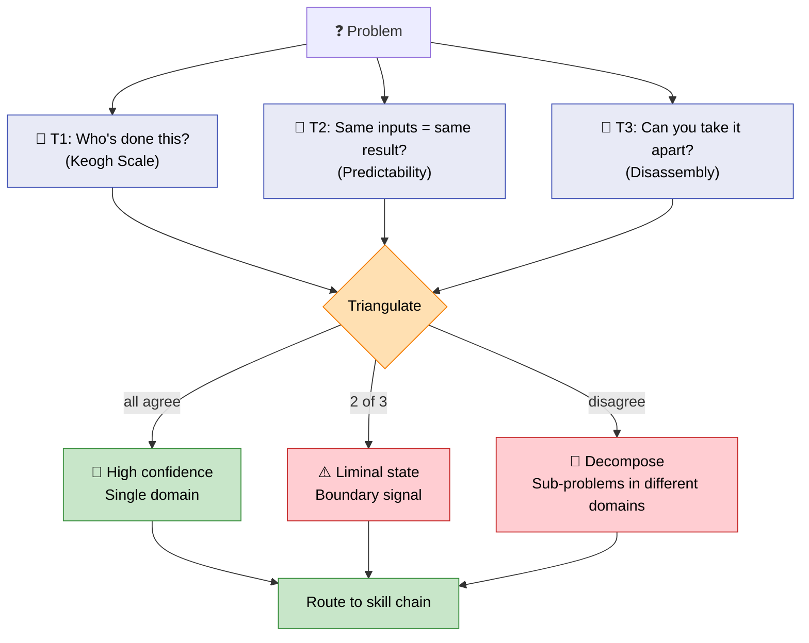
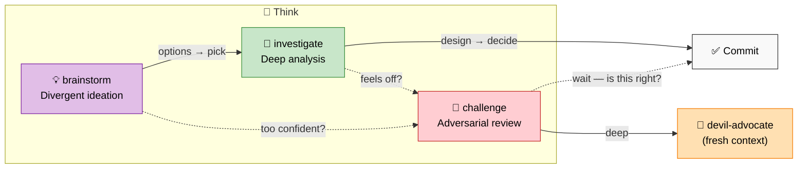
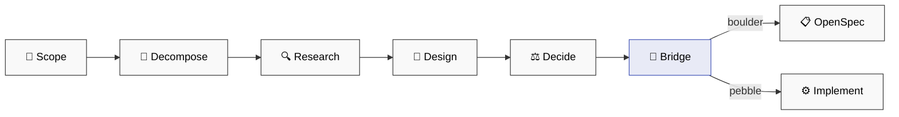
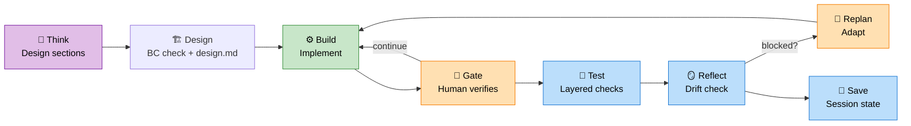
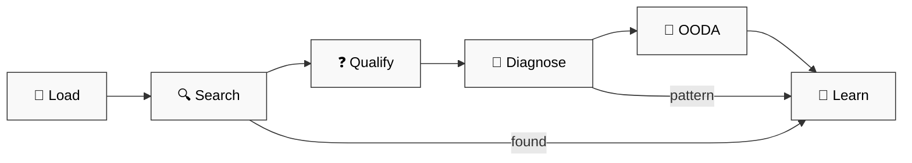
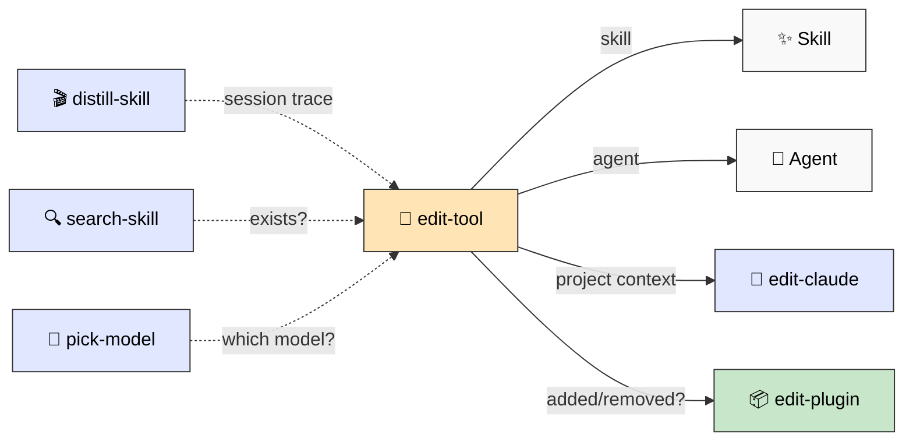

# 📚 Digital Stoic Praxis — Full Catalog

> ⚠️ Live experiment. Highly personalized to my working style. Fork it, adapt it to *your* brain.

📖 **Reading order**: [README](README.md) (what + how?) → [PHILOSOPHY](PHILOSOPHY.md) (why?) → [PRACTICE](PRACTICE.md) (deep how) → [HARNESS-ENGINEERING](HARNESS-ENGINEERING.md) (the harness) → **this file** (every skill)

---

## 🔄 Workflow Phases

Everything in this toolkit maps to a workflow phase — a stage in how you engage with a problem.


```mermaid
flowchart LR
    F["🧭 Frame"] --> T["🧠 Think"]
    T --> B["⚙️ Build"]
    B --> D["🔧 Debug"]
    D --> L["🪞 Learn"]
    L -.->|"next cycle"| F

    classDef frame fill:#E8EAF6,stroke:#3F51B5,color:#000
    classDef think fill:#E1BEE7,stroke:#7B1FA2,color:#000
    classDef build fill:#C8E6C9,stroke:#388E3C,color:#000
    classDef debug fill:#FFE0B2,stroke:#F57C00,color:#000
    classDef learn fill:#BBDEFB,stroke:#1976D2,color:#000

    class F frame
    class T think
    class B build
    class D debug
    class L learn
```

You don't always go through every phase. A pebble (small fix) skips straight to Build. A crisis starts at Debug. The point is: **know which phase you're in**.

---

## 🧭 Frame — Sense-Making (6 skills)

*Before acting, understand the problem space.*


```mermaid
flowchart TD
    task["❓ Task"] --> frame["🧭 frame<br/>What kind of problem?"]
    task --> pick["🎯 pick-model<br/>Which model?"]
    task --> search["🔍 search-skill<br/>Skill exists already?"]
    task --> edit["🎯 edit-tool<br/>What tool type?"]

    frame -->|"route"| chain["Skill chain"]
    pick -->|"recommend"| model["haiku / sonnet / opus"]
    search -->|"discover"| existing["Existing skills"]
    edit -->|"route"| editor["skill / command / agent"]

    classDef router fill:#E8EAF6,stroke:#3F51B5,color:#000
    classDef output fill:#f9f9f9,stroke:#333,color:#000
    class frame,pick,search,edit router
    class chain,model,existing,editor output
```

| Skill | Purpose |
|-------|---------|
| `frame-problem` | 🧭 Classify problem (Cynefin) → route to right skill chain |
| `probe` | 🔬 Safe-to-fail experiment for Complex domain (two-phase: qualify → probe → sense) |
| `experiment` | ⚡ Act-sense loop for Chaotic domain (gate after every action) |
| `pick-model` | 🎯 Recommend optimal model (haiku/sonnet/opus) for the task |
| `search-skill` | 🔍 Discover existing skills before building new ones |
| `edit-tool` | 🎯 Unified skill/agent/script editor — triages and creates/modifies tools |

### `/frame-problem` — The Entry Point

Cynefin is a **sense-making framework**, not a categorization tool. The skill doesn't ask "which box?" — it **triangulates** using 3 concrete tests anyone can answer, then routes (or decomposes if the problem spans multiple domains).


```mermaid
flowchart TD
    task["❓ Problem"] --> t1["🔮 T1: Who's done this?<br/>(Keogh Scale)"]
    task --> t2["🔁 T2: Same inputs = same result?<br/>(Predictability)"]
    task --> t3["🧩 T3: Can you take it apart?<br/>(Disassembly)"]

    t1 & t2 & t3 --> tri{"Triangulate"}

    tri -->|"all agree"| classify["🎯 High confidence<br/>Single domain"]
    tri -->|"2 of 3"| liminal["⚠️ Liminal state<br/>Boundary signal"]
    tri -->|"disagree"| decompose["🧩 Decompose<br/>Sub-problems in different domains"]

    classify --> route["Route to skill chain"]
    liminal --> route
    decompose --> route

    classDef test fill:#E8EAF6,stroke:#3F51B5,color:#000
    classDef decision fill:#FFE0B2,stroke:#F57C00,color:#000
    classDef output fill:#C8E6C9,stroke:#388E3C,color:#000
    classDef warn fill:#FFCDD2,stroke:#C62828,color:#000

    class t1,t2,t3 test
    class tri decision
    class classify,route output
    class liminal,decompose warn
```

**The 3 tests (in plain English):**

| Test | Question | What it catches |
|------|----------|----------------|
| 🔮 **Keogh** | "Who has done this before?" (everyone → nobody) | Distinguishes Clear/Complicated from Complex |
| 🔁 **Predictability** | "If you reran this, same result?" | Catches engineers who think they can analyze what's actually unpredictable |
| 🧩 **Disassembly** | "Can you break it apart and reassemble?" | Targets the hardest boundary: Complicated vs Complex |

**Domain routing:**

| Domain | In plain English | Constraint | Route | OpenSpec? |
|--------|------------------|-----------|-------|-----------|
| **Clear** | Everyone knows how — just follow the process | Rigid | Just code it | 🪨 Boulder: yes · 🫧 Pebble: no |
| **Complicated** | Experts can solve — needs analysis, not experimentation | Governing | `/investigate` → `/openspec-plan` | 🪨 Boulder: yes |
| **Complex** | Only makes sense in hindsight — must probe first | Enabling | `/probe` → sense → `/openspec-plan` | ✅ Yes |
| **Chaotic** | No cause-effect visible — act first, stabilize | Absent | `/experiment` → act-sense → `/probe` | ❌ No (act first) |
| **Liminal** | On the boundary between two domains | Mixed | `/probe` to resolve boundary → re-frame | Deferred |
| **Composite** | Sub-parts in different domains | Mixed | Decompose → route each part separately | Per part |

**Key design choice:** The skill never asks "what type of constraint?" directly — people systematically misclassify (engineers see Complex as Complicated, novices see Complicated as Chaotic). The 3 tests triangulate to the same answer from different angles.

---

## 🧠 Think — Ideation & Analysis (5 skills + 1 agent)

*Diverge before you converge. Analyze before you design. Challenge before you commit.*


```mermaid
flowchart LR
    subgraph THINK["🧠 Think"]
        direction LR
        B["💡 brainstorm<br/>Divergent ideation"]
        I["🔬 investigate<br/>Deep analysis"]
        C["🔴 challenge<br/>Adversarial review"]
    end

    B -->|"options → pick"| I
    I -->|"design → decide"| COMMIT["✅ Commit"]
    C -.->|"wait — is this right?"| COMMIT

    B -.->|"too confident?"| C
    I -.->|"feels off?"| C
    C -->|"deep"| DA["🤖 devil-advocate<br/>(fresh context)"]

    classDef generative fill:#E1BEE7,stroke:#7B1FA2,color:#000
    classDef analytical fill:#C8E6C9,stroke:#388E3C,color:#000
    classDef adversarial fill:#FFCDD2,stroke:#C62828,color:#000
    classDef agent fill:#FFE0B2,stroke:#F57C00,color:#000
    classDef output fill:#f9f9f9,stroke:#333,color:#000

    class B generative
    class I analytical
    class C adversarial
    class DA agent
    class COMMIT output
```

Three cognitive stances — **generative** (create options), **analytical** (decompose + decide), **adversarial** (challenge before committing). `/challenge` is reactive: invoke it when output feels too confident, too fast, or too convenient.

### `/challenge` (skill, opus)

Structured adversarial review — forces reconsideration of current AI output using provocation patterns.

| Subcommand | Error Type | Technique |
|---|---|---|
| `anchor` | Premature commitment / anchoring bias | Counterfactual reframe, Steelman opposite |
| `verify` | Factual errors / hallucination | Claim decomposition, source audit |
| `framing` | Wrong problem / framing errors | Problem restatement, scope challenge |
| `deep` | High-stakes — all 9 patterns in fresh context | Spawns `devil-advocate` sub-agent (all 3 families: anchor → verify → framing → alignment check → verdict) |

**Triggers:** "challenge this", "are you sure", "push back", "prove it", "devil's advocate", "poke holes", "sanity check"

> 🤖 **Agent: `devil-advocate`** (Opus)
> Fresh context · All 9 debiasing patterns (Gatekeeper, Reset, Alt Approaches, Pre-mortem, Proof Demand, CoVe, Fact Check List, Socratic, Steelman) · Read/Glob/Grep only
> Returns: comprehensive Challenge Report with explicit technique rationale, reasoning traces, and confidence levels

### `/brainstorm` (skill, opus)

Structured ideation: research → divergent → convergent → recommendation.

| Phase | What |
|-------|------|
| **Research** | WebSearch for existing solutions (2-3 searches) |
| **Divergent** | SCAMPER + Starbursting → 5-10 distinct options |
| **Convergent** | Auto-select method (Weighted Scoring / Six Thinking Hats / Constraint-Based) |
| **Recommendation** | Top choice + assumptions + boulder/pebble detection |

### `/investigate` (skill, opus)

Deep proactive analysis for complex technical problems.


```mermaid
flowchart LR
    S["🎯 Scope"] --> D["🧩 Decompose"]
    D --> R["🔍 Research"]
    R --> G["🎨 Design"]
    G --> C["⚖️ Decide"]
    C --> BR["🌉 Bridge"]

    BR -->|"boulder"| OS["📋 OpenSpec"]
    BR -->|"pebble"| IMPL["⚙️ Implement"]

    classDef default fill:#f9f9f9,stroke:#333,color:#000
    classDef bridge fill:#E8EAF6,stroke:#3F51B5,color:#000
    class BR bridge
```

| Phase | Techniques |
|-------|------------|
| **Decompose** | Issue Trees (MECE), Constraint Mapping, unknowns inventory |
| **Research** | WebSearch, Kepner-Tregoe IS/IS NOT, codebase analysis |
| **Design** | Morphological Analysis (Zwicky), trade-off matrix, Mermaid diagrams |
| **Decide** | Weighted Decision Matrix, Pre-mortem, assumptions list |
| **Bridge** | Handoff → OpenSpec (boulder) or direct implementation (pebble) |

**Key distinction:** Troubleshoot = reactive (error → fix). Brainstorm = divergent (options → pick). Investigate = proactive (complex problem → decompose → design → decide).

### `/bridge` (skill, haiku)

Capture cross-project connections on the fly. Persists to `thinking/bridges/` as structured YAML.

| Command | Action |
|---|---|
| `/bridge HP → Brand: philosopher encounters reframe positioning` | Capture a bridge (auto-detect archetype) |
| `/bridge list [project]` | Show recent bridges, optionally filtered |
| `/bridge map` | Generate mermaid bridge map |
| `/bridge stats` | Weekly summary by project and archetype |

**10 bridge archetypes:** 🔄 flywheel · 🧠 knowledge · 👤 people · 🌱 terrain · 📖 narrative · 🎭 identity · 🔬 complexity · 🤝 local · ⚡ option · 🪞 mirror

**Design:** Bridges are knowledge, not tasks. Captured during work, reconciled during weekly review. No GTD writes — `thinking/bridges/` accumulates evidence, GTD `## 🔗 Ponts Stratégiques` holds strategic intent.

### `/benchmark-praxis` (skill, opus)

Structured benchmarking of Praxis methodology against external frameworks/tools. 3 modes:

| Mode | Command | What it does |
|---|---|---|
| **Full** | `/benchmark-praxis <url-or-name>` | Deep research → score all 8 Set 1 dims → verdict → actions |
| **Quick** | `/benchmark-praxis quick <name>` | Lightweight — 4-5 relevant dims, no deep research |
| **Gap** | `/benchmark-praxis gap [target]` | Self-assessment on 4 aspirational dims (Set 2) vs holy grail |

**Evaluation:** 4-layer taxonomy (Beliefs → Principles → Practices → Observables). Set 1 = 8 external benchmarking dims. Set 2 = 4 aspirational self-assessment dims. Scoring: 🟢🟢🟢 to 🔴 + ⬜ (N/A).

**Output:** Investigation artifacts + inventory updates → `$PRAXIS_DIR/thinking/benchmarks/`.

---

## ⚙️ Build — Structured Development (10 skills)

*Plan → implement → gate → test → sync. Human-in-the-loop iteration.*


```mermaid
flowchart LR
    plan["📝 Think<br/>Design sections"] --> design["🏗️ Design<br/>BC check + design.md"]
    design --> dev["⚙️ Build<br/>Implement"]
    dev --> gate["🚧 Gate<br/>Human verifies"]
    gate -->|"continue"| dev
    gate --> test["🧪 Test<br/>Layered checks"]
    test --> reflect["🪞 Reflect<br/>Drift check"]
    reflect -->|"blocked?"| replan["🔀 Replan<br/>Adapt"]
    reflect --> save["💾 Save<br/>Session state"]
    replan --> dev

    classDef think fill:#E1BEE7,stroke:#7B1FA2,color:#000
    classDef build fill:#C8E6C9,stroke:#388E3C,color:#000
    classDef gate fill:#FFE0B2,stroke:#F57C00,color:#000
    classDef meta fill:#BBDEFB,stroke:#1976D2,color:#000

    class plan think
    class dev build
    class gate,replan gate
    class test,reflect,save meta
```

| Skill | Purpose |
|-------|---------|
| `openspec-init` | 🎬 Setup project (set mode: garage/scale/maintenance) |
| `openspec-design` | 🏗️ BC-first structural design — produces `design.md` between proposal and tasks |
| `openspec-plan` | 📝 Design proposal + test.md strategy (human reviews test plan upfront) |
| `openspec-review` | 🔍 Pre-implementation tech lead gate — reviews all artifacts as coherent whole |
| `openspec-develop` | ⚙️ Implement sections, stop at gates for human review |
| `openspec-test` | 🧪 Execute test.md verification, log to test-logs/ (no improvisation) |
| `openspec-reflect` | 🪞 Pre-gate drift check (flags missing test.md in scale/maintenance) |
| `openspec-replan` | 🔀 Pivot when blocked (adapt, don't force) |
| `openspec-sync` | 💾 Save session state (resume tomorrow without context loss) |
| `edit-risen-prompt` | ✍️ Create/audit RISEN prompts with structure validation |

**Core innovation:** Gates = human checkpoints between implementation sections. AI stops → you verify → mark pass → AI continues. Enables crash recovery (checkboxes persist), prevents scope drift (section-by-section review), maintains human control (you set the pace).

**Transparent testing:** test.md documents verification strategy at plan time. Human reviews test approach before any execution. Checkpoint reads test.md literally (no improvisation). Logs written to test-logs/ for audit trail.

**Execution modes:**
- **Garage** → Working > perfect. test.md recommended, smoke tests sufficient.
- **Scale** → Production rigor. test.md required, full verification at gates.
- **Maintenance** → Conservative changes, careful refactoring.

---

## 🔧 Debug — Troubleshooting (1 skill)

*Search first. Diagnose second. Learn always.*


```mermaid
flowchart LR
    L["📖 Load"] --> S["🔍 Search"]
    S --> Q["❓ Qualify"]
    Q --> D["🧠 Diagnose"]
    D --> I["🔄 OODA"]
    I --> R["💾 Learn"]

    S -->|"found"| R
    D -->|"pattern"| R

    classDef default fill:#f9f9f9,stroke:#333,color:#000
```

| Phase | What |
|-------|------|
| **Load** | Read learnings.yaml for known patterns |
| **Search** | WebSearch SO, GitHub, Docs, Reddit (80% of bugs solved online) |
| **Qualify** | 2-3 questions (stack, env, what changed?) |
| **Diagnose** | Mental models → Isolation → 5 Whys |
| **OODA** | Observe → Orient → Decide → Act |
| **Learn** | Save pattern to learnings.yaml for next time |

**Techniques:** Wolf Fence (binary search), 5 Whys, Fishbone 6 M's, Rubber Duck, OODA loops.

---

## 🪞 Learn — Retrospectives & Session Memory (8 skills)

*Extract patterns from sessions. Persist context across conversations.*

### Session Recap

| Skill | Purpose | Model |
|-------|---------|-------|
| `tldr` | 📝 Concise recap of previous response (summary + action items) | haiku |

### Session Analysis

| Skill | Purpose | Model |
|-------|---------|-------|
| `retrospect-domain` | 🎓 Extract learnings (WHAT/WHY) from captured sessions | opus |
| `retrospect-collab` | 🤝 Analyze collaboration patterns (HOW) + compute metrics | opus |
| `retrospect-report` | 📊 Aggregate trends and visualizations across sessions | opus |

### Context Management

| Skill | Purpose | Model |
|-------|---------|-------|
| `create-context` | 🎬 Create baseline from `.in/` folder (run once per project) | sonnet |
| `save-context` | 💾 Serialize session → CONTEXT-llm.md (before leaving) | sonnet |
| `load-context` | 📥 Resume session from CONTEXT-llm.md (optional `--full`) | sonnet |
| `list-contexts` | 📋 List all contexts across code/ and projects/ with status | haiku |

> 🤖 **Agent: `summarize-for-context`** (Haiku)
> Chunked reading for files >25K tokens · Read + python3 + wc only
> Returns: token-budgeted markdown summary preserving key facts, decisions, and actionable items

🧬 **Harness Engineering**: Session lifecycle, guides/sensors model, and maturity levels → [HARNESS-ENGINEERING.md](HARNESS-ENGINEERING.md)

---

## 🔨 Create — Tool Orchestration (6 skills)

*Build your own skills and agents.*


```mermaid
flowchart LR
    distill["🎬 distill-skill"] -.->|"session trace"| edit["🎯 edit-tool"]
    search["🔍 search-skill"] -.->|"exists?"| edit
    edit -->|"skill"| skill["✨ Skill"]
    edit -->|"agent"| agent["🤖 Agent"]
    edit -->|"project context"| claude["📄 edit-claude"]

    pick["🎯 pick-model"] -.->|"which model?"| edit

    edit -->|"added/removed?"| plugin["📦 edit-plugin"]

    classDef router fill:#FFE4B5,stroke:#333,color:#000
    classDef output fill:#f9f9f9,stroke:#333,color:#000
    classDef support fill:#E0E7FF,stroke:#333,color:#000
    classDef post fill:#C8E6C9,stroke:#333,color:#000
    class edit router
    class skill,agent output
    class claude,search,pick,distill support
    class plugin post
```

| Skill | When to Use |
|-------|-------------|
| `edit-tool` | 🎯 Unified skill/agent/script editor — triages and creates/modifies tools |
| `edit-claude` | 📄 Project CLAUDE.md files |
| `edit-plugin` | 📦 Version bumps and plugin metadata sync |
| `search-skill` | 🔍 Discover & evaluate skills from curated sources |
| `distill-skill` | 🎬 Record a session and distill it into a generalized skill via `edit-tool` |
| `pick-model` | 🎯 Recommend haiku/sonnet/opus for the task |

---

## 🔧 Utilities (9 skills)

| Skill | Purpose |
|-------|---------|
| `commit-repo` | 🗂️ Streamlined git commit with single human gate (scope + message review) |
| `anonymize-doc` | 🔒 Detect/anonymize PII + business data (GDPR/HIPAA aware) |
| `install-dependency` | 📦 Monorepo-aware package installation (pip/bun/apt) |
| `convert-md-to-pdf` | 📄 Convert markdown with Mermaid to styled PDF |
| `infographize` | 🎨 Convert markdown to AntV infographic SVG (visual storytelling) |
| `dump-output` | 📤 Toggle auto-dump to `.dump/` |
| `literatize` | 📝 Add section-level comments to code capturing intent, rationale, and gotchas for LLM re-entry |
| `scratch` | 🗒️ Zero-friction session scratch pad — park side-thoughts during deep work without losing flow |
| `bridge` | 🔗 Cross-project connection capture — 10 archetypes, YAML to `thinking/bridges/`, weekly reconciliation nudge |


## 📥 Conversions & Imports (6 skills)

| Skill | Purpose | Model |
|-------|---------|-------|
| `convert-pdf` | 📄 PDF → markdown (Docling) | haiku |
| `convert-docx` | 📝 Word → markdown (markitdown) | haiku |
| `convert-pptx` | 📊 PowerPoint → markdown (markitdown) | haiku |
| `convert-epub` | 📖 EPUB → markdown | haiku |
| `import-gdoc` | 📥 Import Google Docs with manifest tracking | haiku |
| `background` | 🔄 Run tasks in background | sonnet |

## 🚀 Deployment (1 skill)

| Skill | Purpose | Model |
|-------|---------|-------|
| `deploy-surge` | 🌐 Deploy static sites to Surge.sh with inventory tracking | sonnet |

---

> 📦 **Cross-plugin skills**: This catalog covers the **dstoic** plugin (53 skills). Other plugins have their own catalogs: [gtd](gtd/) (4 skills), [coach](coach/) (1 skill), [biz](biz/) (7 skills), [philosopher](philosopher/) (20 skills), [cowork](cowork/) (4 skills). **Total across all plugins: 89 skills, 18 agents.**

---

## 🤖 Agents (2 dstoic + 16 philosopher)

**dstoic agents:**

| Agent | Purpose | Model |
|-------|---------|-------|
| `devil-advocate` | 🔥 Comprehensive debiasing — all 9 patterns (anchor + verify + framing) | opus |
| `summarize-for-context` | 📦 Chunked reading for files >25K tokens — token-budgeted summaries | haiku |

**philosopher agents:** 16 persona agents (one per philosopher) used by `/encounter` for autonomous multi-agent dialogue. See [philosopher/README.md](philosopher/README.md) for the full roster.


---

## 🪝 Hooks (5)

| Hook | Purpose |
|------|---------|
| `notify-tmux.sh` | 🖥️ Visual feedback in tmux status bar |
| `retrospect-capture.sh` | 📝 Auto-log session events for retrospective analysis |
| `dump-output.sh` | 📤 Debug artifacts to `.dump/` directory |
| `list-context-sync.sh` | 🔄 Context file sync on session start |
| `session-pin.sh` | 📌 Session pin persistence across compaction |

Configure in `hooks.json`. See [hooks/README.md](dstoic/hooks/README.md) for details.

---

## 📦 Dependencies

### Environment Variables

| Variable | Purpose | Setup |
|----------|---------|-------|
| `PRAXIS_DIR` | Root of your praxis data directory (config, reference, thinking, session logs) | `export PRAXIS_DIR="$HOME/dev/praxis"` in shell profile, then `mkdir -p "$PRAXIS_DIR/thinking"/{frames,brainstorms,probes,investigations,experiments,troubleshoot,bridges,dumps}` |

### Config Files

Skills that need user-specific configuration read from `$PRAXIS_DIR/config/` (outside the plugin repo — user data, not skill code):

| File | Used by | Purpose |
|------|---------|---------|
| `projects.yaml` | `/bridge`, `/save-context` | Portfolio: aliases, roles, tiers, goals, flywheel roles, stakeholders |
| `coach.yaml` | `/coach` | Coaching: vault paths, streams, signal definitions |

### Required

| Feature | Requires | Install |
|---------|----------|---------|
| `openspec-*` skills | [OpenSpec CLI](https://github.com/digital-stoic-org/openspec) | `pip install openspec` (TBD) |
| `anonymize-doc` | scrubadub, faker, spacy | `pip install scrubadub faker spacy && python -m spacy download en_core_web_sm` |
| `/convert-pdf` | [Docling](https://github.com/DS4SD/docling) | `pip install docling` |
| `/convert-docx` | [markitdown](https://github.com/microsoft/markitdown) | `pip install markitdown` |
| `/convert-pptx` | [markitdown](https://github.com/microsoft/markitdown) | `pip install markitdown` |
| `/convert-epub` | [epub-to-markdown](https://github.com/nickvdyck/epub-to-markdown) | `pip install epub-to-markdown` |
| `infographize` | [@antv/infographic](https://github.com/antvis/infographic) | `bun add @antv/infographic` |

### Recommended

| Feature | Requires | Install |
|---------|----------|---------|
| Browser automation | [agent-browser](https://github.com/vercel-labs/agent-browser) | CLI: `bun install -g agent-browser` · Skill: `bunx skills add vercel-labs/agent-browser --skill agent-browser -y` |
| Token-optimized output | [rtk](https://github.com/pszymkowiak/rtk) | See repo for install |
| Node.js packages | [bun](https://bun.sh) | `curl -fsSL https://bun.sh/install \| bash` |

### Optional

| Feature | Requires | Notes |
|---------|----------|-------|
| `notify-tmux.sh` | [tmux](https://github.com/tmux/tmux) | 🖥️ Visual notifications |
| Hooks | bash | 🐚 All hooks require bash |

---

## 📦 Installation

Install from the Claude Code marketplace:

```
/install-plugin https://github.com/digital-stoic-org/agent-skills
```

This installs all plugins (dstoic, gtd, cowork, etc.). To install a specific plugin only, add it to `.claude/settings.json`:
```json
{"plugins": ["digital-stoic-org/agent-skills/dstoic"]}
```

---

📄 **License:** MIT — Fork it, adapt it, make it yours.

🧭 **Philosophy:** [PHILOSOPHY.md](PHILOSOPHY.md) · 📄 **TL;DR:** [README.md](README.md) · 🎯 **Practice:** [PRACTICE.md](PRACTICE.md) · 📊 **Benchmarks:** `/benchmark-praxis` skill (vs ECC, BMAD, ACP, HumanLayer, Ralph, ICM)
