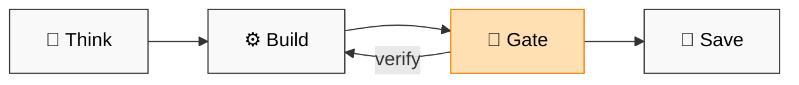

# 🧠 Agent Skills Marketplace — TL;DR

> ⚠️ **Live experiment.** My personal cognitive toolkit—not a universal solution. Beyond dev: writing, analysis, learning, any knowledge work. Unix-geek approach applied to AI collaboration.

## 🏪 Plugins

| Plugin | Description | Status |
|--------|-------------|--------|
| [dstoic](dstoic/) | Core toolkit: OpenSpec, context, retrospectives, investigation | ✅ v0.1.63 |
| [gtd](gtd/) | GTD workflow automation for Obsidian vaults | ✅ v0.1.0 |
| ... | More planned | 🔜 |

## 📖 Why TL;DR?

GenAI makes it too easy to generate walls of text → **cognitive overload** for humans.

| Doc Type | For | Example |
|----------|-----|---------|
| 📄 `README.md` | Humans (30 sec scan) | This file |
| 📚 `README-full.md` | Humans (deep dive) | [Full docs](README-full.md) |
| 🤖 `SKILL.md` | LLMs (token-optimized) | Not for human reading |

Respect your attention. Start here, dive deeper only when needed.

---

## 🎯 Core Idea

**Human+AI collaboration as cognitive discipline.**

Think first. Build in sections. Stay in control.

## 💡 Why OpenSpec?

**AI collaboration over days/weeks needs structure, not ceremony.**



**Mechanics:**
- 🧠 **Think first** → Plan before code (boulder → pebbles)
- 🚧 **Human gates** → Verify between sections, prevent AI runaway
- 💾 **Resumable** → Checkboxes + context persist across sessions
- 🎯 **Adaptive** → Garage (scrappy) or Scale (rigorous)

Not waterfall. Not chaos. **Human-in-the-loop iteration for complex builds.**

## ✨ 3 Things This Does

1. 📋 **OpenSpec** → Plan before code (`init` → `plan` → `develop` → `test` → `sync`)
2. 💾 **Context** → Save/restore sessions (`/save-context`, `/load-context`)
3. 🔍 **Retrospect** → Learn from patterns (`/retrospect-domain`, `/retrospect-collab`)

## 📦 Install

```bash
git clone https://github.com/digital-stoic-org/agent-skills.git
```

Add specific plugin to `.claude/settings.json`:
```json
{"plugins": ["/path/to/agent-skills/dstoic"]}
```

Or install all plugins via marketplace:
```json
{"plugins": ["/path/to/agent-skills"]}
```

## 🚀 Quick Start

```bash
/dstoic:openspec-init    # Setup project
/dstoic:openspec-plan    # Plan a change
/save-context            # Save before leaving
```

## ⚠️ Warning

🪥 CLAUDE.md = toothbrush. See [CLAUDE.md.example](CLAUDE.md.example) for inspiration, don't copy.

The example uses [`rtk`](https://github.com/pszymkowiak/rtk) for token-optimized command output. Install it separately if you want to use the rtk instructions.

---

📚 **Full docs:** [README-full.md](README-full.md)
