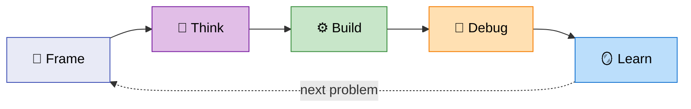

# 🧠 Agent Skills Marketplace

> **Structured human+AI collaboration for knowledge work.**

⚠️ Live experiment. My cognitive toolkit — fork it, adapt it to *your* brain.

---

## 💡 Why This Exists

AI coding tools are powerful but chaotic. Most people either **micromanage** every prompt or **let AI run wild** and pray. Neither scales to real work.

This toolkit treats **AI collaboration as cognitive discipline** — a set of thinking modes you activate depending on the situation, with the human always setting the pace.

## 🎯 Principles

- 🧭 **Frame before act** — classify the problem, then pick the right approach
- 🧠 **Think before build** — brainstorm, investigate, design *before* writing code
- 🚧 **Human controls pace** — gates between sections, you verify, AI continues
- 🪨 **Boulder → Pebbles** — scale your process to the problem (OpenSpec for big, just code for small)
- 💾 **Sessions persist** — save context, resume tomorrow without re-explaining
- 🪞 **Learn from patterns** — retrospectives extract what worked and what didn't

📖 Deep dive: [PHILOSOPHY.md](PHILOSOPHY.md)

---

## 🔄 Cognitive Modes



| Mode | What | Hero Skills |
|------|------|-------------|
| 🧭 **Frame** | Classify the problem → route to the right skill chain | `/frame-problem` (Cynefin + Stacey), `/pick-model` |
| 🧠 **Think** | Divergent ideation, deep technical analysis | `/brainstorm` (SCAMPER), `/investigate` (Issue Trees, Pre-mortem) |
| ⚙️ **Build** | Plan → develop → gate → test → sync | `/openspec-*` suite (7 skills, human-gated sections) |
| 🔧 **Debug** | Search-first troubleshooting with learnings DB | `/troubleshoot` (Wolf Fence, 5 Whys, OODA) |
| 🪞 **Learn** | Extract patterns, persist sessions | `/retrospect-*`, `/save-context`, `/load-context` |

Plus: **tool creation** (`/edit-tool` → routes to skill/command/agent editors), **conversions** (PDF, EPUB, Google Docs), and a **GTD plugin** for task capture.

---

## 🏪 Plugins

| Plugin | Description | Status |
|--------|-------------|--------|
| [dstoic](dstoic/) | Core cognitive toolkit: 25 skills, 16 commands, 4 hooks | ✅ v0.11.3 |
| [gtd](gtd/) | GTD workflow automation for Obsidian vaults | ✅ v0.1.0 |
| ... | More planned | 🔜 |

## 📦 Install

Install from the Claude Code marketplace:

```
/install-plugin https://github.com/digital-stoic-org/agent-skills
```

This installs all plugins (dstoic, gtd). To install a specific plugin only, add it to `.claude/settings.json`:
```json
{"plugins": ["digital-stoic-org/agent-skills/dstoic"]}
```

## 🚀 Quick Start

```bash
/frame-problem how should I approach building a new auth system
# → Classifies as Complicated (HOW) + Boulder
# → Routes to: /investigate → /openspec-plan

/brainstorm product naming ideas for my CLI tool
# → Research → SCAMPER divergence → weighted scoring → recommendation

/troubleshoot "TypeError: Cannot read property 'map' of undefined"
# → WebSearch → qualify → diagnose → OODA → save learning
```

---

## 📖 Documentation Philosophy

GenAI makes it too easy to generate walls of text → **cognitive overload** for humans.

| Doc Type | For | Example |
|----------|-----|---------|
| 📄 `README.md` | Humans (1 min scan) | This file |
| 📚 `README-full.md` | Humans (deep dive) | [Full catalog](README-full.md) |
| 🧭 `PHILOSOPHY.md` | Humans (mindset) | [Principles](PHILOSOPHY.md) |
| 🤖 `SKILL.md` | LLMs (token-optimized) | Not for human reading |

Respect your attention. Start here, dive deeper only when needed.

---

⚠️ 🪥 CLAUDE.md = toothbrush. See [CLAUDE.md.example](CLAUDE.md.example) for inspiration, don't copy. ([Why?](PHILOSOPHY.md#-claudemd--toothbrush))

The example uses [`rtk`](https://github.com/pszymkowiak/rtk) for token-optimized command output. Install it separately if you want to use the rtk instructions.

---

📚 **Full skill catalog:** [README-full.md](README-full.md) · 🧭 **Philosophy:** [PHILOSOPHY.md](PHILOSOPHY.md)
