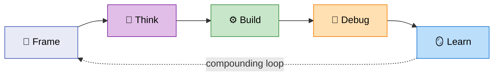

# 🧠 Digital Stoic Praxis

> **Praxis** (πρᾶξις) = practice. Knowledge enacted, not just known.

⚠️ Live experiment. My cognitive toolkit — fork it, adapt it to *your* brain.

---

## 🎯 In One Sentence

A cognitive discipline for human-AI collaboration built on **mutual sharpening** — the human sets intent and directs, the AI challenges and reveals blind spots, and both learn from the loop.

---

## 💡 Why This Exists

AI tools are powerful but chaotic. Most people either **micromanage** every prompt or **let AI run wild** and pray. Neither scales to real work.

This toolkit treats **AI collaboration as cognitive discipline** — a set of thinking modes you activate depending on the situation, where the AI also pushes back on your assumptions. The goal is not to make AI do more. It's to **think better together** — and that includes letting AI challenge the human.

Deeper why → [PHILOSOPHY.md](PHILOSOPHY.md)

---

## 🧭 The Flow


```mermaid
flowchart LR
    F["🧭 Frame"] --> T["🧠 Think"]
    T --> B["⚙️ Build"]
    B --> D["🔧 Debug"]
    D --> L["🪞 Learn"]
    L -.->|"compounding loop"| F

    classDef frame fill:#E8EAF6,stroke:#3F51B5,color:#000
    classDef think fill:#E1BEE7,stroke:#7B1FA2,color:#000
    classDef build fill:#C8E6C9,stroke:#388E3C,color:#000
    classDef debug fill:#FFE0B2,stroke:#F57C00,color:#000
    classDef learn fill:#BBDEFB,stroke:#1976D2,color:#000

    class F frame
    class T think
    class B build
    class D debug
    class L learn
```

| Mode | What | Hero Skills |
|------|------|-------------|
| 🧭 **Frame** | Triangulate the problem (3 tests) → route to the right skill chain | `/frame-problem` (Cynefin triangulation), `/pick-model` |
| 🧠 **Think** | Divergent ideation, deep analysis, adversarial review | `/brainstorm` (SCAMPER), `/investigate`, `/probe`, `/challenge` |
| ⚙️ **Build** | Plan → develop → gate → test → sync | `/openspec-*` suite (9 skills, human-gated sections) |
| 🔧 **Debug** | Search-first troubleshooting with learnings DB | `/troubleshoot` (Wolf Fence, 5 Whys, OODA), `/experiment` |
| 🪞 **Learn** | Extract patterns, persist sessions | `/retrospect-*`, `/save-context`, `/load-context` |

Plus: **tool creation** (`/edit-tool`), **conversions** (PDF, EPUB, Google Docs), and domain plugins (GTD, coaching, business analysis, philosopher personas).

---

## 🤝 Human-AI Blend

Not human-drives-AI. Not AI-drives-human. **Mutual sharpening:**

- **Human → AI**: Sets intent, chooses cognitive mode, directs execution, verifies at gates
- **AI → Human**: Challenges assumptions, surfaces blind spots, reveals patterns the human can't self-observe
- **Together**: The human thinks more clearly *because* the AI pushes back. The AI produces better work *because* the human sets precise intent.

**Key**: Posture before technique — but posture includes the willingness to be challenged.

Full autonomy spectrum + orchestrated agency → [PRACTICE.md](PRACTICE.md#-the-human-ai-blend)

---

## 💰 Cognitive ROI (Return on Tokens)

Not "how fast" — **how deep**:

| Tier | What | Value/Token |
|------|------|-------------|
| ⚙️ Automation | Rote tasks (convert, deploy, format) | Low |
| 🤝 Assisted Thinking | AI structures human thought | Medium |
| 🧠 Amplified Judgment | AI challenges/deepens reasoning | **High** |

**Maturity = shifting tokens from ⚙️ toward 🧠.**

Multiplied by **context efficiency** (don't waste tokens re-explaining) and **compounding** (learnings reduce future spend). Full model → [PRACTICE.md](PRACTICE.md#-cognitive-roi-return-on-tokens)

---

## 📊 By the Numbers

- **49 skills** across 5 cognitive modes + utilities
- **6 plugins**: core (dstoic), GTD, coaching, business analysis, philosopher personas, cowork
- **2 agents**: devil's advocate (debiasing), context summarizer
- **4 hooks**: notifications, session capture, debug dumps, daily sync
- **3 execution modes**: garage (default), scale, maintenance
- **🪥 Toothbrush principle**: This is one practitioner's discipline. Don't copy — adapt. [Why?](PHILOSOPHY.md#-the-toothbrush-principle)
- **📊 Benchmarked** against 7 frameworks including [ECC](https://github.com/affaan-m/everything-claude-code) (144K⭐), [ACP](https://lexler.github.io/augmented-coding-patterns/), [BMAD](https://github.com/bmad-sim/BMAD-METHOD) (36K⭐) — leads on context quality, cognitive depth, adversarial thinking. Only BMAD edges ahead (for teams). Details → [PRACTICE.md](PRACTICE.md#-benchmark-results-april-2026) · [benchmarks/](benchmarks/)

---

## 🏪 Plugins

| Plugin | Description | Status |
|--------|-------------|--------|
| [dstoic](dstoic/) | Core cognitive toolkit: 48 skills, 0 commands, 4 hooks | ✅ v0.27.0 |
| [gtd](gtd/) | GTD workflow automation for Obsidian vaults | ✅ v0.3.1 |
| [coach](coach/) | Personal coaching: CLEAR + GROW protocols | ✅ v0.3.0 |
| [biz](biz/) | Business analysis toolkit: competitive analysis, UX strategy, UX wireframes, UX evaluation, UX brand identity | ✅ v0.7.2 |
| [philosopher](philosopher/) | Philosopher personas: historically-grounded dialogue, source attribution, AI meta-cognition | ✅ v0.6.0 |
| [cowork](cowork/) | Multi-project context management: switch projects, save/load sessions, ref/wip file zones + sync. Non-CLI friendly | ✅ v0.4.0 |

## 📦 Install

```
/install-plugin https://github.com/digital-stoic-org/agent-skills
```

To install a specific plugin only, add it to `.claude/settings.json`:
```json
{"plugins": ["digital-stoic-org/agent-skills/dstoic"]}
```

## 🚀 Quick Start

```bash
/frame-problem how should I approach building a new auth system
# → Triangulates: Keogh=2 (team expertise), Predictable=yes, Disassemble=yes
# → Complicated (3/3 agree) + Boulder → /investigate → /openspec-plan

/brainstorm product naming ideas for my CLI tool
# → Research → SCAMPER divergence → weighted scoring → recommendation

/troubleshoot "TypeError: Cannot read property 'map' of undefined"
# → WebSearch → qualify → diagnose → OODA → save learning
```

---

## 📖 Documentation — Two Cognitions, One Practice

This toolkit serves **two kinds of readers** with fundamentally different needs:

**👤 Human cognition** — scans, skims, needs cognitive ease. Overwhelmed by walls of text. Seeks the "aha" moment, then dives deeper only when motivated. Diagrams and structure reduce cognitive load.

**🤖 LLM cognition** — parses tokens. Needs directive density, structured data, zero filler. Diagrams are nice but YAML is better. Self-contained is better than linked.

The practice itself is about **combining both**: a human who thinks consciously and an AI that both amplifies and challenges that thinking. The documentation mirrors this — each layer optimized for its reader:

| # | Document | Reader | Job |
|---|----------|--------|-----|
| 1 | 📄 **README.md** | 👤 Human | **"What + How (TL;DR)"** — This file. The GitHub landing page. |
| 2 | 🧭 [PHILOSOPHY.md](PHILOSOPHY.md) | 👤 Human | **"Why"** — Beliefs, 7 principles, execution modes, toothbrush principle |
| 3 | 🎯 [PRACTICE.md](PRACTICE.md) | 👤 Human | **"Deep How"** — Cognitive ROI model, autonomy spectrum, benchmarking |
| 4 | 📚 [README-full.md](README-full.md) | 👤 Human | **"Every Skill"** — Complete catalog, reference |
| 5 | 🤖 [PRACTICE-llm.md](PRACTICE-llm.md) | 🤖 LLM | **Self-contained benchmark** — Token-optimized, YAML-heavy, all-in-one |
| — | 🤖 `SKILL.md` (per skill) | 🤖 LLM | **Execution directives** — What the LLM actually runs |

Human docs link to each other (progressive depth). LLM docs are **self-contained** (no navigation, everything in one shot). The practice works because both cognitions play to their strengths.

---

⚠️ 🪥 CLAUDE.md = toothbrush. See [CLAUDE.md.example](CLAUDE.md.example) for inspiration, don't copy. ([Why?](PHILOSOPHY.md#-the-toothbrush-principle))

The example uses [`rtk`](https://github.com/pszymkowiak/rtk) for token-optimized command output. Install it separately if you want to use the rtk instructions.
