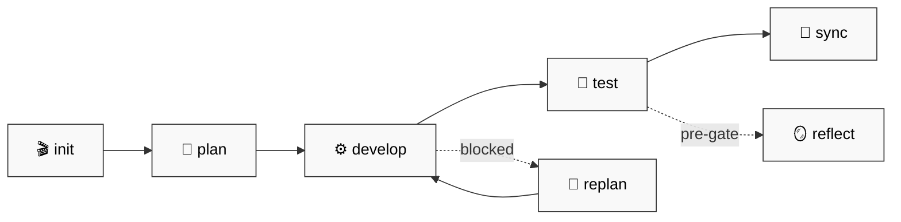
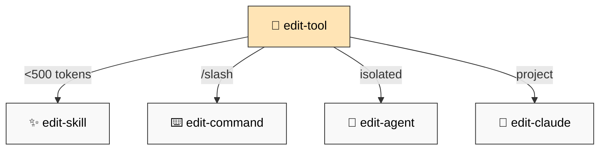
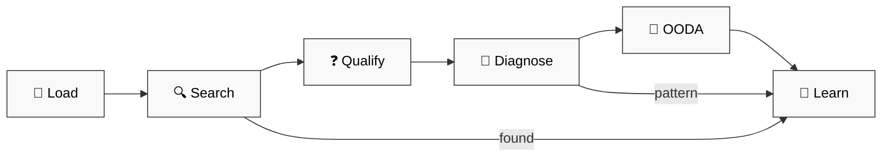

# 📚 dstoic Plugin — Full Documentation

> ⚠️ **Live experiment.** Highly personalized to my working style and cognitive traits. Fork and adapt to your own patterns.

## 🎯 Overview

Cognitive development toolkit for Claude Code:

| # | Feature | Purpose |
|---|---------|---------|
| 1 | 📋 **OpenSpec Workflow** | Plan → Develop → Test → Sync |
| 2 | 💾 **Context Management** | Save/restore LLM-optimized state |
| 3 | 🔍 **Retrospective Analysis** | Learn from collaboration |
| 4 | 🔧 **Tool Orchestration** | Create skills, commands, agents |
| 5 | 🔧 **Troubleshoot** | Search-first debugging with learnings |

---

## 📋 OpenSpec Lifecycle

| Skill | When |
|-------|------|
| `openspec-init` | 🎬 New project |
| `openspec-plan` | 📝 Before coding |
| `openspec-develop` | ⚙️ Implementation |
| `openspec-test` | 🧪 Verification |
| `openspec-replan` | 🔀 Blocked/drifted |
| `openspec-sync` | 🔄 Update docs |
| `openspec-reflect` | 🪞 Pre-gate check |

---

## 🔧 Tool Creation

`edit-tool` orchestrator routes to:

| Type | Criteria | Editor |
|------|----------|--------|
| ✨ Skill | <500 tokens, auto-invoked | `edit-skill` |
| ⌨️ Command | User-triggered `/slash` | `edit-command` |
| 🤖 Agent | Isolated context | `edit-agent` |
| 📄 CLAUDE.md | Project context | `edit-claude` |

---

## 💾 Context Management

| Command | Purpose |
|---------|---------|
| `/save-context` | 💾 Serialize → CONTEXT-llm.md (1500-2000 tokens) |
| `/load-context` | 📥 Resume (`--full` for expansion) |

---

## 🔧 Troubleshoot

Search-first debugging with learnings accumulation.

| Phase | What |
|-------|------|
| **Load** | Read learnings.yaml for known patterns |
| **Search** | WebSearch SO, GitHub, Docs, Reddit |
| **Qualify** | 2-3 questions (stack, env, changed) |
| **Diagnose** | Mental models → Isolation → 5 Whys |
| **OODA** | Observe → Orient → Decide → Act |
| **Learn** | Save pattern to learnings.yaml |

**Techniques:** Wolf Fence, 5 Whys, Fishbone 6 M's, Rubber Duck

---

## 🔍 Session Analysis

| Command | Focus |
|---------|-------|
| `/retrospect-domain` | 🎓 WHAT/WHY learned |
| `/retrospect-collab` | 🤝 HOW we worked |
| `/retrospect-report` | 📊 Trends over time |

---

## ⚙️ Configuration

Hooks enabled by default. Edit `hooks.json` to customize.

---

## 📦 Version

`0.1.49`
