# 📚 dstoic Plugin — Full Documentation

> ⚠️ **Live experiment.** Highly personalized to my working style and cognitive traits. Fork and adapt to your own patterns.

## 🎯 Overview

Cognitive development toolkit for Claude Code:

| # | Feature | Purpose |
|---|---------|---------|
| 1 | 📋 **OpenSpec Workflow** | Plan → Develop → Test → Sync |
| 2 | 💾 **Context Management** | Save/restore LLM-optimized state |
| 3 | 🔍 **Retrospective Analysis** | Learn from collaboration |
| 4 | 🔧 **Tool Orchestration** | Create skills, commands, agents |

---

## 📋 OpenSpec Lifecycle

```mermaid
flowchart LR
    init["🎬 init"] --> plan["📝 plan"]
    plan --> develop["⚙️ develop"]
    develop --> test["🧪 test"]
    test --> sync["🔄 sync"]

    develop -.->|blocked| replan["🔀 replan"]
    replan --> develop

    test -.->|pre-gate| reflect["🪞 reflect"]

    classDef default fill:#f9f9f9,stroke:#333,color:#000
```

| Skill | When |
|-------|------|
| `openspec-init` | 🎬 New project |
| `openspec-plan` | 📝 Before coding |
| `openspec-develop` | ⚙️ Implementation |
| `openspec-test` | 🧪 Verification |
| `openspec-replan` | 🔀 Blocked/drifted |
| `openspec-sync` | 🔄 Update docs |
| `openspec-reflect` | 🪞 Pre-gate check |

---

## 🔧 Tool Creation

`edit-tool` orchestrator routes to:

```mermaid
flowchart TD
    edit["🎯 edit-tool"]
    edit -->|"<500 tokens"| skill["✨ edit-skill"]
    edit -->|"/slash"| command["⌨️ edit-command"]
    edit -->|"isolated"| agent["🤖 edit-agent"]
    edit -->|"project"| claude["📄 edit-claude"]

    classDef default fill:#f9f9f9,stroke:#333,color:#000
    classDef router fill:#FFE4B5,stroke:#333,color:#000
    class edit router
```

| Type | Criteria | Editor |
|------|----------|--------|
| ✨ Skill | <500 tokens, auto-invoked | `edit-skill` |
| ⌨️ Command | User-triggered `/slash` | `edit-command` |
| 🤖 Agent | Isolated context | `edit-agent` |
| 📄 CLAUDE.md | Project context | `edit-claude` |

---

## 💾 Context Management

| Command | Purpose |
|---------|---------|
| `/save-context` | 💾 Serialize → CONTEXT-llm.md (1500-2000 tokens) |
| `/load-context` | 📥 Resume (`--full` for expansion) |

---

## 🔍 Session Analysis

| Command | Focus |
|---------|-------|
| `/retrospect-domain` | 🎓 WHAT/WHY learned |
| `/retrospect-collab` | 🤝 HOW we worked |
| `/retrospect-report` | 📊 Trends over time |

---

## ⚙️ Configuration

Hooks enabled by default. Edit `hooks.json` to customize.

---

## 📦 Version

`0.1.42`
