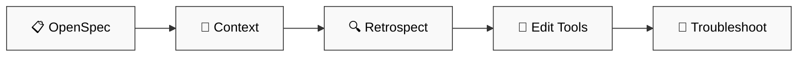

# 🧠 dstoic Plugin — TL;DR

> ⚠️ Live experiment. My brain, not yours.

## ✨ What



| # | Feature | Purpose |
|---|---------|---------|
| 1 | 📋 **OpenSpec** | plan → develop → test → sync |
| 2 | 💾 **Context** | save/restore sessions |
| 3 | 🔍 **Retrospect** | learn from patterns |
| 4 | 🔧 **Edit tools** | create skills/commands/agents |
| 5 | 🔧 **Troubleshoot** | search-first debugging with learnings |

## 🚀 Quick Start

```bash
/dstoic:openspec-init
/dstoic:openspec-plan
/save-context
```

## 📦 Version

`0.1.58`

---

📚 **Full docs:** [README-full.md](README-full.md)
