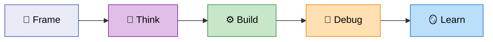

# 🧠 dstoic Plugin — TL;DR

> ⚠️ Live experiment. My cognitive toolkit — adapt it to your brain.

## ✨ What



| Mode | What it does |
|------|-------------|
| 🧭 **Frame** | Classify problem → route to right skill chain (`/frame-problem`, `/pick-model`) |
| 🧠 **Think** | Brainstorm, investigate, deep analysis (`/brainstorm`, `/investigate`) |
| ⚙️ **Build** | Plan → develop → gate → test → sync (`/openspec-*` suite) |
| 🔧 **Debug** | Search-first troubleshooting with learnings (`/troubleshoot`) |
| 🪞 **Learn** | Retrospectives, context save/restore (`/retrospect-*`, `/save-context`) |

Plus: tool creation, conversions, and hooks.

## 🚀 Quick Start

```bash
/frame-problem how should I approach this new feature
/brainstorm naming ideas for my project
/troubleshoot "error: module not found"
```

## 📦 Version

`0.8.0` · 23 skills · 15 commands · 3 hooks

---

📚 **Full catalog:** [README-full.md](../README-full.md) · 🧭 **Philosophy:** [PHILOSOPHY.md](../PHILOSOPHY.md)
