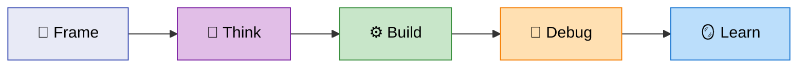

# 🧠 dstoic Plugin — TL;DR

> ⚠️ Live experiment. My cognitive toolkit — adapt it to your brain.

## ✨ What


```mermaid
flowchart LR
    F["🧭 Frame"] --> T["🧠 Think"]
    T --> B["⚙️ Build"]
    B --> D["🔧 Debug"]
    D --> L["🪞 Learn"]

    classDef frame fill:#E8EAF6,stroke:#3F51B5,color:#000
    classDef think fill:#E1BEE7,stroke:#7B1FA2,color:#000
    classDef build fill:#C8E6C9,stroke:#388E3C,color:#000
    classDef debug fill:#FFE0B2,stroke:#F57C00,color:#000
    classDef learn fill:#BBDEFB,stroke:#1976D2,color:#000

    class F frame
    class T think
    class B build
    class D debug
    class L learn
```

| Skill | Purpose |
|-------|---------|
| `/commit-repo` | 🗂️ Streamlined git commit with single human gate |
| `/pick-model` | 🎯 Recommend optimal model (haiku/sonnet/opus) for the task |
| `/save-context` | 💾 Save session state to CONTEXT-llm.md |
| `/load-context` | 📥 Resume session from CONTEXT-llm.md |
| `/scratch` | 🗒️ Session scratch pad for parking side-thoughts |
| `/kaizen` | ⚡ Capture friction with any Praxis artifact |
| `/dump-output` | 📤 Toggle auto-dump of output to `.dump/` |

Plus: 3 hooks (praxis-dir guard, tmux notifications, debug dumps) and 1 agent (devil-advocate). _(Retrospect-capture, list-context-sync, session-pin & recent-notes hooks now live in the `experimental` plugin — staged, gated off.)_

> ℹ️ Skills like `/frame-problem`, `/brainstorm`, `/troubleshoot`, `/openspec-*`, `/retrospect-*` etc. were split into dedicated plugins (cognitive, openspec, retrospect, toolsmith, content, convert). See [README.md](../README.md) for the full plugin table.

## 🚀 Quick Start

```bash
/pick-model should I use haiku or opus for this code review
/scratch park this thought about the auth refactor
/commit-repo
```

## 📦 Version

`0.39.0` · 8 skills · 1 agent · 7 hooks

---

📚 **Full catalog:** [README-full.md](../README-full.md) · 🧭 **Philosophy:** [PHILOSOPHY.md](../PHILOSOPHY.md)
