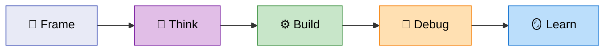

# 🧠 dstoic Plugin — TL;DR

> ⚠️ Live experiment. My cognitive toolkit — adapt it to your brain.

## ✨ What


```mermaid
flowchart LR
    F["🧭 Frame"] --> T["🧠 Think"]
    T --> B["⚙️ Build"]
    B --> D["🔧 Debug"]
    D --> L["🪞 Learn"]

    classDef frame fill:#E8EAF6,stroke:#3F51B5,color:#000
    classDef think fill:#E1BEE7,stroke:#7B1FA2,color:#000
    classDef build fill:#C8E6C9,stroke:#388E3C,color:#000
    classDef debug fill:#FFE0B2,stroke:#F57C00,color:#000
    classDef learn fill:#BBDEFB,stroke:#1976D2,color:#000

    class F frame
    class T think
    class B build
    class D debug
    class L learn
```

| Mode | What it does |
|------|-------------|
| 🧭 **Frame** | Triangulate problem (3 tests) → route to right skill chain (`/frame-problem`, `/pick-model`) |
| 🧠 **Think** | Brainstorm, investigate, deep analysis, cross-project bridging (`/brainstorm`, `/investigate`, `/bridge`) |
| ⚙️ **Build** | Plan → develop → gate → test → sync (`/openspec-*` suite) |
| 🔧 **Debug** | Search-first troubleshooting with learnings (`/troubleshoot`) |
| 🪞 **Learn** | Retrospectives, context save/restore (`/retrospect-*`, `/save-context`) |

Plus: tool creation, conversions, and hooks.

## 🚀 Quick Start

```bash
/frame-problem how should I approach this new feature
/brainstorm naming ideas for my project
/troubleshoot "error: module not found"
```

## 📦 Version

`0.33.0` · 51 skills · 0 commands · 6 hooks

---

📚 **Full catalog:** [README-full.md](../README-full.md) · 🧭 **Philosophy:** [PHILOSOPHY.md](../PHILOSOPHY.md)
