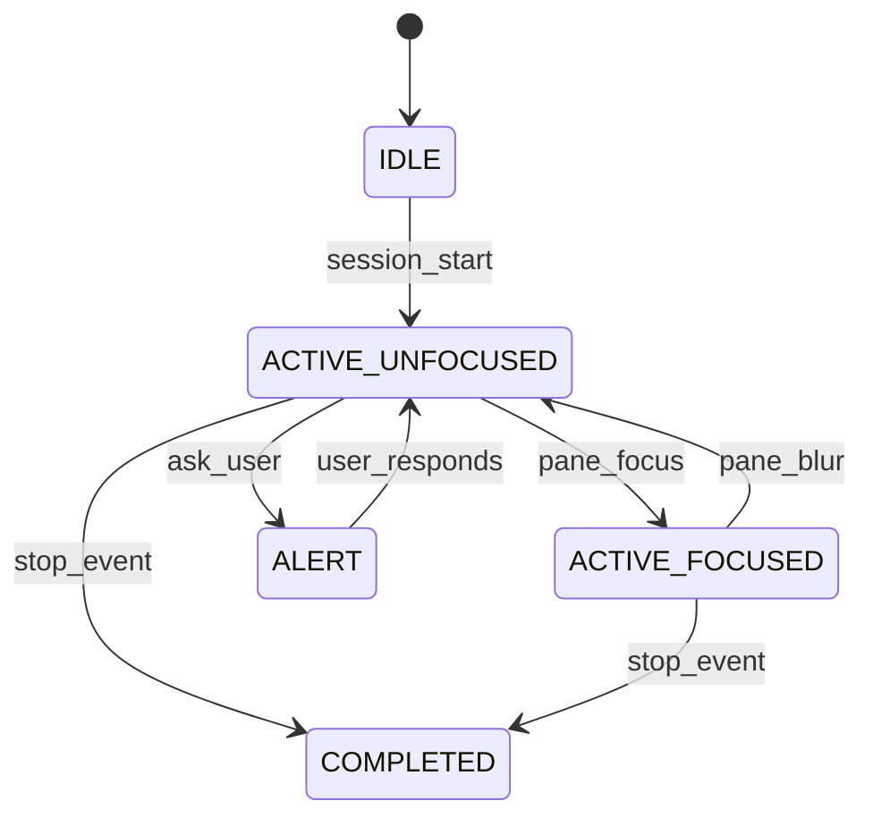

# 📚 Hooks — Full Documentation

> ⚠️ **Live experiment.** Highly personalized—adapt to your setup.

## 🎯 Overview

| Hook | Purpose | Requires |
|------|---------|----------|
| 🖥️ `notify-tmux.sh` | Visual tmux window notifications | tmux |
| 📝 `retrospect-capture.sh` | Auto-log session events | bash |
| 📤 `dump-output.sh` | Debug artifacts on stop | bash |

---

## 🖥️ notify-tmux.sh

Context-aware tmux window notification.

### ✨ Features

- 🤖 Persistent robot emoji for Claude sessions
- ✅ COMPLETED state when Claude finishes
- 🚨 ALERT state for user questions
- 🔧 Tool emojis (✏️🧪🔍⚙️🌐💭) during work
- 👁️ Focus-aware: removes status when focused

### 🔄 States



| State | Display | When |
|-------|---------|------|
| 🔷 IDLE | (none) | No session |
| 🟢 ACTIVE_UNFOCUSED | 🤖{tool} | Working, not focused |
| 🔵 ACTIVE_FOCUSED | 🤖 | Working, focused |
| 🔴 ALERT | 🤖🚨 | Waiting for user |
| 🟣 COMPLETED | 🤖✅ | Done |

### 🔧 Manual Install

```bash
chmod +x hooks/notify-tmux.sh
```

Configure in `.claude/settings.json`:
```json
{
  "hooks": {
    "PostToolUse": [{"hooks": [{"type": "command", "command": "./hooks/notify-tmux.sh"}]}],
    "Stop": [{"hooks": [{"type": "command", "command": "./hooks/notify-tmux.sh"}]}]
  }
}
```

---

## 📝 retrospect-capture.sh

Captures session events for later analysis with `/retrospect-*` commands.

### 📋 Events Captured

| Event | When |
|-------|------|
| `SessionStart` | 🎬 Session begins |
| `SessionEnd` | 🏁 Session ends |
| `UserPromptSubmit` | 💬 User sends message |
| `PreToolUse` / `PostToolUse` | 🔧 Tool execution |
| `PermissionRequest` | 🔐 Permission asked |
| `Stop` / `SubagentStop` | 🛑 Execution stops |
| `PreCompact` | 📦 Before compaction |
| `Notification` | 🔔 System notification |

---

## 📤 dump-output.sh

Dumps session output to `.dump/` on stop for debugging.

---

## ⚙️ Configuration

All hooks configured in `hooks.json`. Edit to enable/disable specific hooks.

---

## ⚠️ Known Limitations

- 🟣 COMPLETED state persists after Claude exits (no cleanup trigger)
- ✅ Workaround: acceptable for most use cases
