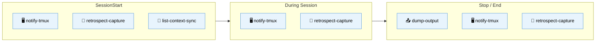
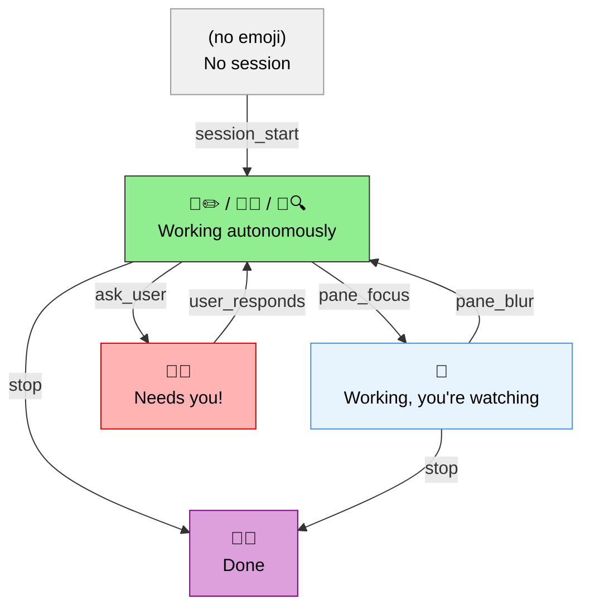
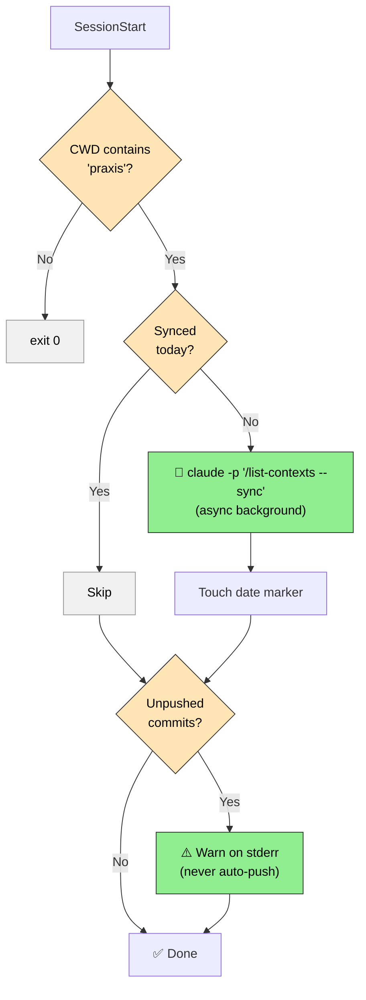

# 📚 Hooks — Full Documentation

> ⚠️ **Live experiment.** Highly personalized—adapt to your setup.

## 🎯 Overview

| Hook | Purpose | Why | Trigger | Requires |
|------|---------|-----|---------|----------|
| 🖥️ `notify-tmux.sh` | Visual tmux window notifications | Know when the agent needs you vs working autonomously | Multiple | tmux |
| 📝 `retrospect-capture.sh` | Auto-log session events | Reflect on AI-human collab per project — beyond execution-centric Agile retros | Multiple | bash, jq |
| 📤 `dump-output.sh` | Debug artifacts on stop | Review agent output later without scrolling back | Stop | bash, jq |
| 🔄 `list-context-sync.sh` | Daily context sync + git notify | Stop wasting session starts on manual housekeeping | SessionStart | bash, jq, claude CLI |

---

## 🖥️ notify-tmux.sh

Context-aware tmux window notification with double emoji prefixes (🤖 + status).

### 🔄 States

| Tmux Display | Meaning | Tool Emojis |
|-------------|---------|-------------|
| *(none)* | No active session | — |
| 🤖✏️ | Writing/editing files | Edit, Write |
| 🤖🧪 | Running tests | Bash (test) |
| 🤖🔍 | Searching/reading code | Grep, Glob, Read |
| 🤖⚙️ | Running commands | Bash |
| 🤖🌐 | Web fetch | WebFetch, WebSearch |
| 🤖💭 | Thinking/subagent | Task |
| 🤖🚨 | **Needs your input** | AskUserQuestion |
| 🤖✅ | **Done** | — |

Focus-aware: tool emoji hidden when pane is focused (you're already watching).

---

## 📝 retrospect-capture.sh

Captures all 10 Claude Code lifecycle events to `.retro/sessions/.staging/{session-id}.jsonl` for later analysis with `/retrospect-*` skills.

| Event | When |
|-------|------|
| `SessionStart` | 🎬 Session begins |
| `SessionEnd` | 🏁 Session ends (finalizes to YAML) |
| `UserPromptSubmit` | 💬 User sends message |
| `PreToolUse` / `PostToolUse` | 🔧 Tool execution |
| `PermissionRequest` | 🔐 Permission asked |
| `Stop` / `SubagentStop` | 🛑 Execution stops |
| `PreCompact` | 📦 Before compaction |
| `Notification` | 🔔 System notification |

---

## 📤 dump-output.sh

Dumps Claude's last output to `$CLAUDE_PROJECT_DIR/.dump/{timestamp}.md` on Stop event. Toggle-controlled — only active when `.dump/.enabled` exists. Use `/dump-output` skill to toggle.

**Safety**: Checks `stop_hook_active` to prevent infinite loops, sleeps 0.5s for transcript flush.

---

## 🔄 list-context-sync.sh

Opportunistic daily maintenance on session start. Praxis-only (exits immediately for other projects).

**State**: `{git_root}/.tmp/list-context-sync/{YYYYMMDD}-context-sync` marker prevents re-runs. Auto-cleaned after 2 days.

**Log**: `{git_root}/.tmp/list-context-sync.log`

---

## ⚙️ Configuration

All hooks configured in `hooks.json`. Edit to enable/disable specific hooks.

## ⚠️ Known Limitations

- 🟣 COMPLETED tmux state persists after Claude exits (no cleanup trigger)
- ✅ Workaround: acceptable for most use cases
