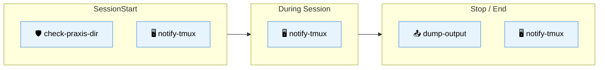
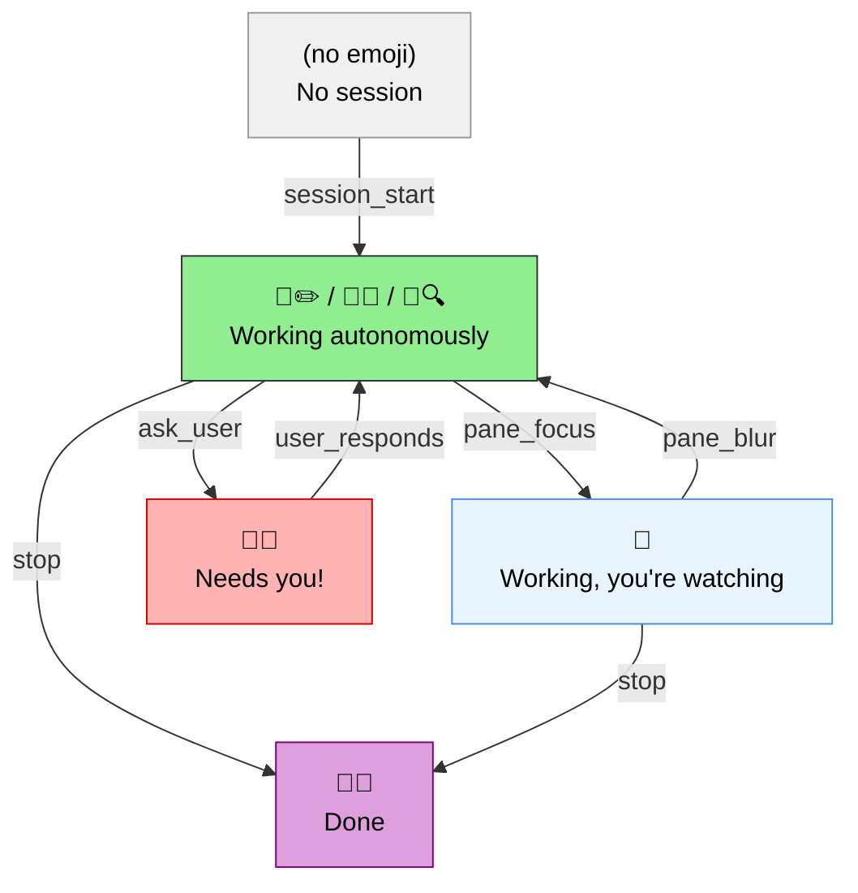

# 📚 Hooks — Full Documentation

> ⚠️ **Live experiment.** Highly personalized—adapt to your setup.

## 🎯 Overview

| Hook | Purpose | Why | Trigger | Requires |
|------|---------|-----|---------|----------|
| 🛡️ `check-praxis-dir.sh` | Guard: warn when outside the Praxis dir | Avoid running session automation in the wrong tree | SessionStart | bash |
| 🖥️ `notify-tmux.sh` | Visual tmux window notifications | Know when the agent needs you vs working autonomously | Multiple | tmux |
| 📤 `dump-output.sh` | Debug artifacts on stop | Review agent output later without scrolling back | Stop | bash, jq |

> 📦 **Moved to the `experimental` plugin** (staged, gated off by default): `retrospect-capture.sh`, `list-context-sync.sh`, `session-pin.sh`, `recent-notes.sh`. See `experimental/hooks/`.

```mermaid
flowchart LR
    subgraph S1["SessionStart"]
        A0["🛡️ check-praxis-dir"]
        A1["🖥️ notify-tmux"]
    end

    subgraph S2["During Session"]
        B1["🖥️ notify-tmux"]
    end

    subgraph S3["Stop / End"]
        C1["📤 dump-output"]
        C2["🖥️ notify-tmux"]
    end

    S1 --> S2 --> S3

    classDef hook fill:#E8F4FD,stroke:#4A90D9,color:#000
    classDef phase fill:#F0F0F0,stroke:#999,color:#000
    class A0,A1,B1,C1,C2 hook
```

---

## 🖥️ notify-tmux.sh

Context-aware tmux window notification with double emoji prefixes (🤖 + status).

### 🔄 States

```mermaid
flowchart TD
    IDLE["(no emoji)<br/>No session"] -->|session_start| UNFOCUSED["🤖✏️ / 🤖🧪 / 🤖🔍<br/>Working autonomously"]
    UNFOCUSED -->|pane_focus| FOCUSED["🤖<br/>Working, you're watching"]
    FOCUSED -->|pane_blur| UNFOCUSED
    UNFOCUSED -->|ask_user| ALERT["🤖🚨<br/>Needs you!"]
    ALERT -->|user_responds| UNFOCUSED
    UNFOCUSED -->|stop| DONE["🤖✅<br/>Done"]
    FOCUSED -->|stop| DONE

    classDef idle fill:#F0F0F0,stroke:#999,color:#000
    classDef active fill:#90EE90,stroke:#333,color:#000
    classDef focused fill:#E8F4FD,stroke:#4A90D9,color:#000
    classDef alert fill:#FFB3B3,stroke:#CC0000,color:#000
    classDef done fill:#DDA0DD,stroke:#800080,color:#000
    class IDLE idle
    class UNFOCUSED active
    class FOCUSED focused
    class ALERT alert
    class DONE done
```

| Tmux Display | Meaning | Tool Emojis |
|-------------|---------|-------------|
| *(none)* | No active session | — |
| 🤖✏️ | Writing/editing files | Edit, Write |
| 🤖🧪 | Running tests | Bash (test) |
| 🤖🔍 | Searching/reading code | Grep, Glob, Read |
| 🤖⚙️ | Running commands | Bash |
| 🤖🌐 | Web fetch | WebFetch, WebSearch |
| 🤖💭 | Thinking/subagent | Task |
| 🤖🚨 | **Needs your input** | AskUserQuestion |
| 🤖✅ | **Done** | — |

Focus-aware: tool emoji hidden when pane is focused (you're already watching).

---

## 📤 dump-output.sh

Dumps Claude's last output to `$CLAUDE_PROJECT_DIR/.dump/{timestamp}.md` on Stop event. Toggle-controlled — only active when `.dump/.enabled` exists. Use `/dump-output` skill to toggle.

**Safety**: Checks `stop_hook_active` to prevent infinite loops, sleeps 0.5s for transcript flush.

---

## ⚙️ Configuration

All hooks configured in `hooks.json`. Edit to enable/disable specific hooks.

## ⚠️ Known Limitations

- 🟣 COMPLETED tmux state persists after Claude exits (no cleanup trigger)
- ✅ Workaround: acceptable for most use cases
