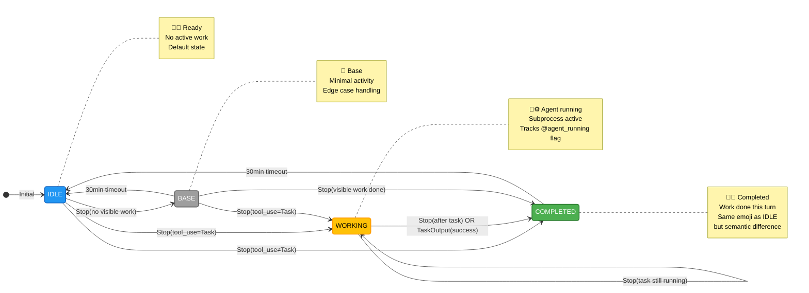

# notify-tmux.sh State Machine

Complete state diagram for the context-aware tmux notification hook.

**Model**: Stop-Only Completion Model
**Updates**: End-of-turn only (Stop hook)
**Hook Config**: PostToolUse NOT configured (intentional - see Path A for real-time mode)

---

## State Diagram



---

## State Definitions

### 🤖✅ IDLE (Default State)
**Display**: `🤖✅<project_name>`
**Meaning**: Ready for work, no active tasks
**Tmux Variables**:
- `@agent_running=false`
- `@last_completed_time=""` (or expired >30min)

**Behavior**:
- Default startup state
- Returns here after 30min timeout from COMPLETED or BASE
- Indicates Claude is listening and ready

**Entry**: Initial state, or timeout from COMPLETED/BASE
**Exit**: Stop event with tool use detected

---

### 🤖⚙️ WORKING (Agent Subprocess)
**Display**: `🤖⚙️<project_name>`
**Meaning**: Background agent/task running
**Tmux Variables**:
- `@agent_running=true`

**Behavior**:
- Set when Task tool launches subprocess
- Cleared by TaskOutput hook (eventual consistency)
- If TaskOutput not configured: cleared on next Stop (BUG-2)
- Provides visibility that agent is active even if parent session continues working

**Entry**: Stop event with `tool_name == "Task"`
**Exit**: Stop event after task completes, or TaskOutput success

---

### 🤖✅ COMPLETED (Work Done)
**Display**: `🤖✅<project_name>`
**Meaning**: Work completed this turn
**Tmux Variables**:
- `@agent_running=false`
- `@last_completed_time=<timestamp>`

**Behavior**:
- Same emoji as IDLE (🤖✅) - visually indistinguishable
- Semantic difference: completion timestamp present
- Timeout: 30 minutes → transitions to IDLE
- Indicates successful work completion

**Entry**: Stop event with visible tool use (Edit, Write, Bash, etc.)
**Exit**: 30min timeout → IDLE

---

### 🤖 BASE (Minimal Activity)
**Display**: `🤖<project_name>`
**Meaning**: Activity detected but no completion markers
**Tmux Variables**:
- `@agent_running=false`
- `@last_completed_time=""` (or expired)

**Behavior**:
- Edge case state for ambiguous scenarios
- No tool use detected, but Stop event fired
- Timeout: 30 minutes → transitions to IDLE

**Use Cases**:
- Read-only operations (Read, Grep, Glob only)
- Planning without execution
- Session management events

**Entry**: Stop event with no visible work
**Exit**: 30min timeout → IDLE, or new work → COMPLETED/WORKING

---

## Transitions (8 Total - All Working)

### From IDLE (3 transitions)

#### IDLE → WORKING
**Trigger**: Stop event with Task tool use
**Condition**: `last_tool_use_name == "Task"`
**Script Logic**: Lines 64-66 (set `@agent_running=true`)
**Effect**: Window name changes to `🤖⚙️<project_name>`

#### IDLE → COMPLETED
**Trigger**: Stop event with visible work (not Task)
**Condition**: Tool use detected (Edit, Write, Bash, etc.) AND no Task
**Script Logic**: Lines 78-82 (set `@last_completed_time`)
**Effect**: Window name changes to `🤖✅<project_name>` with timestamp

#### IDLE → BASE
**Trigger**: Stop event with no visible work
**Condition**: No tool use or read-only operations (Read/Grep/Glob)
**Script Logic**: Lines 84-86 (no timestamps set)
**Effect**: Window name changes to `🤖<project_name>`

---

### From WORKING (2 transitions)

#### WORKING → COMPLETED
**Trigger**: Stop event after task completes OR TaskOutput success
**Condition**: Task finished AND visible work done
**Script Logic**: Lines 69-71 (TaskOutput clears `@agent_running`) + Lines 78-82 (set completion)
**Effect**: Window name changes to `🤖✅<project_name>` with timestamp

**Note**: Dual trigger (Stop OR TaskOutput)
- Primary: Stop event (always fires)
- Secondary: TaskOutput (if configured) - NOT currently configured (BUG-2)

#### WORKING → WORKING
**Trigger**: Stop event while task still running
**Condition**: `@agent_running=true` persists
**Script Logic**: Lines 32-35 (check `@agent_running`, maintain 🤖⚙️)
**Effect**: No state change, window stays `🤖⚙️<project_name>`

---

### From COMPLETED (1 transition)

#### COMPLETED → IDLE
**Trigger**: 30-minute timeout
**Condition**: `current_time - @last_completed_time > 1800s`
**Script Logic**: Lines 89-92 (bash arithmetic timeout check)
**Effect**: Clear completion timestamp, return to ready state

---

### From BASE (3 transitions)

#### BASE → IDLE
**Trigger**: 30-minute timeout
**Condition**: No activity for 30 minutes
**Script Logic**: Same as COMPLETED → IDLE timeout
**Effect**: Reset to default IDLE state

#### BASE → WORKING
**Trigger**: Stop event with Task tool use
**Condition**: Same as IDLE → WORKING
**Script Logic**: Lines 64-66
**Effect**: Window name changes to `🤖⚙️<project_name>`

#### BASE → COMPLETED
**Trigger**: Stop event with visible work
**Condition**: Tool use detected (Edit, Write, Bash)
**Script Logic**: Lines 78-82
**Effect**: Window name changes to `🤖✅<project_name>` with timestamp

---

## Hook Configuration

### Currently Configured

#### Stop Hook ✅
**Status**: Configured in `hooks.json`
**Fires**: End of every turn (when Claude finishes responding)
**Purpose**: Primary state transition trigger
**Frequency**: 1 per turn (~every 10-60 seconds)

**Behavior**:
- Updates all tmux variables (`@agent_running`, `@last_completed_time`)
- Refreshes window name with appropriate emoji
- Checks timeouts (30min for COMPLETED/BASE → IDLE)
- All 8 transitions depend on this hook

---

### NOT Configured (Intentional Design Choice)

#### PostToolUse Hook ❌
**Status**: NOT configured (intentional)
**Would Fire**: After every tool use (5-10x per turn)
**Would Enable**: Real-time activity updates

**If Enabled** (Path A - Real-Time Mode):
- 11 additional tool-specific emojis: ✏️🧪🔍⚙️🌐📝🎯⚡📤💭🚨
- 13 additional transitions (ACTIVE_UNFOCUSED, ACTIVE_FOCUSED, ALERT states)
- 5-10x more hook fires per turn
- Rich visual feedback (emoji changes during tool execution)

**Current State** (Path B - Stop-Only Mode):
- 2 active emojis: 🤖✅ (ready/done), 🤖⚙️ (agent running)
- 8 transitions (all end-of-turn)
- 1 hook fire per turn
- Simple, predictable, performant

**To Enable**: Add to `hooks.json`:
```json
"PostToolUse": [
  "common/hooks/notify-tmux.sh"
]
```

#### TaskOutput Hook ⚠️
**Status**: NOT configured (BUG-2)
**Would Fire**: When Task agent subprocess completes
**Would Improve**: WORKING state cleanup (clears `@agent_running` immediately)

**Current Behavior**:
- WORKING state persists until next Stop event
- Eventual consistency model (acceptable tradeoff)
- Stop hook provides fallback cleanup

**Impact**: Low priority (1-2 turn delay in state refresh)

---

## Emoji Reference

### Active Emojis (2 - Stop-Only Mode)

| Emoji | State | Meaning | When Shown |
|-------|-------|---------|------------|
| 🤖✅ | IDLE/COMPLETED | Ready/Done | Default + after work |
| 🤖⚙️ | WORKING | Agent running | Task subprocess active |

**Note**: 🤖✅ serves dual purpose (IDLE vs COMPLETED). Check `@last_completed_time` to differentiate programmatically.

---

### Reserved Emojis (11 - Require PostToolUse Hook)

These emojis exist in script logic but are dormant under Stop-only mode:

| Emoji | Tool | Would Show | Status |
|-------|------|------------|--------|
| ✏️ | Edit | During edits | Dormant (PostToolUse needed) |
| 🧪 | Bash | During shell commands | Dormant |
| 🔍 | Read/Grep/Glob | During searches | Dormant |
| ⚙️ | TodoWrite | During todo updates | Dormant |
| 🌐 | WebFetch/WebSearch | During web requests | Dormant |
| 📝 | Write | During file creation | Dormant |
| 🎯 | Skill/Task | During skill/task invocation | Dormant |
| ⚡ | SlashCommand | During quick commands | Dormant |
| 📤 | TaskOutput | During agent output | Dormant |
| 💭 | Other tools | During misc operations | Dormant |
| 🚨 | AskUserQuestion | During user prompts | Dormant |

**Script References**:
- Tool emoji mapping: Lines 120-145
- PostToolUse logic: Lines 110-148 (never executed in Stop-only mode)
- ALERT state (🚨): Lines 160-165 (unreachable)

**To Activate**: Configure PostToolUse hook (see Hook Configuration section)

---

## Edge Cases

### 1. TaskOutput Hook Missing (BUG-2)
**Scenario**: Agent completes, but WORKING state persists
**Current Behavior**: Next Stop event refreshes state to COMPLETED
**Impact**: WORKING emoji (🤖⚙️) may persist 1-2 turns longer than actual
**Severity**: Medium (eventual consistency acceptable)
**Fix**: Configure TaskOutput hook in `hooks.json` (optional)

### 2. Rapid Tool Use in Single Turn
**Scenario**: Read → Edit → Bash in one turn
**Current Behavior**: Only Stop event fires → single state update to COMPLETED
**Alternative**: If PostToolUse enabled → 3 emoji changes (🔍 → ✏️ → 🧪 → ✅)
**Status**: Working as designed (Stop-only model)

### 3. Task Launch with Quick Completion
**Scenario**: Task tool → immediate completion → Stop
**Current Behavior**: IDLE → WORKING → COMPLETED (2 state updates)
**Expected**: WORKING state may be brief (1 turn) if task finishes quickly
**Status**: Correct behavior

### 4. Long-Running Agent (Multi-Turn)
**Scenario**: Agent runs for 5+ turns before completion
**Current Behavior**: WORKING state persists across turns (🤖⚙️ stays visible)
**Expected**: Stays WORKING until task completes or Stop without `@agent_running`
**Status**: Correct behavior - provides ongoing visibility

### 5. Read-Only Operations
**Scenario**: Only Read/Grep/Glob tools used, no edits
**Current Behavior**: IDLE → BASE (no completion timestamp)
**Rationale**: BASE provides visibility of activity without claiming "work completed"
**Status**: Correct behavior - semantic distinction

### 6. Timeout Edge Case (Exact 30min)
**Scenario**: Completion timestamp exactly 1800 seconds ago
**Current Behavior**: Bash arithmetic `[[ $((now - timestamp)) -gt 1800 ]]`
**Result**: 1800s exactly → no timeout (requires >1800, not ≥1800)
**Impact**: Off-by-one second edge case (acceptable)
**Status**: Minor - timeout at 1801s instead of 1800s

---

## Unreachable States (PostToolUse Required)

These states exist in documentation legacy but are NOT reachable under Stop-only mode:

### ACTIVE_UNFOCUSED
**Documentation**: Lines 86-101 (old state machine.md)
**Script Logic**: Lines 120-145 implement tool emoji mapping
**Why Unreachable**: PostToolUse hook not configured
**Alternative**: Use WORKING state for agent activity
**To Enable**: Configure PostToolUse hook

### ACTIVE_FOCUSED
**Documentation**: Lines 102-107 (old state machine.md)
**Script Logic**: Lines 50-54 implement focus detection
**Why Unreachable**: PostToolUse hook not configured
**Alternative**: No equivalent in Stop-only model (no mid-turn updates)
**To Enable**: Configure PostToolUse hook

### ALERT
**Documentation**: Lines 109-115 (old state machine.md)
**Script Logic**: Lines 160-165 implement 🚨 emoji
**Why Unreachable**: PostToolUse hook not configured (AskUserQuestion triggers PostToolUse)
**Alternative**: No visual alert in Stop-only mode (only end-of-turn updates)
**To Enable**: Configure PostToolUse hook

---

## Testing Checklist

Use this to verify all 8 transitions work correctly:

### From IDLE (3 tests)
- [ ] Launch Task agent → verify 🤖⚙️ appears
- [ ] Edit a file → verify 🤖✅ appears (with timestamp)
- [ ] Read a file only → verify 🤖 appears (BASE, no timestamp)

### From WORKING (2 tests)
- [ ] Task completes → verify 🤖✅ appears
- [ ] Task still running after turn → verify 🤖⚙️ persists

### From COMPLETED (1 test)
- [ ] Wait 30+ minutes idle → verify 🤖✅ remains (timeout should clear timestamp)

### From BASE (3 tests)
- [ ] From BASE, launch Task → verify 🤖⚙️ appears
- [ ] From BASE, edit file → verify 🤖✅ appears
- [ ] From BASE, wait 30min → verify 🤖✅ appears (IDLE)

---

## Performance Characteristics

### Stop-Only Model (Current)
- **Hook fires**: 1 per turn
- **Update frequency**: Every ~10-60 seconds (turn duration)
- **Latency**: <1ms per update
- **State consistency**: Eventually consistent (1-2 turn delay for agent cleanup)
- **User experience**: Clean, simple, predictable

### Real-Time Model (Path A - If PostToolUse Enabled)
- **Hook fires**: 5-10 per turn
- **Update frequency**: Every ~1-5 seconds (tool duration)
- **Latency**: <1ms per update (same)
- **State consistency**: Strongly consistent (immediate updates)
- **User experience**: Rich feedback, more visual activity

**Tradeoff**: Stop-only has 80-90% fewer hook fires (better performance, simpler model)

---

## Known Limitations

### L-1: Task Agent (Subagent) Tool Use Not Tracked
**Issue**: When Task tool spawns a subagent, subagent's tool use does NOT trigger parent PostToolUse hook

**Impact**:
- No emoji updates during subagent work (in real-time mode)
- Subagent tool use invisible to hook

**Mitigation** (Current Implementation):
- WORKING state (`@agent_running`) tracks that agent is active
- Shows 🤖⚙️ even if parent continues working
- Provides visibility without detailed tool tracking

**Reliability**: ~75% (agent activity visible, but not specific tool use)

### L-2: claude_exit Detection Not Implemented
**Issue**: No mechanism to detect when Claude Code exits (vs. just finishing a turn)

**Impact**:
- COMPLETED state (🤖✅) persists after Claude exits
- No automatic cleanup to IDLE on exit

**Workaround**: Acceptable - shows last session state until next session starts

**Future Enhancement**: Could use `client-detached` hook or exit trap

---

## Migration from Real-Time Model

If you previously had PostToolUse configured and are seeing this documentation:

### What Changed
- ❌ Removed 3 states: ACTIVE_UNFOCUSED, ACTIVE_FOCUSED, ALERT
- ❌ Removed 13 transitions (PostToolUse-dependent)
- ❌ Disabled 11 tool-specific emojis (✏️🧪🔍⚙️🌐📝🎯⚡📤💭🚨)
- ✅ Kept 4 states: IDLE, WORKING, COMPLETED, BASE
- ✅ Kept 8 transitions (Stop-dependent)
- ✅ Kept 2 emojis: 🤖✅ (ready/done), 🤖⚙️ (agent running)

### Benefits
- 80-90% fewer hook fires (improved performance)
- Simpler mental model (end-of-turn only)
- More predictable behavior (no mid-turn changes)

### To Restore Real-Time Mode
Add to `.claude/hooks.json`:
```json
"PostToolUse": [
  "common/hooks/notify-tmux.sh"
]
```

All 11 dormant emojis and 13 transitions will activate immediately (script already has the logic).

---

## File Reference

**Script**: `hooks/notify-tmux.sh`
**Hook Config**: `hooks.json`
**This Documentation**: `hooks/notify-tmux-state-machine.md`
