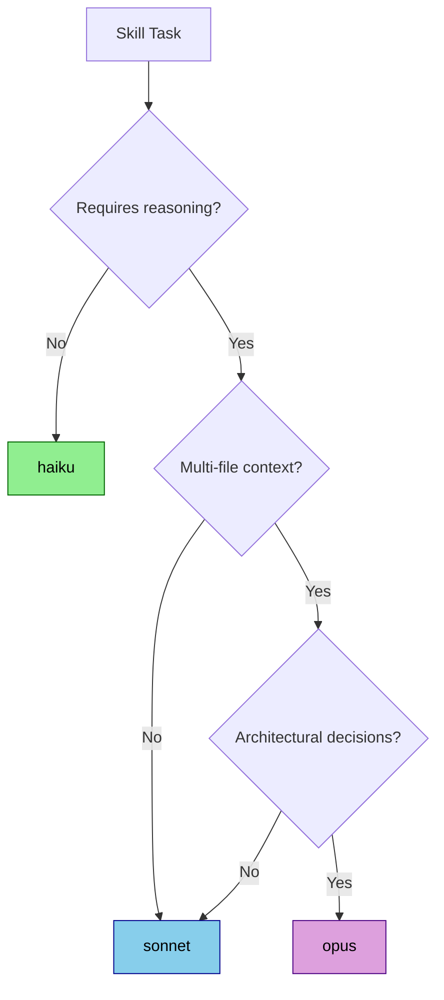
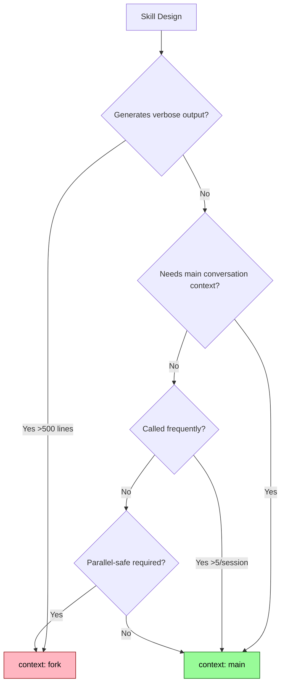
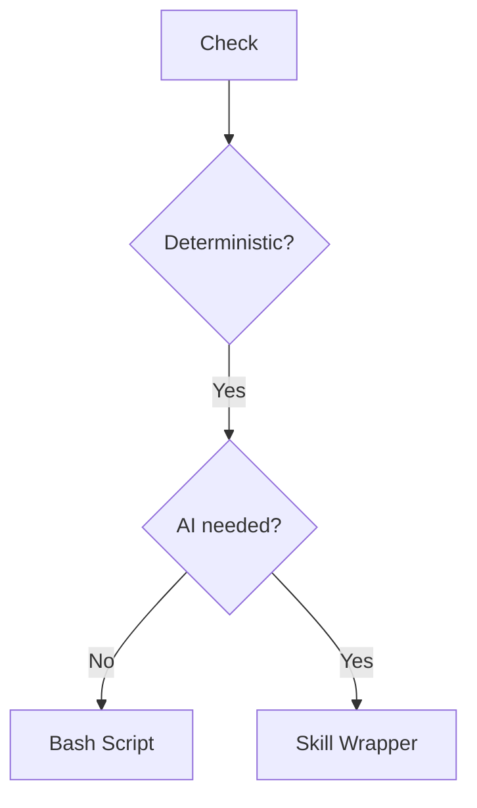

# Skill Editor Reference Guide

Detailed templates, examples, and best practices for creating and modifying Claude Code skills.

---

## Tool Selection Framework

**NOTE**: For comprehensive tool selection matrix, use the `edit-tool` skill orchestrator.

### Quick Decision Tree (Skill-Specific)

1. **>1000 tokens or multiple reference files?** → Slash Command or Sub-Agent
2. **Complex multi-step exploration?** → Sub-Agent (existing Task tool)
3. **User manually invokes?** → Slash Command
4. **Auto-invoked AND concise?** → Skill
5. **Frequently used across sessions?** → Skill (if concise)
6. **Deterministic shell-only?** → Bash script (or Skill wrapper if AI needed)

### Tool Comparison

| Tool | Best For | Context | When to Avoid |
|------|----------|---------|---------------|
| **Skill** | Specific auto-invoked capabilities | Loaded when active (<500 tokens ideal) | Verbose workflows, rare use, multiple capabilities |
| **Slash Command** | User-initiated workflows | User-controlled expansion (can be verbose) | Should happen automatically, cross-project use |
| **Sub-Agent** | Complex exploration/research | Isolated (no pollution) | Simple operations, needs main context |

### Context Overload Signals

When you see these, consider slash command or sub-agent:
- Instructions >2000 tokens
- Multiple reference files needed
- Detailed step-by-step procedures
- Complex decision trees

### Response Templates

**Suggest slash command:**
```
"This workflow seems verbose. A slash command would be better because you control when it loads into context. Should I create a slash command at `.claude/commands/[name].md` instead?"
```

**Suggest sub-agent:**
```
"This capability exists via the Task tool with specialized agents. Creating a custom skill would add redundant context overhead. Should I demonstrate the existing capability?"
```

**Ask about verbose skill:**
```
"These instructions would use ~[X] tokens. Consider:
1. Slash Command - Load on-demand with `/[name]`
2. Sub-Agent - Isolated context
3. Streamlined Skill - More concise version

Which do you prefer?"
```

---

## SKILL.md Templates

### Standard Template

```markdown
---
name: skill-name
description: What it does and when to use it. Include file types, keywords, triggers (max 1024 chars)
allowed-tools: [Read, Edit, Bash]  # Optional
model: sonnet  # Optional: haiku|sonnet|opus
context: main  # Optional: main|fork
---

# Skill Name

Brief overview (1-2 sentences).

## When to Use

- Trigger scenario 1
- Trigger scenario 2
- File types: .ext

## Instructions

1. Step with inline example: `code here`
2. Sub-steps:
   - Detail A
   - Detail B
3. Reference patterns below

## Best Practices

- Key point 1
- Key point 2
- Avoid: common pitfall

## Common Patterns

```bash
# Pattern example
command --flag value
```

### Minimal Template

```markdown
---
name: simple-skill
description: What it does and when to use it
---

# Simple Skill

## Instructions

1. Step one
2. Step two
3. Step three
```

---

## Naming Rules

**Requirements:** lowercase, numbers, hyphens only (max 64 chars), descriptive

| Good ✅ | Bad ❌ | Why |
|---------|--------|-----|
| `api-tester` | `API_Tester` | Uppercase, underscore |
| `pdf-filler` | `pdf filler` | Space |
| `db-migrator` | `general-helper` | Too vague |
| `git-commits` | `document-processor-and-analyzer-tool` | Too long |

---

## Description Best Practices

**Formula:** `[What it does] + [Capabilities] + [When to use] + [File types/keywords]`

| Example | Quality |
|---------|---------|
| "Fill PDF forms, extract text, merge PDFs. Use when working with .pdf files" | ✅ Specific, has triggers |
| "Generate REST API clients from OpenAPI specs. Use for swagger.json, openapi.yaml" | ✅ Clear triggers |
| "Helps with documents" | ❌ Too generic, no triggers |
| "Performs database migrations" | ❌ Missing when/what triggers |

**Requirements:**
- Max 1024 characters
- Include WHAT + WHEN
- Mention file types/keywords
- Specific, not generic

---

## Token Efficiency Techniques

### Use Tables vs Prose

❌ Verbose: "The workflow type can be sequential, which means tasks run one after another, or parallel..."

✅ Efficient:
| Type | Behavior |
|------|----------|
| Sequential | Run one after another |
| Parallel | Run simultaneously |

### Inline Examples

❌ `Step 1: Create config file\n\nExample:\n```yaml\nconfig: enabled: true\n```\n`

✅ `1. Create config: \`{enabled: true}\``

### Bullets Over Paragraphs

❌ "When you encounter an error, first check logs, then attempt to fix..."

✅ `On error: Check logs → Attempt fix → Report if unfixable`

### Code Blocks for Templates

❌ Describing code in prose

✅ Show the pattern:
```js
function greet(name) { return `Hello ${name}`; }
```

### Reference Other Files

❌ Including 500 lines of API docs in SKILL.md

✅ `See reference.md for API details`

### Front-Load Critical Info

Structure: Instructions → Best Practices → Background

---

## Model Selection Guide

Choose the right model based on task complexity and cost/latency requirements.

### Model Comparison Matrix

| Model | Best For | Token Cost | Latency | When to Use |
|-------|----------|------------|---------|-------------|
| **haiku** | Simple deterministic tasks | Lowest | Fastest | Token counting, format conversion, template filling, regex operations |
| **sonnet** | Most reasoning tasks | Medium | Medium | Code analysis, refactoring, bug fixes, general problem-solving (DEFAULT) |
| **opus** | Complex architectural work | Highest | Slowest | Multi-file refactoring, architectural decisions, complex debugging |

### Decision Tree



### Examples by Model

**haiku examples:**
- Count tokens in file
- Convert JSON to YAML
- Extract URLs from text
- Validate file structure
- Simple regex find/replace

**sonnet examples (DEFAULT):**
- Analyze code quality
- Refactor single file
- Debug test failures
- Generate API client
- Review pull request

**opus examples:**
- Design system architecture
- Refactor across 10+ files
- Migrate framework versions
- Complex distributed systems debugging

### Cost/Latency Trade-offs

| Priority | Recommended Model | Rationale |
|----------|-------------------|-----------|
| Speed over quality | haiku | 5x faster than sonnet |
| Balanced (most skills) | sonnet | Best quality/speed/cost ratio |
| Quality over cost | opus | Most capable, use sparingly |

**Rule of thumb:** Use haiku when you can write exact instructions. Use sonnet when Claude needs to reason. Use opus when sonnet isn't enough.

---

## Context Execution Mode (`context: fork`)

Skills can run in forked sub-agent context using `context: fork` frontmatter.

### Context Modes

| Mode | Execution | Use Case | Pros | Cons |
|------|-----------|----------|------|------|
| **main** (default) | Runs in main conversation | Quick actions, shared context | Fast, context-aware | Can pollute conversation |
| **fork** | Runs in isolated sub-agent | Research, exploration, parallel work | Clean separation, parallel-safe | Slower, no main context access |

### When to Use Fork Context

Use `context: fork` when:

✅ **Research/exploration** - Deep codebase analysis that generates verbose output
✅ **Parallel operations** - Multiple independent tasks running simultaneously
✅ **Experimental logic** - Testing new approaches without polluting main conversation
✅ **Long-running analysis** - Report generation, test coverage analysis
✅ **Isolation needed** - Task shouldn't affect or be affected by main conversation state

### When to Use Main Context (default)

Use `context: main` (or omit field) when:

✅ **Quick operations** - Token counting, format conversion, simple transformations
✅ **Context-dependent** - Needs awareness of current conversation/files
✅ **Frequent invocation** - Called 5+ times per session (fork overhead adds up)
✅ **Interactive workflow** - User needs to see results in main conversation flow
✅ **State sharing** - Multiple tool calls need to build on each other

### Decision Tree: Main vs Fork



### Examples

**Fork context examples:**
```yaml
---
name: codebase-analyzer
context: fork  # Generates 1000+ line reports
---

---
name: test-coverage-deep
context: fork  # Runs multiple test suites in parallel
---

---
name: security-audit
context: fork  # Long-running analysis, shouldn't block main
---
```

**Main context examples (default):**
```yaml
---
name: token-counter
# context: main (default) - Quick, needs current file context
---

---
name: quick-refactor
# context: main (default) - Interactive, user follows along
---

---
name: git-helper
# context: main (default) - Frequent use, fast operations
---
```

### Performance Considerations

| Aspect | Main Context | Fork Context |
|--------|--------------|--------------|
| Startup time | Instant | ~1-2s (sub-agent spawn) |
| Context access | Full main conversation | Isolated (only skill context) |
| Output visibility | Inline in main conversation | Returned as summary |
| Parallelization | Limited (shared state) | Safe (isolated state) |
| Memory | Shares main context window | Separate context window |

---

## Common Mistakes

| Issue | Fix |
|-------|-----|
| Skill never activates | Add trigger keywords to description |
| Too broad scope | Split into focused skills |
| Verbose instructions | Use tables, bullets, code blocks |
| Missing frontmatter | Add `---` YAML delimiters |
| Generic description | Specify what + when + file types |
| Wrong tool type | Use Step 0 decision framework |
| Context overload (>1000 tokens) | Refactor to reference.md or change tool type |

---

## Modification Best Practices

### Types

| Type | Action |
|------|--------|
| Add Feature | Add instructions, update description triggers |
| Fix/Improve | Refine instructions, clarify, optimize tokens |
| Refactor | Restructure, update to best practices |
| Scope Change | Update allowed-tools, modify triggers |

### Workflow

1. Locate and read existing SKILL.md
2. Analyze: frontmatter, instructions
3. Make surgical edits (Edit tool, not rewrites)
4. Update description if adding triggers
5. Validate: YAML valid, triggers clear, under token budget

### When NOT to Modify

Ask user first if:
- Breaking changes (v2.0.0)
- Scope changes significantly
- Unsure about impact

Suggest new skill if:
- Purpose fundamentally changes
- New capability is distinct
- Violates single-responsibility

---

## Example Skills

### Good Examples ✅

```yaml
name: xlsx-analyzer
description: Analyze Excel files, extract to CSV, pivot tables, charts. Use for .xlsx, .xls files or spreadsheet analysis.
```

```yaml
name: api-client-gen
description: Generate REST API clients from OpenAPI/Swagger specs. Use for swagger.json, openapi.yaml, or API client requests.
```

```yaml
name: git-workflow
description: Git commits following Conventional Commits (feat, fix, chore, docs). Use when committing or formatting messages.
```

### Bad Examples ❌

```yaml
name: document-helper
description: Helps with documents
# Problem: What documents? What operations? No triggers
```

```yaml
name: code-tools
description: Various code utilities
# Problem: Too vague, multiple capabilities, no triggers
```

```yaml
name: general-assistant
description: Assists with tasks
# Problem: Not specific, violates single-responsibility
```

---

## Supporting Files

For complex skills:
- **reference.md**: Detailed docs, API references
- **examples.md**: Usage examples, patterns
- **templates/**: File templates
- **scripts/**: Utility scripts

Keeps SKILL.md concise while providing depth.

---

## Progressive Disclosure Patterns

Based on Anthropic's official skill-creator guidelines. Skills use a **three-level loading system**:

1. **Metadata (name + description)** - Always in context (~100 words)
2. **SKILL.md body** - When skill triggers (<500 tokens ideal, <1000 max)
3. **Bundled resources** - As needed by Claude (scripts = 0 tokens)

### Pattern 1: High-Level Guide with References

Keep core workflow in SKILL.md, link to detailed resources:

```markdown
# PDF Processing

## Quick start
Extract text with pdfplumber: [code example]

## Advanced features
- **Form filling**: See [forms.md](forms.md) for complete guide
- **API reference**: See [reference.md](reference.md) for all methods
- **Examples**: See [examples.md](examples.md) for patterns
```

Claude loads forms.md, reference.md, or examples.md **only when needed**.

### Pattern 2: Domain-Specific Organization

For skills with multiple domains, organize by domain to avoid loading irrelevant context:

```
bigquery-skill/
├── SKILL.md (overview + navigation)
└── references/
    ├── finance.md (revenue, billing)
    ├── sales.md (pipeline, opportunities)
    ├── product.md (usage, features)
    └── marketing.md (campaigns, attribution)
```

When user asks about sales, Claude only reads `references/sales.md`.

### Pattern 3: Conditional Details

Show basic content, link to advanced:

```markdown
# DOCX Processing

## Creating documents
Use docx-js for new documents. See [docx-js.md](docx-js.md).

## Editing documents
For simple edits, modify XML directly.

**For tracked changes**: See [redlining.md](redlining.md)
**For OOXML details**: See [ooxml.md](ooxml.md)
```

### Important Guidelines

**Avoid deeply nested references**: Keep references one level deep from SKILL.md. All reference files should link directly from SKILL.md.

**Structure longer reference files**: For files >100 lines, include table of contents at top so Claude can see full scope when previewing.

---

## Token Efficiency Techniques

From Anthropic best practices: **"Concise is key. Only add context Claude doesn't already have."**

### Tables vs Prose

❌ **Verbose** (150 tokens):
```markdown
The workflow type can be sequential, which means tasks run one after another in a specific order, or parallel, which means multiple tasks can execute simultaneously without waiting for each other to complete.
```

✅ **Efficient** (30 tokens):
```markdown
| Type | Behavior |
|------|----------|
| Sequential | Run one after another |
| Parallel | Run simultaneously |
```

**Savings: 80%**

### Inline Examples

❌ **Verbose**:
```markdown
Step 1: Create config file

Example:
```yaml
config:
  enabled: true
  timeout: 30
```\
```

✅ **Efficient**:
```markdown
1. Create config: `{enabled: true, timeout: 30}`
```

### Bullets Over Paragraphs

❌ **Prose**:
```markdown
When you encounter an error during processing, you should first check the logs to understand what went wrong, then attempt to fix the issue based on what you find, and if you still cannot resolve it, report the problem to the user.
```

✅ **Bullets**:
```markdown
On error: Check logs → Attempt fix → Report if unfixable
```

### Mermaid for Complex Flows

❌ **Text** (~200 tokens):
```markdown
First check if deterministic. If yes, check if AI needed to decide when/how. If not, use bash script. If yes, check token budget. If less than 500, use skill wrapper...
```

✅ **Mermaid** (~100 tokens):


**Savings: 50%**

### Front-Load Critical Info

Structure: **Instructions → Best Practices → Background**

Claude reads top-to-bottom. Put essential info first, background/theory last or in reference.md.

---

## Anthropic Best Practices

### Core Principles

1. **Concise is key**: Context window is public good. Default assumption: Claude is already smart.

2. **Set appropriate degrees of freedom**:
   - **High freedom** (text instructions): Multiple valid approaches
   - **Medium freedom** (pseudocode/scripts with params): Preferred pattern exists
   - **Low freedom** (specific scripts): Operations fragile, consistency critical

3. **Progressive disclosure**: Keep SKILL.md <500 lines, split content when approaching limit

### Skill Anatomy

```
skill-name/
├── SKILL.md (required)
│   ├── YAML frontmatter (name, description - required)
│   └── Markdown instructions (required)
└── Bundled Resources (optional)
    ├── scripts/ - Executable code (0 tokens when executed)
    ├── references/ - Documentation (loaded as needed)
    └── assets/ - Output files (not loaded into context)
```

### What NOT to Include

Do NOT create extraneous documentation:
- ❌ README.md
- ❌ INSTALLATION_GUIDE.md
- ❌ QUICK_REFERENCE.md
- ❌ CHANGELOG.md

Skills are for AI agents, not human documentation.

### Scripts Directory Usage

**When to include scripts/**:
- Same code rewritten repeatedly
- Deterministic reliability needed
- Token efficiency (scripts executed, not loaded)

**Example**: `scripts/rotate_pdf.py` for PDF rotation tasks

**Benefits**:
- 0 token cost (executed, not in context)
- Deterministic behavior
- Reusable across sessions

**Note**: Scripts may still need to be read by Claude for patching or adjustments

### References Directory Usage

**When to include references/**:
- Documentation Claude should reference while working
- Database schemas, API docs, domain knowledge
- Company policies, workflow guides

**Examples**: `references/finance.md`, `references/api_docs.md`

**Best practice**: If files >10k words, include grep search patterns in SKILL.md

**Avoid duplication**: Info should live in SKILL.md OR references/, not both

### Assets Directory Usage

**When to include assets/**:
- Files used in final output (not loaded into context)
- Templates, images, icons, boilerplate code

**Examples**: `assets/logo.png`, `assets/slides.pptx`, `assets/frontend-template/`

**Benefits**: Separates output resources from documentation

---

## Anthropic Workflows & Patterns

### Sequential Workflow Pattern

For complex tasks, give Claude overview of process:

```markdown
Filling a PDF form involves these steps:

1. Analyze the form (run analyze_form.py)
2. Create field mapping (edit fields.json)
3. Validate mapping (run validate_fields.py)
4. Fill the form (run fill_form.py)
5. Verify output (run verify_output.py)
```

### Conditional Workflow Pattern

For branching logic, guide through decision points:

```markdown
1. Determine the modification type:
   **Creating new content?** → Follow "Creation workflow" below
   **Editing existing content?** → Follow "Editing workflow" below

2. Creation workflow: [steps]
3. Editing workflow: [steps]
```

### Template Pattern

**For strict requirements** (API responses, data formats):

```markdown
## Report structure

ALWAYS use this exact template structure:

# [Analysis Title]

## Executive summary
[One-paragraph overview]

## Key findings
- Finding 1 with data
- Finding 2 with data
```

**For flexible guidance** (adaptation useful):

```markdown
## Report structure

Here is a sensible default format, but use your best judgment:

# [Analysis Title]

## Executive summary
[Overview]

## Key findings
[Adapt based on what you discover]

Adjust sections as needed for the specific analysis type.
```

### Examples Pattern

For output quality, provide input/output pairs:

```markdown
## Commit message format

Generate commit messages following these examples:

**Example 1:**
Input: Added user authentication with JWT tokens
Output:
```
feat(auth): implement JWT-based authentication

Add login endpoint and token validation middleware
```

Follow this style: type(scope): brief description, then detailed explanation.
```

---

## Script Wrapper Pattern

When deterministic operations need AI decision-making:

### When to Use

- Scripts exist but AI decides when/how to invoke
- AI needs to generate parameters for scripts
- Part of larger capability that needs context

### Structure

```
skill-name/
├── SKILL.md (when to use scripts, how to interpret output)
└── scripts/
    ├── operation1.py
    ├── operation2.sh
    └── validate.py
```

### Example: PDF Rotator

```markdown
# SKILL.md
---
name: pdf-rotator
description: Rotates PDF pages. Use for .pdf files or rotation requests.
---

# PDF Rotator

## Usage
Determine rotation angle based on user request:
- "rotate clockwise" → 90
- "flip upside down" → 180
- "rotate counterclockwise" → 270

Then run:
```bash
python scripts/rotate.py input.pdf output.pdf --angle [ANGLE]
```

## Output
Script returns success/error. Check output.pdf was created.
```

**Why not bash script alone?**
- AI interprets user intent ("make it upright" → calculate angle)
- AI validates input/output
- Provides user feedback in natural language

---
## Instruction Ordering: Attention Mechanism Optimization

### Problem: The "Validation-First" Anti-Pattern

Most skills bury high-frequency workflows under validation gates:

```
❌ Current pattern (problematic):
1. MANDATORY Validation gate (25-35% of file)
2. Learn what you can do (2-5%)
3. How to do rare action (40% of file)
4. How to do common action (buried at 50-60%)
```

This creates:
- ❌ Only 5-10% of first 30% is actionable
- ❌ Most common task (UPDATE/MODIFY) buried
- ❌ 75-95% longer to reach relevant section

### Solution: Frequency-Ordered Structure

Order sections by **frequency of use**, not by gatekeeping:

```
✅ Recommended pattern:
1. Determine Action Type (100% frequency - everyone sees this)
2. Most Frequent Workflow (MODIFY/UPDATE) (60-80% use)
3. Medium Frequency Workflow (OPTIMIZE) (15-30% use)
4. Least Frequent Workflow (CREATE) (10-25% use)
5. Key Principles (applies to all)
6. Validation Rules (gates, but after action clarity)
7. Advanced Patterns (reference)
8. Checklist (final safety)
```

### Why This Works

| Principle | Benefit |
|-----------|---------|
| **Action Type First** | User understands immediately what's possible (100% frequency) |
| **Frequency Ordering** | Most common path is shortest/fastest to reach |
| **Validation Late** | Gates remain present but don't block understanding |
| **Key Principles Early** | Shared mindset before detailed instructions |
| **Reference Last** | Advanced content doesn't interfere with critical path |
| **Checklist Last** | Final safety net, not gatekeeping |

### Impact

| Metric | Before | After | Gain |
|--------|--------|-------|------|
| First 30% actionable lines | ~5% | ~85% | +1700% |
| Time to UPDATE section (frequent path) | Line 93+ | Line 20 | 75% faster |
| Attention retention in critical path | ~40% | ~80% | +100% |

### Implementation Checklist

When creating skill instructions:

- [ ] **First section**: Determine Action Type (100% users)
- [ ] **Second section**: Most frequent workflow (60%+ users)
- [ ] **Third section**: Medium frequency (30%+ users)
- [ ] **Fourth section**: Least frequent (10%+ users)
- [ ] **Fifth section**: Key Principles (applies to all)
- [ ] **Sixth section**: Validation gates (if needed, after clarity)
- [ ] **Seventh section**: Advanced patterns/reference
- [ ] **Last section**: Validation checklist

### Universal Application

This pattern applies to **ALL instruction sets**, not just skills:

1. "What can you do?" (Action types)
2. "How to do the most common action" (Fastest path)
3. "How to do medium action" (Secondary)
4. "How to do rare action" (Tertiary)
5. "Principles that apply everywhere" (Context)
6. "Guards/validation" (Safety, but not gatekeeping)
7. "Advanced patterns" (Reference)
8. "Safety checklist" (Final)

### Why Anthropic LLMs Benefit

Claude's attention mechanisms show:
- **Recency bias**: Information at end gets 20-30% attention
- **Frequency sensitivity**: Repeated patterns are weighted by frequency
- **Position decay**: Every 20-30 lines loses ~20% attention
- **Purpose clarity**: Understanding purpose early improves instruction following

Reordering by frequency optimizes for how Claude actually processes context.
