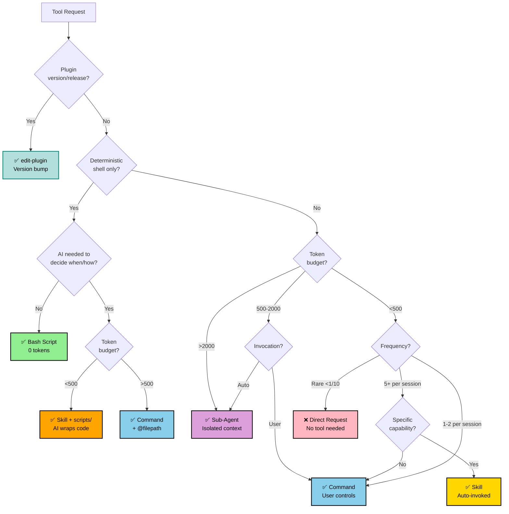

# Edit Tool Orchestrator

Automatically triages tool creation requests to the appropriate mechanism (skill, command, agent, or script).

## Triage Process

**CRITICAL**: Always follow these steps:

1. **Analyze request** against decision tree
2. **Explain decision** to user with rationale
3. **Invoke appropriate skill** or provide guidance

## Decision Tree

## Decision Factors Reference

When path requires multiple criteria, consult:

| Factor | Key Question | Result |
|--------|--------------|--------|
| **Token Budget** | <500 / 500-2000 / >2000? | Skill / Command / Agent |
| **Frequency** | 5+ / 1-2 / <1 per 10 sessions? | Skill / Command / Direct |
| **Context** | Main / Isolated? | Command / Agent |
| **Scripts** | AI wrapper needed? | Skill+scripts/ / Bash |
| **Invocation** | User / Auto? | Command / Skill |
| **Capability** | Specific / Workflow? | Skill / Command |

## Delegation

After explanation: **Skill** → `edit-skill` | **Command** → `edit-command` | **Agent** → `edit-agent` | **Plugin** → `edit-plugin` | **Bash** → Direct guidance (scripts/, #!/bin/bash, chmod +x, no tool)

**Special routing:** Version bumps, release metadata, plugin.json/marketplace.json updates → `edit-plugin` (bypasses decision tree)

**Note**: Model selection (opus/sonnet/haiku) is handled by delegated editors using `pick-model` skill.

## Explanation Template

Explain decision: `✅ [TYPE] because: token budget (~X → range), frequency (pattern), key factor (dimension)`

Example: `✅ SKILL because: ~300 tokens → <500, 10+/session, auto-invoked capability`

## Parallelization Check

**Before any write operations**, verify safety:

| Operation Type | Guidance |
|----------------|----------|
| ✅ Read-only | Parallelize freely |
| ⚠️ Writes (independent files) | Sequential OR Plan Mode first |
| ⚠️ Writes (dependent changes) | Must sequence carefully |
| ❌ Destructive operations | Plan Mode MANDATORY |

**Plan Mode triggers:**
- Creating >3 files
- Modifying >5 files
- Architectural changes
- Breaking changes

## Tool Comparison Quick Reference

| Tool | Token Cost | When to Use | Context |
|------|------------|-------------|---------|
| **Bash Script** | 0 (executed) | Deterministic shell ops | None |
| **Skill** | <500 ideal | Auto-invoked, frequent | Shared (pollution) |
| **Command** | 500-2000 ok | User-triggered workflows | User-controlled |
| **Agent** | Unlimited | Complex exploration | Isolated |

## Common Patterns

| Pattern | When | Solution |
|---------|------|----------|
| Script Wrapper | AI decides timing for existing scripts | Skill + scripts/ |
| Verbose Workflow | >1000 tokens, manual trigger | Slash command |
| Research Task | Multi-file exploration, autonomous | Sub-agent (check Task tool first) |

See `reference.md` for edge cases, conversion guide, and extended examples.
