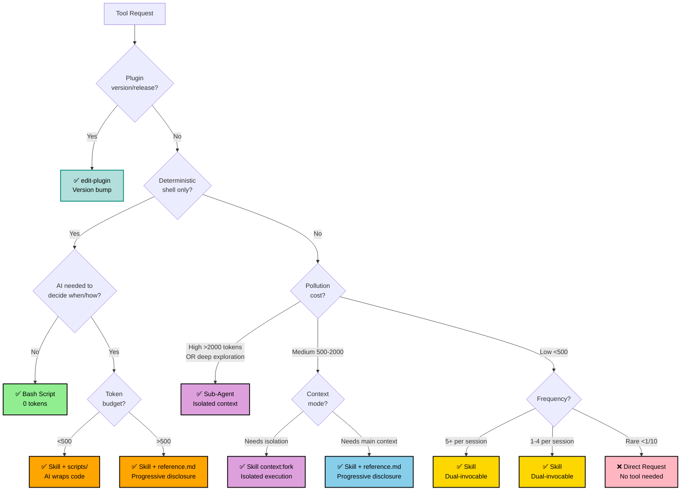

# Edit Tool Orchestrator

Automatically triages tool creation requests to the appropriate mechanism (skill, agent, or script).

## Triage Process

**CRITICAL**: Always follow these steps:

1. **Analyze request** against decision tree
2. **Explain decision** to user with rationale
3. **Invoke appropriate skill** or provide guidance

## Decision Tree

## Decision Factors Reference

Primary axis: **context pollution cost** = token_count × load_frequency

| Factor | Key Question | Result |
|--------|--------------|--------|
| **Pollution Cost** | Low (<500) / Medium (500-2000) / High (>2000)? | Skill / Skill+ref / Agent |
| **Context Mode** | Needs main conversation or isolation? | `context:main` / `context:fork` |
| **Frequency** | 5+ / 1-4 / <1 per 10 sessions? | Skill / Skill / Direct request |
| **Scripts** | AI wrapper needed for deterministic code? | Skill+scripts/ / Bash |

## Delegation

After explanation: **All tools** → `edit-skill` | **Agent** → `edit-agent` | **Plugin** → `edit-plugin` | **Bash** → Direct guidance (scripts/, #!/bin/bash, chmod +x, no tool)

**Default**: All skills are dual-invocable (both `/name` and model auto-invoke). No special frontmatter needed.
`disable-model-invocation: true` is an opt-out for rare edge cases only.

**Special routing:** Version bumps, release metadata, plugin.json/marketplace.json updates → `edit-plugin` (bypasses decision tree)

**Note**: Model selection (opus/sonnet/haiku) is handled by delegated editors using `pick-model` skill.

## Explanation Template

Explain decision: `✅ [TYPE] because: pollution cost (~X tokens × Yfreq), context mode (main|fork), key factor (dimension)`

Example: `✅ SKILL because: ~300 tokens → low pollution, 2x/session, dual-invocable (both / and model)`

## Parallelization Check

**Before any write operations**, verify safety:

| Operation Type | Guidance |
|----------------|----------|
| ✅ Read-only | Parallelize freely |
| ⚠️ Writes (independent files) | Sequential OR Plan Mode first |
| ⚠️ Writes (dependent changes) | Must sequence carefully |
| ❌ Destructive operations | Plan Mode MANDATORY |

**Plan Mode triggers:**
- Creating >3 files
- Modifying >5 files
- Architectural changes
- Breaking changes

## Tool Comparison Quick Reference

| Tool | Pollution Cost | When to Use | Context |
|------|---------------|-------------|---------|
| **Bash Script** | 0 (executed) | Deterministic shell ops | None |
| **Skill** | <500 ideal | All capabilities (dual-invocable by default) | `context:main` (shared) |
| **Skill + reference.md** | <500 SKILL.md | Verbose workflows needing progressive disclosure | `context:main` (shared) |
| **Skill (forked)** | 0 (isolated) | Research, exploration, heavy analysis | `context:fork` (isolated) |
| **Agent** | 0 (isolated) | Complex multi-step exploration | Isolated sub-process |

## Common Patterns

| Pattern | When | Solution |
|---------|------|----------|
| Script Wrapper | AI decides timing for existing scripts | Skill + scripts/ |
| Verbose Workflow | >500 tokens, needs progressive disclosure | Skill + reference.md |
| Research Task | Multi-file exploration, autonomous | Sub-agent (check Task tool first) |
| Heavy Analysis | Deep analysis, shouldn't pollute | Skill + `context:fork` |

See `reference.md` for edge cases, conversion guide, and extended examples.
