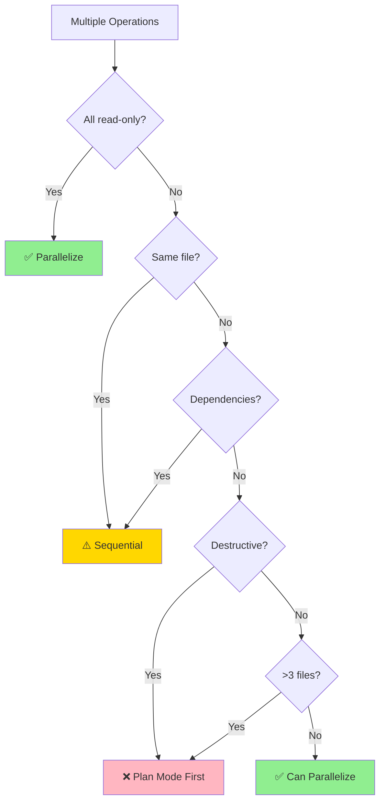

# Edit Tool Orchestrator Reference

Extended decision trees, edge cases, conversion guide, and detailed examples.

---

## Table of Contents

- [Complete Decision Framework](#complete-decision-framework)
- [Token Estimation Guidelines](#token-estimation-guidelines)
- [Edge Cases & Special Situations](#edge-cases--special-situations)
- [Tool Conversion Guide](#tool-conversion-guide)
- [Context Pollution Analysis](#context-pollution-analysis)
- [Bash Script vs Skill Wrapper](#bash-script-vs-skill-wrapper)
- [Parallelization Deep Dive](#parallelization-deep-dive)
- [Real-World Examples](#real-world-examples)

---

## Complete Decision Framework

### 7-Axis Analysis

#### Axis 1: Execution Type (Cost & Determinism)

| Type | Characteristics | Tool Choice |
|------|----------------|-------------|
| **Pure deterministic** | Sequential shell commands, no decisions | Bash Script |
| **Deterministic + AI** | Scripts exist, AI decides when/how | Skill with scripts/ |
| **Single AI operation** | One response, simple logic | Slash Command |
| **Multi-step AI** | Autonomous reasoning across steps | Sub-Agent |
| **Capability enhancement** | Extends Claude's abilities | Skill |

#### Axis 2: Invocation Pattern

| Pattern | User Action | Best Tool |
|---------|-------------|-----------|
| **Explicit manual** | Types `/command` or invokes | Slash Command |
| **Implicit auto** | Keywords trigger automatically | Skill |
| **Programmatic** | Called by other tools | Sub-Agent (Task tool) |

#### Axis 3: Token Budget

| Range | Implication | Tool Choice |
|-------|-------------|-------------|
| **0 tokens** | Script executed, not read | Bash Script or Skill+scripts/ |
| **<500 tokens** | Acceptable context pollution | Skill (ideal) |
| **500-2000 tokens** | Moderate, needs user control | Slash Command |
| **>2000 tokens** | High, needs isolation | Sub-Agent |

**Estimation Tips:**
- Count prose, not code blocks (code is efficient)
- Tables ~50% more efficient than prose
- Mermaid diagrams ~40% more efficient than text descriptions
- Use `wc -w file.md` then multiply by 1.3 for rough token count

#### Axis 4: Context Strategy

| Need | Rationale | Tool Choice |
|------|-----------|-------------|
| **Main context access** | Needs conversation history | Slash Command |
| **Isolated exploration** | Research without pollution | Sub-Agent |
| **Minimal pollution** | Concise, high-value capability | Skill |
| **Zero pollution** | Execution only | Bash Script |

#### Axis 5: Frequency & Justification

| Frequency | Per Session | Justification | Tool Choice |
|-----------|-------------|---------------|-------------|
| **Very high** | 10+ | Essential capability | Skill |
| **High** | 5-9 | Frequent enough | Skill (if <500 tokens) |
| **Medium** | 2-4 | Occasional use | Slash Command |
| **Low** | 1 | User controls timing | Slash Command |
| **Rare** | <0.1 | Not worth tool | Direct Request |

**Context Pollution Math:**
- Skill at 400 tokens, used 10x/session = 4000 token "cost"
- But only loaded once when triggered
- Justify if saves >4000 tokens of repeated instructions

#### Axis 6: Script Wrapping Requirement

| Scenario | Problem | Solution |
|----------|---------|----------|
| **Pure scripts** | No AI needed | Bash Script |
| **Scripts + timing** | AI decides when to run | Skill with scripts/ |
| **Scripts + parameters** | AI generates args | Skill with scripts/ |
| **Scripts + orchestration** | Complex sequencing | Skill or Sub-Agent |
| **User-guided scripts** | Manual trigger + files | Command with @filepath |

**Why not Command for scripts?**
Commands can't bundle scripts directory. Must reference external files with `@filepath`.

#### Axis 7: Write Operations (Parallelization)

| Operation | Risk | Guidance |
|-----------|------|----------|
| **Read-only** | None | ✅ Parallelize freely |
| **Write (independent)** | Conflicts | ⚠️ Sequential OR Plan Mode |
| **Write (dependent)** | Ordering | ⚠️ Careful sequencing |
| **Destructive** | Data loss | ❌ Plan Mode mandatory |

---

## Token Estimation Guidelines

### Quick Estimation

```bash
# Word count method
wc -w SKILL.md
# Multiply by 1.3 for token estimate

# Character count method (rough)
wc -c SKILL.md
# Divide by 4 for token estimate
```

### Content Type Multipliers

| Content Type | Tokens vs Words | Example |
|--------------|-----------------|---------|
| **Prose paragraphs** | 1.5x | "This section describes the process of..." |
| **Bullet lists** | 1.2x | "- Step one\n- Step two" |
| **Tables** | 0.8x | Markdown tables (structure = tokens) |
| **Code blocks** | 0.7x | Syntax highlighting efficient |
| **YAML** | 0.6x | Key-value pairs compress well |
| **Mermaid** | 0.5x | Structure encoded in syntax |

### Target Budgets

```yaml
Skill SKILL.md:
  Ideal: <500 tokens
  Maximum: 1000 tokens (question if higher)

Skill reference.md:
  Typical: 1000-3000 tokens
  Maximum: No hard limit (loaded on-demand)

Command .md:
  Typical: 500-2000 tokens
  Maximum: No hard limit (user-controlled)

Agent .md:
  Typical: 300-1000 tokens (system prompt)
  Maximum: No hard limit (isolated context)
```

---

## Edge Cases & Special Situations

### Case 1: "I want a skill that wraps multiple commands"

**Analysis:**
- Token budget likely >1000 (multiple workflows)
- Violates single-responsibility principle
- Each command should be separate

**Solution:**
- Create individual skills/commands for each capability
- Or create orchestrator skill that delegates (like edit-tool!)

### Case 2: "Make this command auto-invoke"

**Analysis:**
- Commands are user-invoked by design
- Auto-invoke = convert to skill

**Solution:**
- If <500 tokens → Convert to skill
- If >500 tokens → Keep as command (explain trade-off)

### Case 3: "This skill is too verbose (>1000 tokens)"

**Analysis:**
- Wrong tool type OR needs refactoring

**Solutions:**
1. **Convert to Command**: If user-triggered workflow
2. **Split into multiple skills**: If multiple capabilities
3. **Progressive disclosure**: Move details to reference.md
4. **Convert to Agent**: If >2000 tokens and exploratory

### Case 4: "I need a skill that runs complex scripts"

**Analysis:**
- Scripts = 0 tokens (executed, not loaded)
- Perfect for Skill + scripts/ pattern

**Solution:**
```
skill-name/
├── SKILL.md (instructions for when/how to use scripts)
├── scripts/
│   ├── analyze.py
│   ├── transform.sh
│   └── validate.py
└── reference.md (script documentation)
```

### Case 5: "Should this be a skill or use existing Task tool?"

**Analysis:**
- Task tool with specialized agents already exists
- Check if agent type already covers use case

**Decision Tree:**
```
Is there an existing agent? (Explore, Plan, etc.)
├─ Yes → Use Task tool (no new skill needed)
└─ No → Is it <500 tokens and frequently invoked?
    ├─ Yes → Create skill
    └─ No → Create sub-agent or use command
```

### Case 6: "Skill for one project vs all projects"

**Not a tool type question** - it's about location:
- `.claude/skills/` → Current project only
- `~/.claude/skills/` → All projects (rare, use plugins instead)
- `reference/claude-plugins/common/skills/` → Plugin development

---

## Tool Conversion Guide

### Command → Skill

**When to convert:**
- Used 5+ times per session
- Auto-invoke makes sense
- Can reduce to <500 tokens

**Process:**
1. Copy command content
2. Create skill directory: `reference/claude-plugins/common/skills/skill-name/`
3. Add YAML frontmatter with `name` and `description`
4. Add trigger keywords to description
5. Move detailed examples to `reference.md`
6. Remove `$ARGUMENTS` / `@filepath` syntax (skills don't use these)
7. Test auto-invocation with trigger keywords

**Example:**
```markdown
# BEFORE (command)
---
description: Analyze test coverage
argument-hint: [file]
---
Analyze test coverage in @$1 and report gaps.

# AFTER (skill)
---
name: test-coverage
description: Analyzes test coverage and reports gaps. Use when user mentions "test coverage", "coverage report", or .coverage files.
---
# Test Coverage Analyzer
Analyze test coverage and identify gaps...
```

### Skill → Command

**When to convert:**
- Token budget >1000
- Rarely used (<2 times per session)
- User preference for manual trigger

**Process:**
1. Remove skill directory structure
2. Create `.claude/commands/skill-name.md`
3. Optional: Add frontmatter with `description`, `argument-hint`
4. Add `$ARGUMENTS` or `$1, $2` if parameters needed
5. No need to reduce tokens (user controls)

### Command/Skill → Agent

**When to convert:**
- Token budget >2000
- Needs isolated context
- Complex multi-step exploration

**Process:**
1. Create `.claude/agents/agent-name.md`
2. Add frontmatter: `name`, `description`, `tools`, `model`
3. Convert instructions to system prompt (2nd person → role-based)
4. Restrict tools to minimum needed
5. Remove any references to conversation history

**Example:**
```markdown
# BEFORE (command/skill)
Analyze the codebase and find all API endpoints...

# AFTER (agent)
---
name: api-analyzer
description: Analyzes codebase to find and document API endpoints
tools: Read, Grep, Glob
model: sonnet
---
You are an API analysis specialist. Your task is to:
1. Search the codebase for API endpoint definitions
2. Extract routes, methods, and handlers
3. Generate comprehensive documentation
```

### Bash Script → Skill Wrapper

**When to convert:**
- Script works but AI needs to decide when/how to use it
- Parameters need AI-generated values
- Part of larger workflow

**Process:**
1. Create skill: `skill-name/`
2. Move script to `scripts/` subdirectory
3. Write SKILL.md with:
   - When to invoke script
   - How to generate parameters
   - How to interpret output
4. Keep script pure (no AI logic in script)

**Example:**
```markdown
# SKILL.md
---
name: pdf-rotator
description: Rotates PDF pages. Use when user wants to rotate, flip, or reorient PDFs.
---
# PDF Rotator

## Usage
Determine rotation angle (90, 180, 270) based on user request, then run:
```bash
python scripts/rotate.py input.pdf output.pdf --angle [ANGLE]
```

## Common Patterns
- "rotate clockwise" → 90
- "flip upside down" → 180
- "rotate counterclockwise" → 270
```

---

## Context Pollution Analysis

### What is Context Pollution?

Every skill's SKILL.md body is loaded when triggered and remains in context. This competes with:
- Conversation history
- Other skills' metadata
- File contents
- User requests

### Pollution Impact Formula

```
Impact = TokenCount × LoadFrequency × SessionDuration
```

**Example:**
- Skill: 800 tokens
- Triggered: 1x per session
- Duration: Stays loaded entire session
- **Impact**: 800 tokens of pollution

**Justification threshold:**
- Must save >800 tokens of repeated instructions, OR
- Provides capability not easily expressed inline

### Minimizing Pollution

**Technique 1: Progressive Disclosure**
```
SKILL.md (300 tokens) → Always loaded when triggered
reference.md (2000 tokens) → Loaded only if Claude reads it
scripts/ (0 tokens) → Executed, never loaded
```

**Technique 2: Token Efficiency**
- Tables over prose (50% savings)
- Mermaid over text (40% savings)
- Inline examples over blocks
- Front-load critical info

**Technique 3: Precise Triggers**
- Specific triggers = loads only when needed
- Generic triggers = loads too often = more pollution
- Example: "Use for .xlsx files" (good) vs "Use for documents" (bad)

### When Pollution is Acceptable

✅ **High-value capabilities**:
- Skill provides >2000 tokens worth of procedural knowledge
- Used 5+ times per session
- No good alternative (can't be command/agent)

✅ **Zero-inflation skills**:
- Skill mostly references `scripts/` (0 token execution)
- SKILL.md just decides when/how to invoke
- Net pollution: ~200-300 tokens

❌ **Unacceptable pollution**:
- >1000 token skill used 1x per session
- Could easily be command
- Verbose instructions that change rarely

---

## Bash Script vs Skill Wrapper

### Decision Matrix

| Characteristic | Bash Script | Skill Wrapper |
|----------------|-------------|---------------|
| **Operations** | Purely deterministic | AI decides when/how |
| **Parameters** | Hardcoded or user-provided | AI-generated |
| **Context** | None | Minimal (decision logic) |
| **Reusability** | Limited to script use cases | Flexible invocation |
| **Token cost** | 0 | ~200-400 (wrapper logic) |

### Pattern 1: Pure Bash Script

**Use when:**
- Steps are always the same
- No decision-making needed
- Parameters obvious to user

**Example: Git commit message generator**
```bash
#!/bin/bash
# scripts/commit-msg.sh
git log -1 --pretty=%B
echo "---"
git diff --staged
```

Just run: `./scripts/commit-msg.sh`

### Pattern 2: Skill Wrapper

**Use when:**
- AI needs to decide which script to run
- AI needs to generate parameters
- Part of larger capability

**Example: PDF processor**
```
pdf-processor/
├── SKILL.md
└── scripts/
    ├── rotate.py
    ├── merge.py
    └── extract.py
```

```markdown
# SKILL.md
---
name: pdf-processor
description: Process PDFs (rotate, merge, extract). Use for .pdf files.
---

## Operations

**Rotate**: `python scripts/rotate.py input.pdf output.pdf --angle [90|180|270]`
**Merge**: `python scripts/merge.py output.pdf input1.pdf input2.pdf ...`
**Extract**: `python scripts/extract.py input.pdf output.txt --pages [range]`

Determine operation from user request and generate appropriate command.
```

### When Scripts Can't Solve It

**Scenarios requiring AI:**
1. **Ambiguous input**: "Make this image look better" (what operations?)
2. **Context-dependent**: "Fix the test failures" (which tests? what fixes?)
3. **Creative tasks**: "Write API docs" (requires understanding + generation)
4. **Multi-file coordination**: "Refactor authentication" (many files, decisions)

**These need:** Command or Agent, not script wrappers

---

## Parallelization Deep Dive

### Why It Matters

Claude can call multiple tools in one message:
```markdown
Let me read three files in parallel.
[Read file1.js]
[Read file2.js]
[Read file3.js]
```

**Benefits:**
- 3x faster (one round-trip vs three)
- Better UX
- More efficient

**Risks:**
- Write conflicts
- Race conditions
- Dependent operations out of order

### Safe Parallelization Rules

#### ✅ Always Safe: Read Operations

```markdown
# SAFE - no side effects
[Read src/auth.js]
[Read src/user.js]
[Read tests/auth.test.js]
[Grep "function" --output_mode content]
[Glob "**/*.config.js"]
```

#### ⚠️ Sometimes Safe: Independent Writes

**Safe if:**
- Different files
- No shared state
- No dependencies

```markdown
# SAFE - independent files
[Write src/newFeature.js "..."]
[Write tests/newFeature.test.js "..."]
[Write docs/newFeature.md "..."]
```

**Unsafe:**
```markdown
# UNSAFE - same file
[Edit file.js "old1" "new1"]
[Edit file.js "old2" "new2"]  # Conflict!
```

#### ⚠️ Careful: Dependent Writes

**Must sequence:**
- File B depends on file A existing
- Config must be updated before code
- Tests must run after code changes

```markdown
# UNSAFE - dependent operations
[Write config.json "..."]
[Write feature.js "import config from 'config.json'"]
# What if config.json write fails?

# SAFE - sequential
[Write config.json "..."]
# Wait for response
[Write feature.js "import config from 'config.json'"]
```

#### ❌ Never Parallel: Destructive Operations

**Always Plan Mode first:**
- Deleting files
- Renaming files
- Refactoring across >5 files
- Database migrations
- Breaking changes

**Workflow:**
1. Enter Plan Mode
2. Design changes
3. Get user approval
4. Execute sequentially with validation

### Parallelization Decision Tool



---

## Real-World Examples

### Example 1: Test Coverage Analyzer

**User Request:** "I need something to check test coverage and show gaps"

**Analysis:**
- **Token budget**: ~400 tokens (analysis logic + report format)
- **Frequency**: 3-5 times per session (during testing)
- **Context**: Needs main context (recent changes)
- **Scripts**: Could use coverage.py output
- **Invocation**: Auto when user mentions "coverage"

**Decision:** ✅ **SKILL**

**Rationale:**
```
✅ SKILL because:
- Token budget: ~400 tokens → <500 range
- Frequency: 3-5x per session → justifies auto-invoke
- Key factor: Concise capability, frequently used
- Context impact: Low pollution (efficient)
```

**Implementation:**
```
test-coverage/
├── SKILL.md (400 tokens - when to check, how to report)
└── scripts/
    └── parse_coverage.py (0 tokens - executed)
```

### Example 2: API Documentation Generator

**User Request:** "Build a tool that generates API docs from code comments"

**Analysis:**
- **Token budget**: ~1500 tokens (parsing rules, format templates, examples)
- **Frequency**: 1-2 times per session (after features)
- **Context**: Needs main context (recent code changes)
- **Invocation**: User triggers when docs needed

**Decision:** ✅ **SLASH COMMAND**

**Rationale:**
```
✅ COMMAND because:
- Token budget: ~1500 tokens → 500-2000 range
- Frequency: 1-2x per session → occasional use
- Key factor: User controls when to generate
- Context impact: User-controlled (no pollution)
```

**Implementation:**
```
.claude/commands/generate-api-docs.md
- Parse JSDoc/docstrings
- Extract endpoints/methods
- Generate markdown
- User invokes: /generate-api-docs src/api/
```

### Example 3: Codebase Analyzer

**User Request:** "I want something that explores the codebase and explains architecture"

**Analysis:**
- **Token budget**: >3000 tokens (exploration heuristics, analysis patterns, report structure)
- **Frequency**: 1 time per session (onboarding)
- **Context**: Isolated (doesn't need conversation history)
- **Operations**: Multiple file reads, searches, autonomous decisions

**Decision:** ✅ **SUB-AGENT**

**Rationale:**
```
✅ SUB-AGENT because:
- Token budget: ~3500 tokens → >2000 range
- Frequency: 1x per session → isolated task
- Key factor: Complex exploration, needs isolation
- Context impact: Isolated (zero pollution)
```

**Implementation:**
```
.claude/agents/codebase-analyzer.md
- System prompt with analysis methodology
- Tools: Read, Grep, Glob (read-only)
- Model: sonnet (complex reasoning)
```

### Example 4: Git Hook Runner

**User Request:** "Make a tool that runs git hooks automatically"

**Analysis:**
- **Deterministic**: Yes (hook execution is scripted)
- **AI needed**: No (hooks run deterministically)
- **Token budget**: 0 (pure bash)

**Decision:** ✅ **BASH SCRIPT**

**Rationale:**
```
✅ BASH SCRIPT because:
- Execution: Purely deterministic
- AI needed: No decision-making required
- Token cost: 0 (executed, not loaded)
- Key factor: Sequential shell operations
```

**Implementation:**
```bash
#!/bin/bash
# .git/hooks/pre-commit

npm run lint
npm run test
npm run build
```

No AI tool needed - just a script!

### Example 5: Code Review Automation

**User Request:** "Create something that reviews PRs and comments on issues"

**Analysis:**
- **Token budget**: ~800 tokens (review criteria, comment format)
- **Frequency**: Manual trigger (when PR ready)
- **Context**: Needs PR context
- **Invocation**: User types `/review-pr 123`
- **Could be >500 tokens**: Review checklist is detailed

**Decision:** ✅ **SLASH COMMAND**

**Rationale:**
```
✅ COMMAND because:
- Token budget: ~800 tokens → 500-2000 range
- Frequency: On-demand per PR
- Key factor: User controls timing
- Context impact: User-controlled load
```

**Implementation:**
```
.claude/commands/review-pr.md
- Fetch PR with gh CLI
- Check against review criteria
- Generate comments
- Post via gh CLI
- Arguments: $1 = PR number
```

---

## Summary Cheat Sheet

```yaml
Choose BASH SCRIPT when:
  ✅ Purely deterministic shell operations
  ✅ No AI decision-making needed
  ✅ Sequential commands
  ❌ NOT: Needs AI to decide when/how/what

Choose SKILL when:
  ✅ <500 tokens (ideally <400)
  ✅ Used 5+ times per session
  ✅ Auto-invoke makes sense
  ✅ Specific capability (not workflow)
  ❌ NOT: Verbose, rare, or user-triggered

Choose COMMAND when:
  ✅ 500-2000 tokens (can be verbose)
  ✅ User manually triggers
  ✅ 1-5 times per session
  ✅ Workflow with steps
  ❌ NOT: Should auto-invoke or >2000 tokens

Choose SUB-AGENT when:
  ✅ >2000 tokens OR complex exploration
  ✅ Needs isolated context
  ✅ Multi-step autonomous reasoning
  ✅ Research/analysis task
  ❌ NOT: Needs main conversation context

Choose DIRECT REQUEST when:
  ✅ One-off task
  ✅ Used <1 per 10 sessions
  ✅ Simple enough to ask inline
  ❌ NOT: Worth building a tool for
```

---

## Questions & Troubleshooting

**Q: My skill is 600 tokens. Skill or command?**
A: Command. Skills should be <500 ideally. Use progressive disclosure (reference.md) or convert to command.

**Q: Should every bash script become a skill?**
A: No! Only if AI needs to decide when/how to use it. Pure scripts stay as scripts.

**Q: Can I convert a command to a skill later?**
A: Yes. If usage increases to 5+ per session and you can get <500 tokens, convert it.

**Q: How do I know if Task tool already covers my use case?**
A: Check existing agent types: Explore, Plan, Bash, general-purpose. If close match, use Task tool.

**Q: What if I'm unsure about token count?**
A: Start with command (safer). Convert to skill later if usage justifies it.

**Q: My skill needs 1000 tokens of reference data. What do I do?**
A: Put 200-300 tokens in SKILL.md (when to use, how to access), put 1000 tokens in reference.md (Claude loads on-demand).
