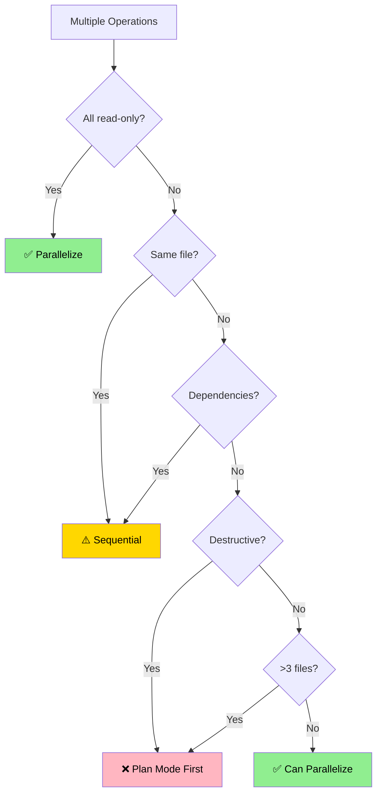

# Edit Tool Frameworks Reference

Extended decision trees, edge cases, conversion guide, and detailed examples.

---

## Table of Contents

- [Complete Decision Framework](#complete-decision-framework)
- [Context Execution Mode](#context-execution-mode)
- [Token Estimation Guidelines](#token-estimation-guidelines)
- [Edge Cases & Special Situations](#edge-cases--special-situations)
- [Tool Conversion Guide](#tool-conversion-guide)
- [Context Pollution Analysis](#context-pollution-analysis)
- [Bash Script vs Skill Wrapper](#bash-script-vs-skill-wrapper)
- [Parallelization Deep Dive](#parallelization-deep-dive)
- [Real-World Examples](#real-world-examples)

---

## Context Execution Mode

**PRIMARY DISCRIMINATOR** for tool design.

### Modes (3-way, v2.1.117+)

| Mode | Parent ctx | Pollution | Startup | Best for |
|------|-----------|-----------|---------|----------|
| **main** (default) | Full | Full | Instant | Quick actions, interactive, shared state |
| **fork** | **Inherited** | **Zero (async)** | ~1-2s | Parallel fan-out with shared base (debiasing, multi-perspective). Requires `CLAUDE_CODE_FORK_SUBAGENT=1` |
| **subagent** | None | Zero | ~1-2s | Research/exploration (parent would bias), heavy output, per-agent config, Team Protocol |

### Decision Tree

See `SKILL.md` for canonical 3-branch Mermaid.

### When to Use Fork (new)

✅ Fan-out parallel reasoning (N perspectives on same target) · ✅ Debiasing (project ctx, no parent reasoning bias) · ✅ Shares prompt cache across forks · ✅ Parent CLAUDE.md + memories needed by each spawn
❌ Per-agent model/memory/tools needed · ❌ Team Protocol required · ❌ Named persona identity

### When to Use Subagent

✅ Verbose output >2000 tokens · ✅ Deep codebase analysis, parent state irrelevant · ✅ Long-running analysis · ✅ Per-agent config (model downgrade, scoped memory, narrower tools) · ✅ Named persona / Team Protocol / SendMessage

### When to Use Main (default)

✅ Quick ops · ✅ Context-dependent · ✅ Frequent invocation (5+/session) · ✅ Interactive

### Fork Spawning Contract

A `context: fork` skill's runtime instructions MUST include:

1. **Invocation**: Call `Agent` WITHOUT `subagent_type` — omitting is what makes it a fork
2. **Restate specifics**: include target/constraint/decision under review in the directive
3. **Batch parallel**: send N forks in one tool-use block (prompt cache sharing)
4. **Don't peek**: never Read the fork's `output_file`
5. **Directive style**: prompt = what to do, not briefing (parent ctx already loaded)

Example fork spawn (inside a `context: fork` skill body):

    Agent({
      name: "challenger-anchor",
      description: "Anchor-pattern debiasing",
      prompt: "Target decision: <RESTATE>. Apply anchor-pattern debiasing. Report <300 words: verdict, evidence, reframe."
      // NOTE: no subagent_type — fork inherits parent context
    })

### Counterexample — when fork does NOT fit

- **`philosopher/council`**: 5 parallel philosophers, independent. Fan-out mechanics fit fork BUT per-agent model (haiku qualification + opus deliberation) + scoped memory require subagent.
- **`philosopher/encounter` / `philosopher/dialogue`**: SendMessage + Team Protocol. Fork has no stable name → must stay subagent.

Rule: per-agent model/memory/tools OR named persona OR Team Protocol → `subagent`, even when fan-out fits fork.

---

## Complete Decision Framework

### 7-Axis Analysis

#### Axis 1: Execution Type (Cost & Determinism)

| Type | Characteristics | Tool Choice |
|------|----------------|-------------|
| **Pure deterministic** | Sequential shell commands, no decisions | Bash Script |
| **Deterministic + AI** | Scripts exist, AI decides when/how | Skill with scripts/ |
| **Single AI operation** | One response, simple logic | Skill (user-triggered or auto) |
| **Multi-step AI** | Autonomous reasoning across steps | Sub-Agent |
| **Capability enhancement** | Extends Claude's abilities | Skill |

#### Axis 2: Invocation Pattern

| Pattern | User Action | Frontmatter |
|---------|-------------|-------------|
| **Dual-invocable** (default) | Both `/skill-name` and model auto-invoke | No special frontmatter needed |
| **Manual-only** (rare) | Only `/skill-name` | `disable-model-invocation: true` |
| **Programmatic** | Called by other tools | Sub-Agent (Task tool) |

#### Axis 3: Token Budget (Pollution Cost)

| Range | Implication | Tool Choice |
|-------|-------------|-------------|
| **0 tokens** | Script executed, not read | Bash Script or Skill+scripts/ |
| **<500 tokens** | Acceptable pollution | Skill (ideal) |
| **500-2000 tokens** | Use progressive disclosure | Skill + reference.md |
| **>2000 tokens** | Needs isolation | Sub-Agent or `context:subagent` |

**Estimation Tips:**
- Count prose, not code blocks (code is efficient)
- Tables ~50% more efficient than prose
- Mermaid diagrams ~40% more efficient than text descriptions
- Use `wc -w file.md` then multiply by 1.3 for rough token count

#### Axis 4: Context Strategy

| Need | Rationale | Tool Choice |
|------|-----------|-------------|
| **Main context access** | Needs conversation history | Skill (`context:main`) |
| **Parallel fan-out w/ shared base** | Debiasing, multi-perspective reasoning | Skill (`context:fork`) — v2.1.117+ |
| **Isolated exploration** | Research without pollution | Skill (`context:subagent`) or Sub-Agent |
| **Minimal pollution** | Concise, high-value capability | Skill (<500 tokens) |
| **Zero pollution** | Execution only | Bash Script |

#### Axis 5: Frequency & Justification

| Frequency | Per Session | Frontmatter | Tool Choice |
|-----------|-------------|-------------|-------------|
| **Very high** | 10+ | default (auto-invoke) | Skill |
| **High** | 5-9 | default (auto-invoke) | Skill (if <500 tokens) |
| **Medium** | 2-4 | default (dual-invocable) | Skill |
| **Low** | 1 | default (dual-invocable) | Skill |
| **Rare** | <0.1 | — | Direct Request |

**Context Pollution Math:**
- Skill at 400 tokens, used 10x/session = 4000 token "cost"
- But only loaded once when triggered
- Justify if saves >4000 tokens of repeated instructions

#### Axis 6: Script Wrapping Requirement

| Scenario | Problem | Solution |
|----------|---------|----------|
| **Pure scripts** | No AI needed | Bash Script |
| **Scripts + timing** | AI decides when to run | Skill with scripts/ |
| **Scripts + parameters** | AI generates args | Skill with scripts/ |
| **Scripts + orchestration** | Complex sequencing | Skill or Sub-Agent |

#### Axis 7: Write Operations (Parallelization)

| Operation | Risk | Guidance |
|-----------|------|----------|
| **Read-only** | None | ✅ Parallelize freely |
| **Write (independent)** | Conflicts | ⚠️ Sequential OR Plan Mode |
| **Write (dependent)** | Ordering | ⚠️ Careful sequencing |
| **Destructive** | Data loss | ❌ Plan Mode mandatory |

---

## Token Estimation Guidelines

### Quick Estimation

```bash
# Word count method
wc -w SKILL.md
# Multiply by 1.3 for token estimate

# Character count method (rough)
wc -c SKILL.md
# Divide by 4 for token estimate
```

### Content Type Multipliers

| Content Type | Tokens vs Words | Example |
|--------------|-----------------|---------|
| **Prose paragraphs** | 1.5x | "This section describes the process of..." |
| **Bullet lists** | 1.2x | "- Step one\n- Step two" |
| **Tables** | 0.8x | Markdown tables (structure = tokens) |
| **Code blocks** | 0.7x | Syntax highlighting efficient |
| **YAML** | 0.6x | Key-value pairs compress well |
| **Mermaid** | 0.5x | Structure encoded in syntax |

### Target Budgets

```yaml
Skill SKILL.md:
  Ideal: <500 tokens
  Maximum: 1000 tokens (question if higher)

Skill reference.md:
  Typical: 1000-3000 tokens
  Maximum: No hard limit (loaded on-demand)

Agent .md:
  Typical: 300-1000 tokens (system prompt)
  Maximum: No hard limit (isolated context)
```

---

## Edge Cases & Special Situations

### Case 1: "I want a skill that wraps multiple workflows"

**Analysis:**
- Token budget likely >1000 (multiple workflows)
- Violates single-responsibility principle

**Solution:**
- Create individual skills for each capability
- Or create orchestrator skill that delegates (like edit-tool!)

### Case 2: "Prevent this tool from auto-invoking"

**Analysis:**
- Rare case where auto-invoke is undesirable (e.g. destructive operations)

**Solution:**
- Add `disable-model-invocation: true` to frontmatter
- This is the exception, not the default

### Case 3: "This skill is too verbose (>1000 tokens)"

**Solutions:**
1. **Progressive disclosure**: Move details to reference.md
2. **Split into multiple skills**: If multiple capabilities
3. **Subagent context**: If research/exploration requires isolation (`context: subagent`)
4. **Fork context**: If parallel fan-out with inherited parent ctx (`context: fork`, v2.1.117+)
5. **Convert to Agent**: If >2000 tokens and exploratory

### Case 4: "I need a skill that runs complex scripts"

**Solution:**
```
skill-name/
├── SKILL.md (instructions for when/how to use scripts)
├── scripts/
│   ├── analyze.py
│   ├── transform.sh
│   └── validate.py
└── reference.md (script documentation)
```

### Case 5: "Should this be a skill or use existing Task tool?"

**Decision Tree:**
```
Is there an existing agent? (Explore, Plan, etc.)
├─ Yes → Use Task tool (no new skill needed)
└─ No → Create skill (with appropriate context mode)
```

### Case 6: "Skill for one project vs all projects"

- `.claude/skills/` → Current project only
- `~/.claude/skills/` → All projects (rare, use plugins instead)
- Plugin `skills/` → Plugin distribution

---

## Tool Conversion Guide

### Legacy Command → Skill

**When:** Migrating existing commands to unified skill format.

**Process:**
1. Create skill directory: `skills/tool-name/`
2. Add unified frontmatter (see skill-guide.md § Unified Frontmatter Specification)
3. Ensure `description` has trigger keywords (enables model auto-invoke)
4. Move verbose content to `reference.md`
6. Optimize SKILL.md to <500 tokens
7. Test trigger still works

**Frontmatter transformation:**
```yaml
# BEFORE (legacy command)
description: Brief description
allowed-tools: [Tool1, Tool2]
argument-hint: pattern
model: sonnet

# AFTER (skill)
name: tool-name
description: Brief description. Use when [triggers].
allowed-tools: [Tool1, Tool2]
argument-hint: pattern
model: sonnet
context: main
# Dual-invocable by default
```

### Skill → Agent

**When:** Token budget >2000, needs isolated context, complex multi-step exploration.

**Process:**
1. Create `.claude/agents/agent-name.md`
2. Add frontmatter: `name`, `description`, `tools`, `model`
3. Convert instructions to system prompt (2nd person → role-based)
4. Restrict tools to minimum needed
5. Remove references to conversation history

### Bash Script → Skill Wrapper

**When:** Script works but AI needs to decide when/how to use it.

**Process:**
1. Create skill: `skill-name/`
2. Move script to `scripts/` subdirectory
3. Write SKILL.md: when to invoke, how to generate parameters, how to interpret output
4. Keep script pure (no AI logic in script)

---

## Context Pollution Analysis

### What is Context Pollution?

Every skill's SKILL.md body is loaded when triggered and remains in context. This competes with conversation history, other skills, file contents, and user requests.

### Pollution Impact Formula

```
Impact = TokenCount × LoadFrequency × SessionDuration
```

### Minimizing Pollution

**Technique 1: Progressive Disclosure**
```
SKILL.md (300 tokens) → Always loaded when triggered
reference.md (2000 tokens) → Loaded only if Claude reads it
scripts/ (0 tokens) → Executed, never loaded
```

**Technique 2: Token Efficiency**
- Tables over prose (50% savings)
- Mermaid over text (40% savings)
- Inline examples over blocks
- Front-load critical info

**Technique 3: Precise Triggers**
- Specific triggers = loads only when needed
- Generic triggers = loads too often = more pollution
- Example: "Use for .xlsx files" (good) vs "Use for documents" (bad)

**Technique 4: Context Mode**
- `context: subagent` = zero pollution (isolated, no parent ctx)
- `context: fork` = zero pollution (parent ctx inherited, async, v2.1.117+)
- Subagent for research/analysis; fork for parallel fan-out with shared base

### When Pollution is Acceptable

✅ **High-value capabilities**: >2000 tokens worth of procedural knowledge, used 5+ times/session
✅ **Zero-inflation skills**: Mostly references `scripts/` (0 token execution), SKILL.md ~200-300 tokens
❌ **Unacceptable**: >1000 token skill used 1x per session — use progressive disclosure (reference.md), `context:subagent` (isolation), or `context:fork` (fan-out)

---

## Bash Script vs Skill Wrapper

### Decision Matrix

| Characteristic | Bash Script | Skill Wrapper |
|----------------|-------------|---------------|
| **Operations** | Purely deterministic | AI decides when/how |
| **Parameters** | Hardcoded or user-provided | AI-generated |
| **Context** | None | Minimal (decision logic) |
| **Reusability** | Limited to script use cases | Flexible invocation |
| **Token cost** | 0 | ~200-400 (wrapper logic) |

### When Scripts Can't Solve It

**Scenarios requiring AI:**
1. **Ambiguous input**: "Make this image look better"
2. **Context-dependent**: "Fix the test failures"
3. **Creative tasks**: "Write API docs"
4. **Multi-file coordination**: "Refactor authentication"

**These need:** Skill or Agent, not script wrappers

---

## Parallelization Deep Dive

### Safe Parallelization Rules

#### ✅ Always Safe: Read Operations
```markdown
[Read src/auth.js]
[Read src/user.js]
[Grep "function" --output_mode content]
[Glob "**/*.config.js"]
```

#### ⚠️ Sometimes Safe: Independent Writes
Safe if different files, no shared state, no dependencies.

#### ❌ Never Parallel: Destructive Operations
Always Plan Mode first: deleting files, renaming, refactoring >5 files, breaking changes.

### Parallelization Decision Tool



---

## Real-World Examples

### Example 1: Test Coverage Analyzer (Auto-invoked Skill)

**Request:** "I need something to check test coverage and show gaps"

**Analysis:**
- Pollution cost: ~400 tokens → Low
- Frequency: 3-5x/session → High
- Context: Needs main (recent changes)

**Decision:** `✅ SKILL because: ~400 tokens → low pollution, 5x/session → auto-invoke justified`

```
test-coverage/
├── SKILL.md (400 tokens - when to check, how to report)
└── scripts/parse_coverage.py (0 tokens - executed)
```

### Example 2: API Documentation Generator (User-triggered Skill)

**Request:** "Build a tool that generates API docs from code comments"

**Analysis:**
- Pollution cost: ~1500 tokens → Medium (use progressive disclosure)
- Frequency: 1-2x/session → Low
- Invocation: User triggers when docs needed

**Decision:** `✅ SKILL because: ~300 token SKILL.md + reference.md for progressive disclosure, 1-2x/session, dual-invocable`

```
generate-api-docs/
├── SKILL.md (~300 tokens - when to use, output format)
└── reference.md (~1200 tokens - parsing rules, templates, examples)
```

### Example 3: Codebase Analyzer (Sub-Agent)

**Request:** "Explore the codebase and explain architecture"

**Analysis:**
- Pollution cost: >3000 tokens → High
- Frequency: 1x/session
- Context: Doesn't need conversation history

**Decision:** `✅ SUB-AGENT because: >3000 tokens, complex exploration, isolated context needed`

### Example 4: Deploy to Vercel (User-triggered Skill)

**Request:** "Make a slash command for deploying to Vercel"

**Analysis:**
- Pollution cost: ~600 tokens → Medium
- Frequency: 1-2x/session → Low
- Invocation: User manually triggers

**Decision:** `✅ SKILL because: progressive disclosure keeps SKILL.md <500, dual-invocable, trigger keywords in description`

```yaml
# Frontmatter
name: deploy-vercel
description: Deploy to Vercel. Use when "deploy to vercel", "vercel deploy".
argument-hint: [environment]
# Dual-invocable by default
```

---

## Summary Cheat Sheet

```yaml
Choose BASH SCRIPT when:
  ✅ Purely deterministic shell operations
  ✅ No AI decision-making needed
  ❌ NOT: Needs AI to decide when/how/what

Choose SKILL (auto-invoked) when:
  ✅ <500 tokens ideal
  ✅ Used 5+ times per session
  ✅ Auto-invoke makes sense
  ✅ Specific capability
  ❌ NOT: Verbose, rare, or user-triggered

Choose SKILL (with progressive disclosure) when:
  ✅ >500 tokens total content
  ✅ Keep SKILL.md <500, verbose content in reference.md
  ✅ Any frequency (dual-invocable by default)
  ✅ Workflow with steps

Choose SKILL (context:subagent) when:
  ✅ Research, exploration, heavy analysis
  ✅ Verbose output that would pollute main context
  ✅ Per-agent config / Team Protocol / named persona
  Frontmatter: context: subagent

Choose SKILL (context:fork) when:   # v2.1.117+
  ✅ Parallel fan-out with inherited parent context
  ✅ Debiasing (each fork gets project ctx, no reasoning bias)
  ✅ Prompt cache sharing across forks
  ❌ NOT: per-agent model/memory/tools/persona/Team Protocol
  Frontmatter: context: fork

Choose SUB-AGENT when:
  ✅ >2000 tokens AND complex exploration
  ✅ Multi-step autonomous reasoning
  ✅ Needs full isolation
  ❌ NOT: Needs main conversation context

Choose DIRECT REQUEST when:
  ✅ One-off task, <1 per 10 sessions
  ✅ Simple enough to ask inline
  ❌ NOT: Worth building a tool for
```
