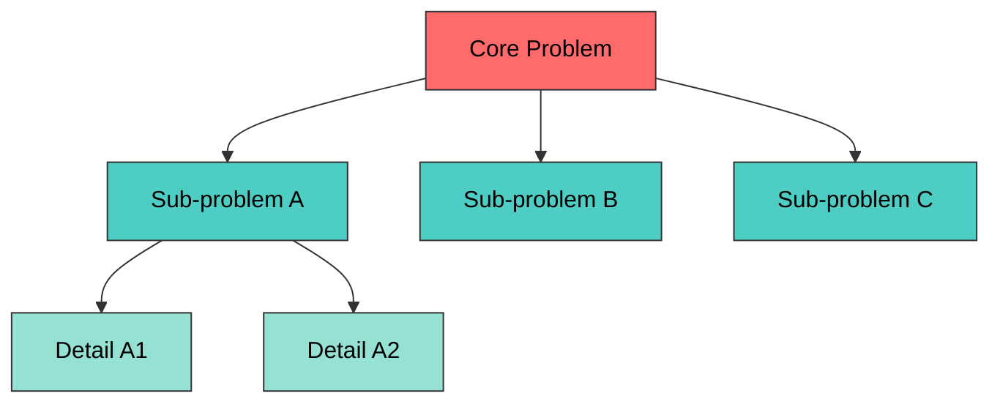

# Decompose Protocol

Break complex problems into tractable sub-problems before solving.

## Issue Trees (MECE)

Mutually Exclusive, Collectively Exhaustive decomposition.

### How to build

1. State the core question at the root
2. Split into 2-4 branches where:
   - **ME**: No overlap between branches (each sub-problem is independent)
   - **CE**: All branches together cover the full problem (nothing missing)
3. Recurse 1-2 levels deep (avoid >3 levels — diminishing returns)

### Template



### Quality check

| Test | Pass? |
|------|-------|
| Branches don't overlap? (ME) | |
| Branches cover everything? (CE) | |
| Each branch is actionable? | |
| Max 3 levels deep? | |

## Constraint Mapping (Theory of Constraints)

Identify which constraint actually limits the system. Optimizing non-bottlenecks is waste.

### Steps

1. **List all constraints**: Technical, environmental, access, time, knowledge, cost
2. **Classify each**:

| Type | Examples |
|------|----------|
| **Hard** (immovable) | API rate limits, Docker isolation, market hours |
| **Soft** (negotiable) | Budget, timeline, tool choice |
| **Assumed** (challenge these!) | "We can't access X" — is that actually true? |

3. **Find the binding constraint**: Which ONE constraint, if relaxed, would unlock the most progress?
4. **Subordinate everything else**: Design around the binding constraint first

### Output format

```yaml
constraints:
  hard:
    - constraint: "Custom Docker env — limited instrumentation"
      impact: "Cannot install arbitrary monitoring tools"
  soft:
    - constraint: "Time budget for investigation"
      negotiable: "Can extend if approach looks promising"
  assumed:
    - constraint: "Data bars are the source of inaccuracy"
      challenge: "Could be feed latency, aggregation logic, or timezone handling"
binding_constraint: "<the one that matters most>"
```

## Unknowns Inventory

Explicitly catalog what you don't know. Prevents hidden assumptions from derailing the design.

### Categories

| Category | Question to ask |
|----------|----------------|
| **Technical unknowns** | How does X actually work under the hood? |
| **Environmental unknowns** | What's the actual runtime behavior? |
| **Data unknowns** | What does the data actually look like? |
| **Integration unknowns** | How do components A and B actually interact? |

### Risk-rank unknowns

For each unknown: `Impact (H/M/L) × Likelihood of being wrong (H/M/L)`

Address High-Impact × High-Likelihood unknowns first in Research phase.
