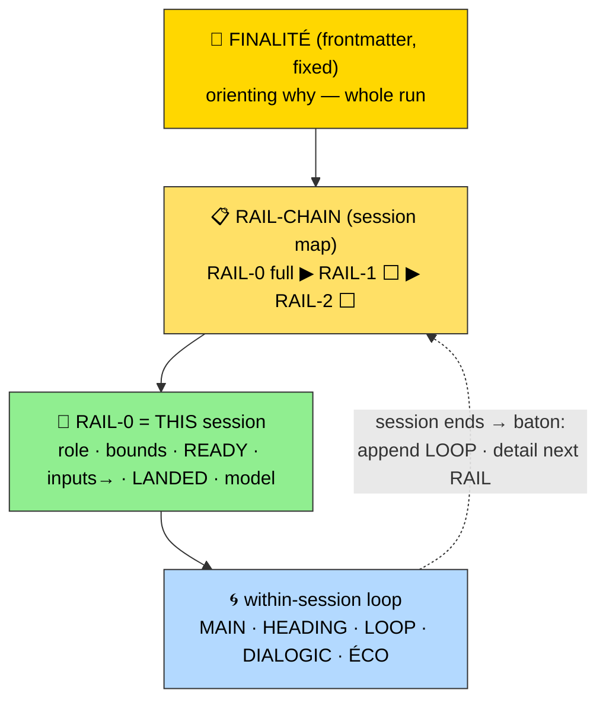

# meta-prompt Reference

Full procedure for the RELIANCE ledger. The live `RELIANCE.md` is token-lean and carries DATA only;
all the invariant machinery below lives here in the skill, never duplicated into each instance.

## The model — three altitudes + within-session loop



- **FINALITÉ** = whole run fulfilled (fixed). **RAIL.landed** = this session done (human gate). **HEADING.next** = this pebble done.
- The recursion runs at TWO scales: within a session (loop over zones) and across sessions (RAIL baton).
- **Baton rule:** RAIL-N's LANDED (DoD) feeds RAIL-(N+1)'s READY (DoR). A session can't start until the prior one's done-ness satisfies its ready-ness.

## Drift protocol (ÉCO) — detail

For each `ref`/`wip` hot file, before acting:
1. **Read the actual file.** Compare to its "expected state" fingerprint (date + 1 line) AND the last LOOP note about it.
2. **Drift** = the file says something the LOOP didn't predict (changed out of loop — by the human or a prior session).
   - Back-sync: append to LOOP → `[#N · date] 🤖 DRIFT: <file> changed out of loop: <what>`.
   - Flag in DIALOGIC before continuing. Never build silently on a stale assumption.
3. No drift → proceed.

**Budget by tier:** `ref 🔒` → cheap check ("was the frozen thing violated?", alarm if yes) · `wip ✏️` → full sync · `park 📦` → skip. Mutability tier = drift budget. This is for a SMALL set of prose files, not a codebase.

## Proportional challenge (DIALOGIC) — three dials

Do NOT run all of `/challenge`'s 9 modes every step. Escalate cheapest-first.

| Dial | Cost | Fires when |
|---|---|---|
| **1 — Standing mandate** | ~0 | every session, but only *speaks* if there's signal |
| **2 — One rotating lens** | low | at each gate, pick ONE lens by dominant risk |
| **3 — Deep `/challenge`** | high | boulder boundary OR human asks |

**Dial 1 (standing mandate):** Before proposing the next step — if you spot a decision that no longer holds, a blind spot, a flattened contradiction, or a reflexive agreement, say it in ONE line before continuing. Holding the tension > resolving it fast.

**Dial 2 (rotating lens — pick ONE):**
| Dominant risk | Lens |
|---|---|
| Old decision | 🔍 "does it still hold?" |
| AI too agreeable | 😈 "what if the opposite?" |
| Scope creeping | ✂️ "smallest possible step?" |
| LOOP flags drift here | ⚠️ "are we repeating a logged failure?" (reads LOOP — recursion as active challenge) |

**Dial 3:** invoke `/challenge` only at a boulder boundary or on request. Dial 1 is the radar; if it flags something big → pay for the depth.

> Why "hold the tension" not "converge": a compass picks one bearing (linear). DIALOGIC keeps opposing demands live (e.g. "ship fast ↔ ship right") and lets the tension generate the move. This is the anti-"you're absolutely right" mechanism.

## LOOP entry schema (append-only)

```
[#N · date] TASK: decision/discovery/pivot — <what + why>
[#N · date] 🤖 COLLAB: WORKED <what+why> | FAILED <fail+why> | DRIFT <where> | RECADRAGE <human correction>
```
- 🤖 COLLAB = the reflexive signal (how the AI worked) — what makes the loop intelligent, not a changelog.
- One line per fact, only if non-trivial. Nothing notable → write nothing. Never prune or rewrite past entries.

## /pick-model embedding

At `init` and at each `close` that opens a new RAIL: invoke `/pick-model` on the RAIL's shape (role/bounds/landed).
Write the verdict into the RAIL's `model:` field as a **recommendation with rationale** — human confirms at the gate, never auto-switch (consistent with pick-model's "judge, don't execute" posture and propose-not-emit). A RAIL boundary is the ideal trigger: you're already pausing for the gate, cache is cold-ish on handoff, so re-evaluating costs ~nothing.

## Token discipline (the live RELIANCE.md)

- Emit from `reference/RELIANCE-template.md` §LLM SKELETON — zones + data ONLY.
- NO legend, NO Mermaid, NO prose, NO gloss in the instance. Those live in this skill's `reference/`, read once at `init`.
- The file is re-read every session — keep it lean. Procedure (this file) is loaded once; the instance must not re-carry it.

## Articulation with context-files

| Axis | Carried by | Content |
|---|---|---|
| Live work | RELIANCE.md | FINALITÉ · RAIL-chain · HEADING · LOOP · DIALOGIC · ÉCO · MAIN |
| Cold-start resume | CONTEXT-llm | focus · hot files · artifact pointers (unchanged) |

When both active: `/save-context` thins `Next` + `Decisions` to `→ see RELIANCE.md`. `/load-context` lists RELIANCE.md as hot file #1. No double register.

## Related

- `reference/RELIANCE-template.md` — the rich human template + LLM skeleton (NOT loaded; Read at `init`).
- `reference/morin-glossary.md` — the legend + concept explanations (NOT loaded; for teaching/onboarding).
- `/pick-model` — composed at RAIL framing.
- `/save-context` · `/load-context` — orthogonal cold-start layer.
- `/challenge` — Dial 3 deep escalation.
