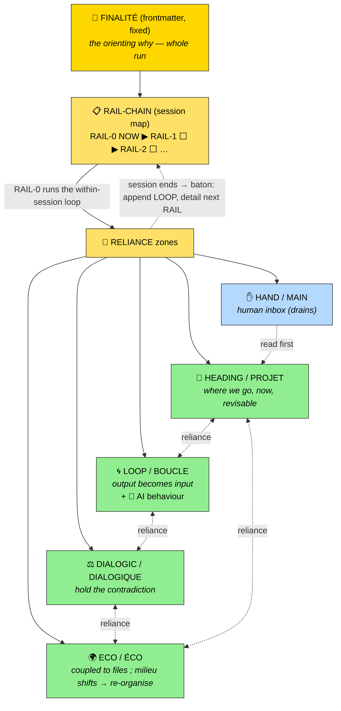
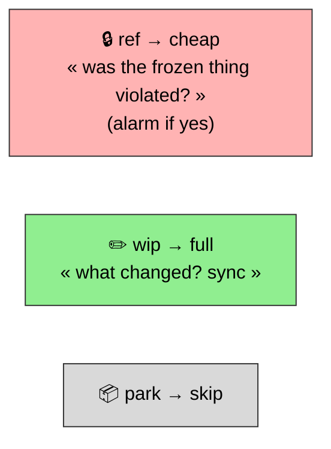
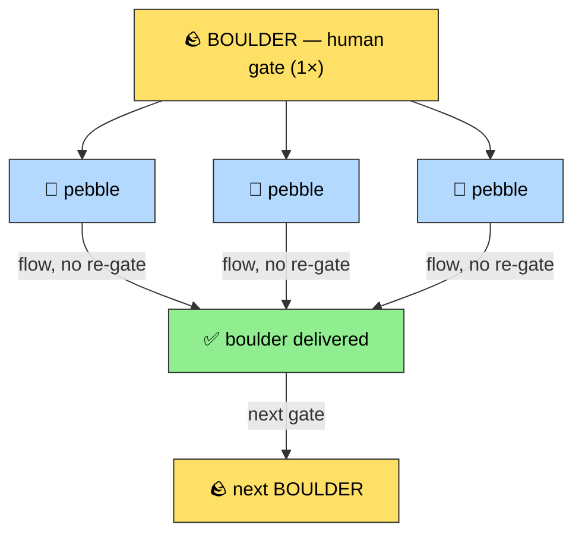

# RELIANCE — *recursive ledger for a human-guided complex task*

> ⚠️ This file is **not a plan**. It is a **linked whole**: several aspects of one piece of
> work that only mean something *together*. You don't read it top-to-bottom like a sequence —
> you read the **links** between zones. The output of one step becomes the input of the next
> (recursive loop). One single file, so everything cross-signals in one place.
>
> **Single source on disk.** Each new step (fresh window) RE-READS this file. No copy ever
> travels inside the prompt → no drift. The file is the truth.
>
> **Two files exist** — see §LLM SKELETON at the bottom:
> - this **template** = human-facing, taught-from (legend, diagrams, prose).
> - the live **`RELIANCE.md`** = token-lean, re-read every step (data + directives only).

---

## 📖 LEGEND — *pensée complexe* (Edgar Morin)

| 🇬🇧 EN | 🇫🇷 FR | Morin concept (one line) | Role here |
|---|---|---|---|
| **RELIANCE** | **RELIANCE** | Re-link what dividing thought separates — the whole exists only in the linking. | The file itself ; the links between zones |
| **FINALITY** | **FINALITÉ** | The orienting *why* — it directs the whole without scripting its path (≠ a goal-with-fixed-steps). | Frontmatter: end-to-end purpose, fixed across all sessions |
| **HEADING** | **PROJET** | A revisable aim, never frozen once-and-for-all — it reshapes as you move. | Now + proposed next step + live decisions (intra-session) |
| **LOOP** | **BOUCLE** | The output becomes the input: what happened feeds what follows (recursive loop). | Append-only trail: discoveries · pivots · 🤖 AI behaviour |
| **DIALOGIC** | **DIALOGIQUE** | Hold two opposing demands together without resolving — the tension is generative. | Challenge: the AI pushes the contradiction, doesn't flatten it |
| **ECO** | **ÉCO** | The work is coupled to its milieu; when the milieu shifts, we re-organise. | Hot files ref/wip/park · drift detection · back-sync |
| ✋ **HAND** | ✋ **MAIN** | *(not Morin — human-in-the-loop primitive)* the human's direct touch on the work. | Human inbox: notes/todo/feedback the AI must consume |

> **Three altitudes of "what good looks like"** — each scoped to its own scale, so none duplicates another:
> **FINALITÉ** = the whole run is fulfilled (fixed) → **RAIL.landed** = this *session* is done (human gate) → **HEADING.next** = this *pebble* is done.
>
> **RAIL** (acronym, not Morin) = the instruction **payload** carried by RELIANCE. One RAIL = **one full interactive session**.
> RELIANCE conveys session N → session N+1 without loss. Future RAILs are **stubs** (boulder-scale forward map), detailed only when reached.



> Dotted edges **are** the reliance: no zone means anything alone.
> LOOP warns DIALOGIC ; ECO feeds LOOP ; HEADING is judged against both ; HAND overrides all.
> Above the zones: FINALITÉ orients the whole ; the RAIL-CHAIN sequences the sessions ; each session runs the loop and hands the baton on.

---

## ✋ HAND / MAIN — *human inbox (read FIRST, drains)*

> *Not a Morin concept — the human-in-the-loop primitive.* The human writes here freely,
> async, any time. The AI **must read this zone before anything else** and consume every entry.
> This zone **drains**: it is neither plan (HEADING) nor history (LOOP) — it's a to-do for the AI.
>
> **Markers:** `//` free-text note/feedback · `[ ]` actionable todo. Both supported, human picks by type.
> **Consume = act → ack into LOOP (`🤖 RECADRAGE …`) → clear from MAIN.** Empty MAIN = nothing pending.
> **Human intent overrides machine drift** — that's why MAIN is read before ECO.

```
// e.g. free-text: rethink S5 timing, feels too tight
[ ] e.g. todo: add Faycal as DevOps témoin in S5
```

---

## 📋 RAIL-CHAIN — *the session map (boulder scale — the instruction payload)*

> Each **RAIL = one full interactive session.** RELIANCE conveys session N → N+1 without loss.
> Only the **current** RAIL is fully written ; future RAILs are **stubs** (title + 1-line aim),
> detailed only when reached — boulder→pebble at session scale. This is the forward map
> (legit forward-sight) — NOT pre-scripted within-session steps (those stay loop-generated).
>
> `// future v0.3: per-RAIL autonomy flag — a RAIL whose LANDED is machine-checkable could run`
> `// /goal-like (autonomous between gates); a judgment RAIL must keep the human gate. RELIANCE`
> `// = the human-in-the-loop superset of /goal. Don't build /goal separately — make autonomy a RAIL property.`

### ▶ RAIL-0 — *NOW (full)*
- **role:** *(who the AI is for THIS session)*
- **bounds:** *(in / out of scope · non-negotiables — Narrowing)*
- **ready (DoR):** *(preconditions to START — prior artifact committed · hot files synced · MAIN drained)*
- **inputs:** → ECO hot files + LOOP trail *(pointer — NOT restated here)*
- **landed (DoD):** *(this session done = the human's gate — session-scale "good")*

### ⬜ RAIL-1 — *stub*
- *(title + 1-line aim ; its `ready` = RAIL-0's `landed`. Detail when reached.)*

### ⬜ RAIL-2 — *stub*
- *(title)*

> **Baton rule:** RAIL-N's **LANDED (DoD)** feeds RAIL-(N+1)'s **READY (DoR)** — a session can't
> start until the previous one's done-ness satisfies its ready-ness. That's the lossless handoff.

---

## 🧭 HEADING / PROJET — *where we go, now (revisable)*

> **Mutable** zone: freely rewritten each step. Never frozen "for good".

### Aim
*(1-2 sentences: the living goal of this task — not a spec sheet)*

### NOW — the single step in progress
*(ONE step, pebble-grained. The rest of the work stays coarse — boulder. Only detail the
next pebble at the moment of confirming it.)*

### Next step — **proposed**, not emitted
> ⚠️ Human-guided semantics: the AI **proposes** the next step and **waits** for the human's
> confirm/redirect. It does NOT open the next window on its own.
- **Proposal:** *(next step, pebble-grained)*
- **The LOOP says:** *(relevant trail signal — success to repeat, drift to avoid)*
- **Confirm / redirect?** → awaiting human

### Live decisions (revisable — ≠ frozen trail)
- *(framing decisions still in force ; moved to LOOP once they become past)*

---

## 🌀 LOOP / BOUCLE — *output becomes input (append-only — NEVER pruned)*

> **Sacred** zone: only **append**, never erase or rewrite. This is the recursive memory:
> each step re-reads it and acts on it.
> **Two levels** per entry — the task AND the collaboration with the AI.

**Entry schema (one line per fact, only if non-trivial):**

```
[#N · date] TASK: decision/discovery/pivot — <what + why>
[#N · date] 🤖 COLLAB: WORKED <what+why> | FAILED <fail+why> | DRIFT <where> | RECADRAGE <human correction>
```

> 🤖 COLLAB = the reflexive signal: how the AI worked. This is what makes the loop
> *intelligent* (not just a changelog). Token discipline: **one line, never a paragraph.**
> If nothing notable on the collab side → write nothing.

### Trail
*(append here, oldest to newest)*
- `[#0 · 2026-06-10] TASK: RELIANCE template created — 4 Morin zones + MAIN, single disk source.`

---

## ⚖️ DIALOGIC / DIALOGIQUE — *hold the contradiction (proportional challenge)*

> The AI's challenge lives here. **Not** "converge toward true north" (that's a compass —
> that's linear) — but **hold the tension open**, resist premature convergence and the
> "you're absolutely right" reflex. Three dials, cheapest first.

### Dial 1 — Standing mandate (cost ~0, always on)
> Before proposing the next step: if you spot a decision that no longer holds, a blind spot,
> a flattened contradiction, or a reflexive agreement — **say it in ONE line before continuing.**
> Otherwise, proceed. Holding the tension > resolving it fast.

### Dial 2 — One rotating lens per gate (ONE, chosen by the dominant risk)
| Step's dominant risk | Lens (one question) |
|---|---|
| Old decision | 🔍 "does it still hold?" |
| AI too agreeable | 😈 "what if the opposite?" (devil's advocate) |
| Scope creeping | ✂️ "smallest possible step?" (YAGNI) |
| LOOP flags drift here | ⚠️ "are we repeating a logged failure?" (LOOP recall) |

> The 4th lens reads the LOOP: this is recursion turning into **active** challenge, not passive archive.

### Dial 3 — Deep challenge (rare, on demand or at boulder boundary)
> Escalate to `/challenge` (9 modes) ONLY at a boulder boundary or when the human asks.
> Dial 1 is the radar ; if it flags something big → pay for the depth.

### Open tensions
- *(contradictions held deliberately, not resolved — e.g. "ship fast ↔ ship right")*

---

## 🌍 ECO / ÉCO — *coupled to the milieu (hot files + drift + back-sync)*

> The work isn't free-floating: it's coupled to a small set of files (not a codebase). When
> the milieu shifts under us, we notice and re-organise. Mutability tier = drift-check budget.

### Hot files (by mutability tier)
| File | Tier | Expected state (human fingerprint: date + 1 line) | Drift check |
|---|---|---|---|
| `e.g. SYLLABUS-v0.2.md` | wip ✏️ | `2026-06-09 · 6 sessions locked, S5 Ops added` | full |
| `e.g. ref/structure-session.md` | ref 🔒 | `frozen · 6-beat template slide 19` | "violated?" |
| `e.g. park/old-outline.md` | park 📦 | dormant | skip |



### Drift protocol (each step, before acting) — `// heuristic → /meta-prompt skill`
1. For each `ref`/`wip` hot file: **read the actual file**, compare to "expected state" + the last LOOP note about it.
2. **Drift detected** (the file says what the LOOP didn't predict) →
   - **back-sync**: append the delta to LOOP (`🤖 DRIFT: <file> changed out of loop: <what>`) ;
   - **flag** in DIALOGIC before continuing. Never build silently on a stale assumption.
3. No drift → proceed.

---

## 🔄 PROPAGATION CONTRACT (last instruction of EVERY step) — `// algorithm → /meta-prompt skill`

> The chain never breaks. But it **proposes**, it doesn't **emit**.

0. **HAND first**: read MAIN. Act on each entry → ack into LOOP → clear it. Human intent overrides drift.
1. **ECO**: drift-check hot files. Drift → back-sync LOOP + flag DIALOGIC.
2. **LOOP**: append the two-level entry (TASK + 🤖 COLLAB if notable). Never prune.
3. **HEADING**: mark NOW done, rewrite the next step **pebble-grained, as a proposal**.
4. **DIALOGIC**: apply Dial 1 (standing mandate) + Dial 2 (one lens) ; flag if any.
5. **Surface to the human**: "Proposed next step: [X]. The LOOP says [Y]. Confirm or redirect."
6. **Wait.** Do NOT open the next window before human confirmation.

### Gate granularity (anti-fatigue) — `// rule → /meta-prompt skill`
> Gate at the **boulder boundary**, not every pebble. Once a boulder is confirmed
> ("yes, build S2 this way"), its pebbles (slides, HM, notes…) flow light-touch without
> re-gating each. The next human gate = the next boulder.



---

## 🤝 ARTICULATION with /save-context · /load-context (division of labour)

> RELIANCE and the CONTEXT files are **orthogonal** — do not duplicate.

| Axis | Carried by | Content |
|---|---|---|
| **Live work** (decisions, trail, next step, AI behaviour) | **RELIANCE** | HEADING · LOOP · DIALOGIC · ECO · HAND |
| **Cold-start resume** (focus, hot files, artifact pointers) | **CONTEXT-llm** | unchanged |

- When a RELIANCE is active: `/save-context` thins its `Next` + `Decisions` to a **pointer**
  (`→ see RELIANCE.md`) instead of re-synthesising. No double register.
- `/load-context` lists `RELIANCE.md` as **hot file #1**.

---

## ✅ SELF-CHECK (before propagating)
☐ Single source: no copy of the file travels in the prompt
☐ MAIN read first and drained (acked into LOOP, cleared)
☐ LOOP append-only (nothing erased/rewritten) — two-level entry if collab notable
☐ Next step = **proposal**, pebble-grained, not an emission
☐ ECO: hot-file drift checked, back-synced if needed
☐ DIALOGIC: Dial 1 applied ; Dial 2 one lens ; no premature convergence
☐ Gate at boulder boundary, not every pebble (anti-fatigue)
☐ No duplication with CONTEXT-llm

---

# 🧱 LLM SKELETON — *what the generated lean `RELIANCE.md` looks like*

> The skill emits THIS (no legend, no diagrams, no prose, no gloss). Lean because it is
> re-read every step. The legend/diagrams above live ONCE here in the template, never re-ingested.
> `// …` markers above flag the procedure that lives in the skill, not in each instance.

```markdown
---
type: reliance
task: <name>
horizon: human-guided
finalité: <end-to-end why — fixed>
---
# RELIANCE — <task>

## MAIN  (human inbox · read first · drains · // free-text · [ ] todo)
(empty)

## RAIL-CHAIN  (session map · only NOW is full · rest stubs)
▶ RAIL-0 NOW: role <…> | bounds <…> | ready(DoR) <…> | inputs → ECO+LOOP | landed(DoD) <…>
⬜ RAIL-1: <title + aim>   (ready = RAIL-0 landed)
⬜ RAIL-2: <title>

## HEADING  (mutable · intra-session)
NOW: <pebble step>
NEXT (proposed): <pebble> | LOOP says: <signal> | awaiting human
decisions: <live, revisable>

## LOOP  (append-only · NEVER prune · 2 levels)
[#0 · date] TASK: <…>
[#N · date] 🤖 COLLAB: WORKED <…> | FAILED <…> | DRIFT <…> | RECADRAGE <…>

## DIALOGIC  (challenge)
open tensions: <held, not resolved>

## ECO  (hot files)
| file | tier | expected (date+1line) |
| … | wip/ref/park | … |

## (procedure — drift protocol, propagation contract, gating, dials — owned by /meta-prompt skill)
```
