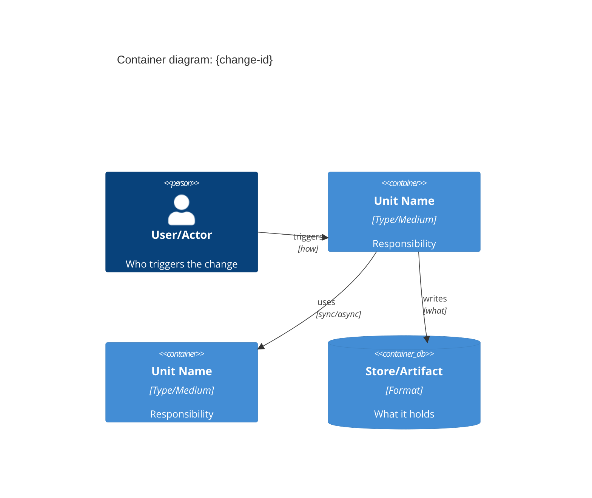
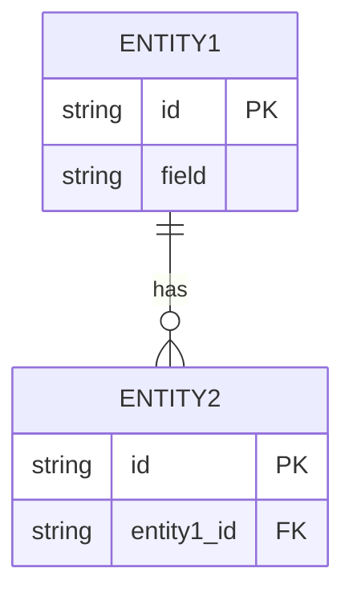
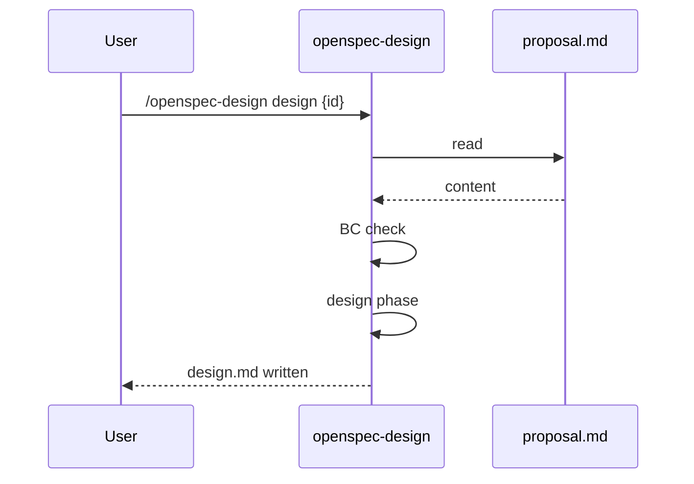
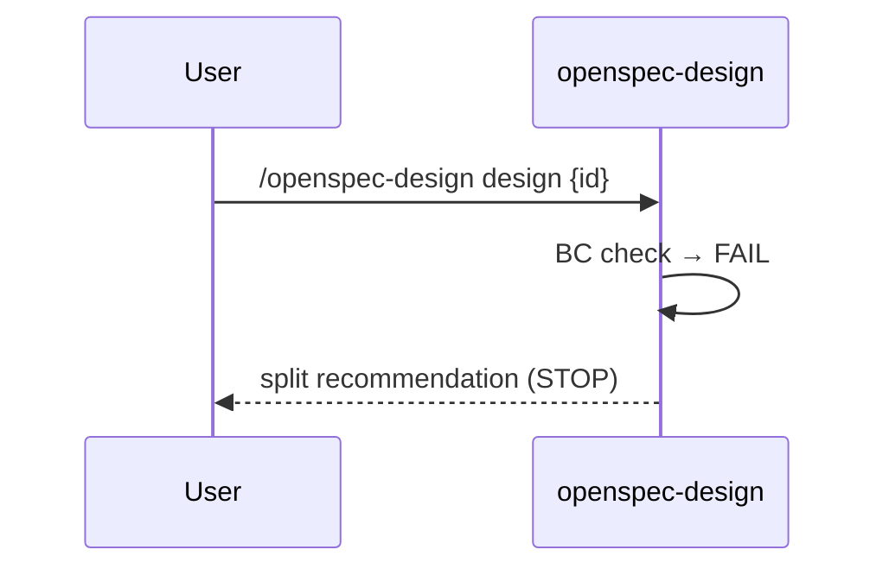
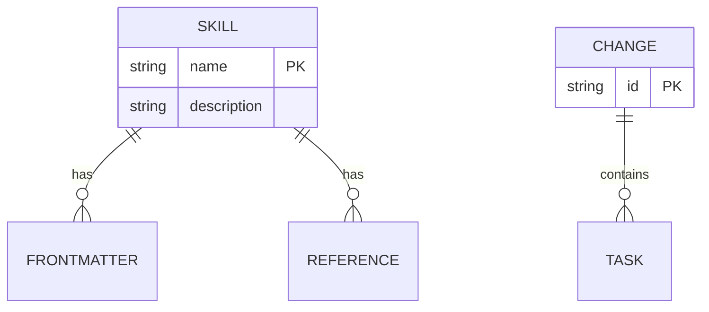

# OpenSpec Design — Reference

Extended documentation for `openspec-design` skill.

---

## design.md Template

Copy-paste scaffold. Replace `{placeholders}`.

```markdown
# Design: {change-id}

## BC Scope

**Domain**: {name of the bounded context}
**Ubiquitous language**:
- {term}: {definition within this context}
- {term}: {definition}

**Owns**: {what this BC is responsible for — active responsibilities}
**Does NOT own**: {explicit negative boundaries — what's adjacent but outside scope}
**Invariants**:
- {what must ALWAYS be true — e.g., "Every skill must have a unique name"}
- {behavioral contract the design must preserve}

**Context interactions**:

| Adjacent BC | DDD Relationship | TT Mode | Notes |
|---|---|---|---|
| {BC name} | {pattern from context map} | {X-as-a-Service / Collaboration / Facilitating} | {e.g., "ACL required — external model"} |

---

## Containers (C4 L2)

**Domain-agnostic**: A "container" is any bounded unit with responsibilities and interfaces. Choose the zoom level that fits:
- **Software**: services, modules, APIs, databases
- **Skills/tools**: SKILL.md, reference.md, scripts/, config files
- **Processes**: workflow phases, handoff stages, decision gates
- **Documents**: sections, reader journeys, artifact types



**Cognitive load check**: "Can one session implement this container?"

| Container | Domains required | Passes? | Action if no |
|---|---|---|---|
| {name} | {domain 1, domain 2} | ✅ / ❌ | {split or document} |

---

## Entity-Relationship



**Aggregate boundaries**:
- Aggregate root: `{ENTITY}` — owns `{ENTITY2, ENTITY3}` (must be consistent together)
- Cross-aggregate: `{ENTITY4}` can be updated independently

---

## Key Flows

### Flow 1: {Happy path name} (command flow)



Note: `->>` solid = command (sync). `-->>` dashed = event/response (async).

### Flow 2: {BC violation path}



---

## ADRs

### ADR-1: {decision title}

**Context**: {why this decision was needed — the situation and problem}
**Decision**: {what was decided — the choice made}
**Consequences**: {trade-offs — what this enables, what it forecloses, what debt it creates}
```

---

## BC Check Signals

Scan proposal.md for these patterns. Any 2+ signals = recommend split.

| # | Signal | What to look for in proposal.md |
|---|---|---|
| 1 | **Multiple distinct vocabularies** | Proposal uses terms from 2+ distinct domains that don't overlap (e.g., "order fulfillment" + "payment processing", or "skill authoring" + "plugin deployment") |
| 2 | **Independent subgraphs** | Containers that never interact — diagram splits into disconnected clusters |
| 3 | **Independent testability** | "Part A works without part B" — if separable, should be separate changes |
| 4 | **Multiple ownership candidates** | "Who owns this?" yields different answers depending on which part |
| 5 | **Cognitive load overflow** | Single container requires 3+ distinct domains to understand simultaneously |

**Threshold**: 1 signal = note in design; 2+ signals = recommend split.

**Override path**: If user decides to proceed despite signals, capture in ADR:
> ADR-0: Decision to proceed as single BC despite {signal}
> Context: {why the signals appeared}
> Decision: proceed as single change because {reason}
> Consequences: {accepted trade-offs}

---

## Context Map: DDD Relationship Types

Seven canonical patterns (Evans, DDD Ch.14; Vernon, IDDD Ch.3).

| Pattern | Meaning | Quick-pick guidance |
|---|---|---|
| **Shared Kernel** | Two BCs share a subset of the domain model | Use when 2 of your own BCs share entities/data. Requires coordinated changes — shared part is a coupling point. |
| **Customer-Supplier** | Upstream serves downstream; downstream has negotiating power over the API | Use when you own both sides. Upstream provides, downstream requests changes via contract. |
| **Conformist** | Downstream conforms to upstream's model with no influence | Use when upstream is external (3rd party API, cloud service). You adopt their model as-is. ACL often needed. |
| **Anti-Corruption Layer (ACL)** | Explicit translation layer protecting your BC from a foreign model | Use whenever integrating with an external system (AWS, Stripe, GitHub API). Adapter/translator in ER diagram. |
| **Open Host Service** | Your BC exposes a well-defined protocol others consume | Use when your BC is the upstream providing a stable API. Versioning matters. |
| **Separate Ways** | No integration — BCs are fully independent | Simplest case. Confirms no coupling. Use when two things share a codebase but don't interact. |
| **Partnership** | Two BCs evolve together cooperatively, joint planning required | Use when two BCs are tightly coupled by necessity (shared roadmap). Should evolve toward looser coupling. |

**Solo-dev quick-pick**:
- External APIs / cloud services → **Conformist + ACL**
- Your own BCs sharing data → **Shared Kernel**
- Your BC exposing an API → **Open Host Service**
- No interaction → **Separate Ways**

---

## ACL Detection Heuristic

> **Rule**: If this BC integrates with a system whose model you do not control, an ACL is required.

Signs you need an ACL:
- You're calling an external API (AWS, Stripe, GitHub, OpenAI)
- You're reading from a third-party data format
- You're consuming events from an external system (webhooks)
- The upstream model uses terminology that doesn't belong in your domain

**ACL in ER diagram**: Show the ACL as a distinct entity/component sitting between your domain entities and the external model. Label it explicitly.

**Lambda example**: AWS Lambda runtime + IAM + API Gateway = foreign model. Without ACL, infrastructure concepts (cold starts, memory limits, IAM role ARNs) bleed into application logic, making both untestable in isolation.

---

## Aggregate Boundary Annotation

Aggregates (Evans, DDD Ch.6): A cluster of entities that must be consistent together, modified as a unit with a single root.

**In ER diagram**: Use Mermaid comment annotations or a grouping pattern:



**Task granularity rule**: Entities within an aggregate = implement in a single task. Entities across aggregates = can be separate tasks (eventually consistent).

---

## Command Flow vs Event Flow Conventions

In sequence diagrams (Key Flows section):

| Arrow | Type | When to use |
|---|---|---|
| `->>` (solid) | **Command** — synchronous, within a BC | Direct function call, API request, user action |
| `-->>` (dashed) | **Event/response** — asynchronous, at BC boundary | Webhook, file watcher, hook callback, response |

**Why it matters**: Designing synchronous call chains where async events are appropriate leads to tight coupling and fragile systems. Make the distinction explicit in every flow diagram.

**Claude Code hook example**:
- `PostToolUse` hook firing = **event** (dashed) — the agent did something, you react
- `/openspec-design design {id}` invocation = **command** (solid) — user requests action

---

## Cognitive Load Heuristic

> **Question**: "Can one session implement this container?"

If **no** → split the container or document the accepted complexity.

**Human cognitive load** (Sweller, 1988):
- **Intrinsic** (domain complexity): Managed by ubiquitous language section — naming reduces load
- **Extraneous** (accidental complexity): Managed by BC check — prevents multi-domain contamination
- **Germane** (productive learning): What design.md should maximize — useful structural understanding

**Agent cognitive load** (context window pressure):
- design.md + proposal.md + tasks.md must fit in the context budget they save
- If a container requires 3+ technical domains simultaneously → the agent cannot hold enough context to implement coherently
- Aggregate boundaries = "what can be done in one focused session"

**Container split heuristic**:
> "Can a single person (or single agent session) hold enough context to implement this container without constantly switching domains?"
> If no → split.

---

## Testability Bridge

Design artifacts inform test.md execution model. When producing design.md, note testability per container:

| Container characteristic | Test type hint |
|---|---|
| Pure data validation (YAML, schema, file checks) | `[auto]` — deterministic, no API calls |
| External system integration (API calls, subprocess) | `[auto]` or `[smoke]` — depends on cost/flakiness |
| Non-deterministic output (LLM responses, creative) | `[smoke]` or `[manual]` — needs human judgment |
| UI/UX flows, visual correctness | `[manual]` — human verification required |

**In cognitive load check table**, optionally add a "Test type" column:

```markdown
| Container | Domains required | Passes? | Test type hint |
|---|---|---|---|
| Structural Harness | YAML parsing | ✅ | [auto] |
| Behavioral Harness | claude -p, subprocess | ✅ | [smoke] |
```

This bridges design.md → test.md so openspec-plan/tasks can generate correctly tagged test steps.
