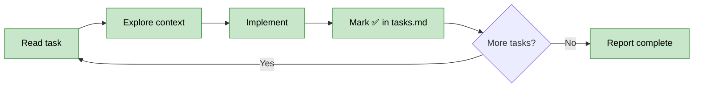

# OpenSpec Develop

Implementation engine for approved OpenSpec proposals. Turns tasks.md checkboxes into working code.

## Workflow: Explore → Implement → Mark



**Critical**: Mark checkbox immediately after each task. Enables crash recovery.

## Exploration Strategy

Before implementation, consult `openspec/project.md` → Exploration Strategy section:

1. **Context sources**: Read `primary` files (project.md, proposal.md, specs)
2. **Must-read files**: CLAUDE.md, settings.json (project constraints)
3. **Tools**: Use configured codebase tools (Glob, Grep, Read, or MCP if enabled)
4. **Pattern matching**: Read existing similar files to match structure/style
5. **Philosophy**: Read Execution Philosophy section for current mode and principles

## Commands

### implement

Implement all pending tasks from tasks.md.

**Input**: `$ARGUMENTS` = `change-id`

**Workflow**:
1. Read `openspec/changes/{change-id}/tasks.md`
2. For each unchecked task (`- [ ]`):
   a. Consult Exploration Strategy for context/tools
   b. Read specs and must-read files
   c. Explore codebase for patterns
   d. Implement the task
   e. **Immediately** mark checkbox: `- [ ]` → `- [x]`
3. When all complete: Report "All tasks complete. Ready for /openspec-test"

**All complete**:
```
✅ All tasks complete for {change-id}
Progress: {done}/{total} tasks
Ready for: /openspec-test {change-id}
```

### task

Implement a specific task by number.

**Input**: `$ARGUMENTS` = `change-id task-number` (e.g., `add-feature 1.3`)

**Workflow**:
1. Read tasks.md, find task by number (e.g., `1.3`)
2. If already checked: Report "Task {number} already complete"
3. If unchecked: Implement using same workflow as `implement`
4. Mark checkbox immediately after completion

**Already complete**:
```
⏭️ Task {number} already complete
Description: {task description}
```

### status

Show implementation progress.

**Input**: `$ARGUMENTS` = `change-id`

**Run**:
```bash
openspec show {change-id}
```

Display task completion progress from CLI output.

## Guardrails

**Autonomous** (no confirmation needed):
- Code generation matching specs
- File edits within scope
- Checkbox updates
- Pattern-matching existing code

**Ask-first** (pause and confirm):
- Architectural decisions not in specs
- New dependencies not mentioned
- Scope deviation >20% from proposal
- Files outside change scope

**Scope check**: Before creating files not mentioned in proposal.md, count affected files. If >20% more than proposal's "Affected files", ask:
```
⚠️ Scope expansion detected
Proposal mentions: {n} files
Implementation needs: {m} files ({percent}% more)

Proceed with expanded scope? [y/N]
```

## Philosophy Check

Before implementing, read `openspec/project.md` → Execution Philosophy → `mode`.

**During implementation**, flag anti-patterns for current mode:
```
⚠️ Philosophy check ({mode} mode):
- Anti-pattern detected: {anti-pattern}
- Current action: {what you're about to do}
- Question: {is this necessary or gold-plating?}

Proceed anyway? [y/N]
```

**Examples by mode**:
- `garage`: Flag premature abstractions, over-engineering, excessive documentation
- `scale`: Flag missing tests, undocumented decisions, cowboy changes
- `maintenance`: Flag unnecessary refactors, feature creep, risky upgrades

## Task Parsing

Parse tasks.md format:
```markdown
## 1. Section Name
- [ ] 1.1 Task description here
- [x] 1.2 Already complete task
- [ ] 1.3 Another pending task
```

Match pattern: `- \[([ x])\] (\d+\.\d+) (.+)$`
- Group 1: checkbox state (space = pending, x = complete)
- Group 2: task number (e.g., 1.3)
- Group 3: task description

## Checkbox Update

After completing task, edit tasks.md:
- Find: `- [ ] {task-number} {description}`
- Replace: `- [x] {task-number} {description}`

Use Edit tool for surgical update. Never rewrite entire file.
