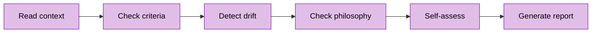

# OpenSpec Reflect

Pre-gate self-check skill. Verifies acceptance criteria, detects scope drift, and ensures philosophy alignment before human review.

## Workflow: Check → Assess → Report



**Critical**: Run before human gates. Catches drift BEFORE human reviews.

## Commands

### reflect

Run comprehensive pre-gate self-check.

**Input**: `$ARGUMENTS` = `change-id`

**Workflow**:
1. **Load context**:
   - Read `openspec/changes/{change-id}/proposal.md` for acceptance criteria
   - Read `openspec/changes/{change-id}/tasks.md` for progress
   - Read `openspec/changes/{change-id}/test.md` for test strategy (if exists)
   - Read `openspec/changes/{change-id}/specs/*.md` for requirements
   - Read `openspec/project.md` for Execution Philosophy

2. **Pre-gate check** (scale/maintenance mode only):
   - Check if `test.md` exists
   - If missing in scale/maintenance mode: flag ⚠️ MISSING_TEST_MD deviation
   - In garage mode: test.md optional (note if missing, don't block)

3. **Check acceptance criteria**:
   - Extract criteria from proposal.md (Success Criteria section)
   - For each criterion: verify met/unmet/partial
   - Record evidence for each status

4. **Detect scope drift**:
   - Extract "Affected files" from proposal.md
   - Run `git status` and `git diff --stat` to find actual changes
   - Calculate deviation percentage: `(actual - proposed) / proposed * 100`
   - Flag if >20% deviation

5. **Check philosophy alignment**:
   - Read `mode` from Execution Philosophy
   - Review implementation for anti-patterns of current mode
   - Flag any violations

6. **Self-assessment**:
   - Answer: "Am I solving the right problem?"
   - Evaluate: Is work aligned with proposal's Problem statement?

7. **Generate gate-ready report** (see format below)

## Guardrails

**Autonomous** (no confirmation needed):
- Reading all context files
- Analyzing implementation
- Generating reports
- Flagging deviations

**Ask-first** (pause and confirm):
- None - reflect is read-only and advisory

## Philosophy Check

Read `openspec/project.md` → Execution Philosophy → `mode`.

| Mode | Flag Anti-patterns |
|------|-------------------|
| `garage` | Over-engineering, premature abstraction, analysis paralysis |
| `scale` | Cowboy coding, skipping tests, undocumented decisions |
| `maintenance` | Refactoring for aesthetics, feature creep, risky upgrades |

Format: `⚠️ PHILOSOPHY VIOLATION ({mode}) - {anti-pattern}: {evidence}`

## Gate-Ready Report Format

```
# Reflection Report: {change-id}

## Test Strategy Coverage
- test.md: {present/missing}
- Mode: {mode}
{if missing + scale/maintenance: ⚠️ MISSING_TEST_MD - required for {mode} mode}
{if missing + garage: ℹ️ test.md optional in garage mode}
{if present: - Coverage: {summary of test.md sections}}

## Criteria Status
| Criterion | Status | Evidence |
|-----------|--------|----------|
| {criterion 1} | {met/unmet/partial} | {evidence} |
| {criterion 2} | {met/unmet/partial} | {evidence} |

## Scope Analysis
- Proposed files: {n}
- Actual files: {m}
- Deviation: {percent}%
{if >20%: ⚠️ SCOPE DRIFT DETECTED - requires human review}

## Philosophy Alignment
- Mode: {mode}
- Anti-patterns detected: {list or "None"}
{if violations: ⚠️ PHILOSOPHY VIOLATION - {details}}

## Self-Assessment
**Question**: Am I solving the right problem?
**Answer**: {assessment based on proposal's Problem statement}

## Deviations Requiring Attention
{list with ⚠️ emoji for each, or "None"}

## Recommendation
{READY FOR GATE | NOT READY - {reasons}}
```

## Deviation Types

- `MISSING_TEST_MD` - test.md missing in scale/maintenance mode
- `SCOPE_DRIFT` - Files changed exceed proposal by >20%
- `CRITERIA_UNMET` - Acceptance criterion not satisfied
- `PHILOSOPHY_VIOLATION` - Anti-pattern for current mode
- `SPEC_DEVIATION` - Implementation differs from specs

Format: `⚠️ DEVIATION: {type} - Expected: {X}, Actual: {Y}, Impact: {Z}, Rec: {action}`

See `reference.md` for detailed examples and patterns.
