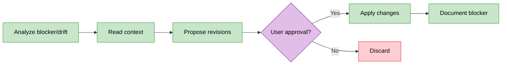

# OpenSpec Replan

Adaptive refinement skill for blocked or drifted changes. Proposes revised tasks or pivots.

## Workflow: Analyze → Propose → Confirm → Apply



**Critical**: Always wait for user confirmation before applying changes (ask_first trust zone).

## Guardrails

**Trust Zone: ask_first** (all changes require human approval)

**Always ask before**:
- Modifying tasks.md
- Modifying proposal.md
- Archiving files
- Any scope changes

**Scope deviation threshold**: >20%
- If openspec-reflect reports >20% drift, suggest replan
- Show deviation calculation in proposal

**Minimal change preference**:
- Count affected vs unaffected tasks
- If <50% affected, revise only those tasks
- If >50% affected, consider pivot instead

## Commands

### replan

Revise tasks when implementation is blocked.

**Input**: `$ARGUMENTS` = `change-id [blocker-description]`

**Workflow**:
1. Read `openspec/changes/{change-id}/tasks.md`, proposal.md, specs
2. Identify blocker (from argument or ask user)
3. Analyze which tasks are affected
4. **Minimal change preference**: Revise only affected tasks, not entire list
5. Propose revised tasks with blocker context
6. **Wait for user approval** before applying
7. If approved: Update tasks.md with revisions
8. Document blocker as comment in tasks.md

**Proposal format**:
```
## Replan Proposal for {change-id}

### Blocker
{blocker description}

### Affected Tasks
- {task-number}: {original} -> {revised}
- {task-number}: REMOVED (blocked)
- NEW {task-number}: {new task}

### Impact
{n} tasks modified, {m} removed, {p} added

Approve these changes? [y/N]
```

**After approval**:
```
Replan applied for {change-id}
Modified: {n} tasks
Removed: {m} tasks
Added: {p} tasks
Blocker documented in tasks.md
```

### pivot

Handle major scope shifts when direction changes.

**Input**: `$ARGUMENTS` = `change-id [reason]`

**Workflow**:
1. Read current proposal.md and tasks.md
2. Ask user for new direction if not provided
3. Draft new proposal.md reflecting changed scope
4. Generate new tasks.md for revised approach
5. **Wait for user approval** before applying
6. If approved: Archive old files, write new ones

**Proposal format**:
```
## Pivot Proposal for {change-id}

### Current Direction
{summary of existing proposal}

### New Direction
{proposed new approach}

### Reason
{why pivot is needed}

### New Tasks
{numbered task list}

Approve this pivot? [y/N]
```

**After approval**:
```
Pivot applied for {change-id}
Old proposal archived: proposal.md.bak
New proposal: {brief summary}
New tasks: {count} items
```

## Philosophy Check

Before proposing revisions, read `openspec/project.md` → Execution Philosophy → `mode`.

**Apply mode principles to revised plan**:
```
Philosophy check ({mode} mode):
- Principles: {list applicable}
- Trade-offs accepted: {from mode config}
- Anti-patterns avoided: {list}
```

**Examples by mode**:
- `garage`: Accept minimal revisions, avoid over-planning, defer optimization
- `scale`: Document decision rationale, ensure test coverage for new tasks
- `maintenance`: Minimize blast radius, prefer conservative changes

## Blocker Documentation

When replan completes, add comment to tasks.md:

```markdown
<!-- REPLAN: {date}
Blocker: {description}
Resolution: {how revised tasks address it}
Tasks affected: {list}
-->
```

Insert after section header of first affected task.

## Exploration Strategy

Before replanning, consult `openspec/project.md` → Exploration Strategy section:

1. **Context sources**: Read `primary` files (project.md, proposal.md, specs)
2. **Must-read files**: CLAUDE.md, settings.json (project constraints)
3. **Tools**: Use configured codebase tools (Glob, Grep, Read, or MCP if enabled)
4. **Existing tasks**: Read tasks.md to understand current plan
5. **Philosophy**: Read Execution Philosophy section for current mode and principles

## Scope Deviation Calculation

Calculate deviation when triggered by reflect:

```
Deviation = (|planned - actual| / planned) * 100%

Where:
- planned = tasks in original tasks.md
- actual = completed + new tasks needed

Example:
- Original: 10 tasks
- Completed: 4 tasks
- New tasks needed: 5 tasks
- Deviation = (|10 - 9| / 10) * 100% = 10% (under threshold)
```

Trigger replan suggestion at >20% deviation.
