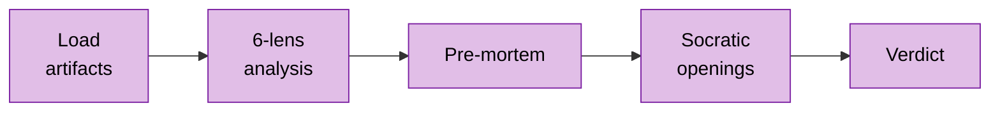

# OpenSpec Review

Senior tech lead + architect review gate. Positioned between `/openspec-plan tasks` and `/openspec-develop`. Reviews all artifacts as a coherent whole — challenges whether the design is worth implementing.

**You are reviewing:** `$ARGUMENTS`

## Commands

### review

Pre-implementation review of all OpenSpec artifacts for a change.

**Input**: `$ARGUMENTS` = `change-id`

**Workflow**:

1. **Load artifacts** — read all in order:

| File | Required | Purpose |
|------|----------|---------|
| `openspec/project.md` | yes | Mode, philosophy, exploration strategy |
| `openspec/changes/{id}/proposal.md` | yes | Problem, scope, acceptance criteria |
| `openspec/changes/{id}/design.md` | if exists | BC scope, containers, flows, ADRs |
| `openspec/changes/{id}/tasks.md` | yes | Task breakdown, gates |
| `openspec/changes/{id}/tests.md` | if exists | Verification strategy |
| `openspec/changes/{id}/specs/*.md` | if exist | Detailed requirements |

   If `proposal.md` or `tasks.md` missing → `⛔ Cannot review. Run /openspec-plan first.`

2. **Spawn devil-advocate** (via Agent tool, subagent_type: `dstoic:devil-advocate:devil-advocate`) in background — feed target description + all artifact paths. Merge findings into Lenses 1, 4, 6.

3. **Run 6 lenses** — see `reference.md` §Six Lenses for full checklists:

| Lens | Question | Key checks |
|------|----------|------------|
| 1: Problem-Solution Fit | Right problem? | Alternatives considered, non-goals, effort proportionality |
| 2: Design Soundness | Will it work? | BC boundaries, sensitivity points, reversibility (one-way doors) |
| 3: Best Practices | What should be here? | Error handling, security, observability, migration |
| 4: Over-Engineering | What shouldn't be here? | YAGNI, premature generalization, gold-plating |
| 5: Task & Test Quality | Implementable? | Outcome phrasing, gate placement, test coverage |
| 6: Gap Detection | What's missing? | Operational readiness, blast radius, integration risks |

4. **Classify findings** by severity — see `reference.md` §Severity Calibration

5. **Pre-mortem** (mandatory) — 3 failure scenarios from devil-advocate or generated independently

6. **Socratic openings** — 3-5 genuine questions (not leading) surfacing unstated assumptions

7. **Verdict** → output report using template from `reference.md` §Output Template

| Verdict | Meaning | Next |
|---------|---------|------|
| **READY** | No critical findings | → `/openspec-develop {change-id}` |
| **READY WITH CAVEATS** | Major findings to address | → Fix, then `/openspec-develop` |
| **NOT READY** | Critical findings block | → Fix, then `/openspec-review` |
| **RETHINK** | Problem-solution fit questioned | → `/openspec-plan create` |

## Philosophy Check

Read `openspec/project.md` → Execution Philosophy → `mode`. Calibrate review depth and flag anti-patterns — see `reference.md` §Philosophy Anti-Patterns by Mode.

## Exploration Strategy

Before review, consult `openspec/project.md` → Exploration Strategy. See `reference.md` §Exploration Strategy.

## Guardrails

**Autonomous**: Reading artifacts, spawning devil-advocate, generating report.

**Read-only**: This skill NEVER modifies files. Advisory only.

## Constraints

- Review artifacts as they ARE, not how you'd write them
- Flag problems, don't propose redesigns — let the author decide
- Don't duplicate `/openspec-reflect` (post-impl drift) or `/challenge` (bias on AI output)
- Calibrate depth to mode: garage = pragmatic, scale/maintenance = thorough
