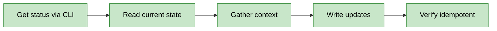

# OpenSpec Sync

Context and documentation synchronization for OpenSpec changes. Keeps CONTEXT-llm.md and docs in sync with implementation state.

## Workflow: Check → Gather → Write



**Critical**: Use `openspec status` for change state, never parse files directly.

## Guardrails

**Autonomous** (no confirmation needed):
- CONTEXT-llm.md updates
- Doc content refresh
- Status queries via CLI

**Ask-first** (pause and confirm):
- Creating new doc files not mentioned in proposal
- Deleting outdated docs
- Major restructuring of existing docs

## CLI Delegation

**Always use CLI for status**:
```bash
openspec status {change-id}
```

**Never**:
- Parse proposal.md for status manually
- Infer status from file existence
- Maintain separate status tracking

The CLI is the single source of truth for change status.

## Commands

### sync

Full synchronization: updates CONTEXT-llm.md and refreshes docs in one command.

**Input**: `$ARGUMENTS` = `change-id`

**Workflow**:
1. Run `openspec status {change-id}` for current state
2. Read git state: `git status --short`, `git log -1 --oneline`
3. Read `openspec/changes/{change-id}/tasks.md` for progress
4. Update CONTEXT-llm.md with gathered state
5. Identify docs affected by implementation (Glob for modified files)
6. Refresh affected docs if out of sync

**Output**:
```
✅ Sync complete for {change-id}
- CONTEXT-llm.md: updated
- Docs refreshed: {count} files
- Change status: {status from CLI}
```

### docs

Refresh documentation files only (no CONTEXT-llm.md update).

**Input**: `$ARGUMENTS` = `change-id`

**Workflow**:
1. Run `openspec status {change-id}` for affected files
2. Read `openspec/changes/{change-id}/proposal.md` → Affected Files
3. Glob for modified files since change started
4. Identify docs that reference changed files
5. Update those docs to reflect current implementation

**Output**:
```
📚 Docs refresh for {change-id}
- Scanned: {n} affected files
- Updated: {m} docs
- Skipped: {k} (already current)
```

### context

Save session state to CONTEXT-llm.md only (no docs refresh).

**Input**: `$ARGUMENTS` = `change-id`

**Workflow**:
1. Run `openspec status {change-id}`
2. Run `git status --short`
3. Run `git log -3 --oneline`
4. Read `openspec/changes/{change-id}/tasks.md`
5. Count completed vs total tasks
6. Write CONTEXT-llm.md with template below

**CONTEXT-llm.md Template**:
```markdown
# Context: {change-id}

## Status
- Change: {status from openspec status}
- Tasks: {done}/{total} complete
- Git: {branch}, {clean|modified}

## Recent Commits
{last 3 commits}

## Current Focus
{current task or section being worked on}

## Next Steps
1. {next unchecked task}
2. {following task}

## Reference
- Proposal: openspec/changes/{change-id}/proposal.md
- Tasks: openspec/changes/{change-id}/tasks.md
- Project: openspec/project.md
```

**Output**:
```
💾 Context saved for {change-id}
- File: CONTEXT-llm.md
- Tasks: {done}/{total}
- Status: {status}
```

## Philosophy Check

Before syncing, read `openspec/project.md` → Execution Philosophy → `mode`.

**In garage mode**: Minimal docs, just CONTEXT-llm.md. Don't gold-plate documentation.
**In scale mode**: Ensure all docs accurate and up-to-date.
**In maintenance mode**: Document changes carefully before modifying existing docs.

## Idempotency

Running sync multiple times with same state produces identical output:

1. Before writing, read current CONTEXT-llm.md
2. Generate new content
3. Compare: if identical, report "Already in sync"
4. Write only if different

**Output when no changes**:
```
⏭️ Already in sync for {change-id}
- CONTEXT-llm.md: current
- Docs: current
- Last sync: {timestamp from file}
```

## Exploration Strategy

Before syncing, consult `openspec/project.md` → Exploration Strategy section:

1. **Context sources**: Read `primary` files (project.md, proposal.md, tasks.md)
2. **Must-read files**: CLAUDE.md, settings.json (project constraints)
3. **Tools**: Use configured codebase tools (Glob, Grep, Read)
4. **Philosophy**: Read Execution Philosophy section for current mode
