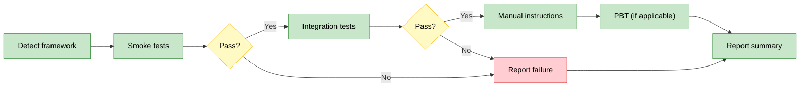
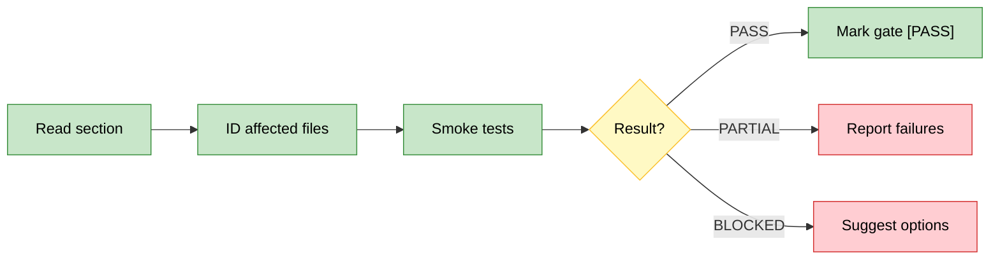

# OpenSpec Test

Layered verification engine for OpenSpec changes. Runs tests in order: smoke → integration → manual → PBT.

## Workflow: Detect → Run Layers → Report



**Critical**: Stop on layer failure. No point running integration if smoke fails.

## Commands

### test

Run all test layers in order for a change.

**Input**: `$ARGUMENTS` = `change-id`

**Workflow**:
1. Read `openspec/changes/{change-id}/proposal.md` for context
2. Detect test framework (see Framework Detection)
3. Run layers in order, stopping on first failure:
   - **Smoke**: Run health check tests
   - **Integration**: Run integration tests
   - **Manual**: Output instructions (do not wait)
   - **PBT**: Run property tests if framework detected
4. Report summary

**Output**:
```
🧪 Test Results: {change-id}

Layer      | Status | Details
-----------|--------|--------
Smoke      | ✅/❌   | {count} tests
Integration| ✅/❌   | {count} tests
Manual     | 📋     | {n} instructions generated
PBT        | ✅/⏭️   | {count} tests or "skipped"

Overall: ✅ Ready for gate / ❌ Fix required
```

### layer

Run a specific test layer only.

**Input**: `$ARGUMENTS` = `change-id layer-name` (e.g., `add-feature integration`)

**Valid layers**: `smoke`, `integration`, `manual`, `pbt`

**Workflow**:
1. Detect test framework
2. Run only the specified layer
3. Report results for that layer

**Output**:
```
🧪 Layer: {layer-name} for {change-id}

Status: ✅/❌
Tests: {passed}/{total}
Details: {summary}
```

### status

Show test status summary.

**Input**: `$ARGUMENTS` = `change-id`

**Workflow**:
1. Check for cached test results (if any)
2. Report last known status per layer

**No previous runs**:
```
🧪 Test Status: {change-id}

No test runs recorded. Run: /openspec-test test {change-id}
```

**With history**:
```
🧪 Test Status: {change-id}

Layer      | Last Run   | Status
-----------|------------|-------
Smoke      | {datetime} | ✅/❌
Integration| {datetime} | ✅/❌
Manual     | pending    | 📋 Awaiting human
PBT        | {datetime} | ✅/⏭️
```

### checkpoint

Run scoped verification for a single section after gate pause.

**Input**: `$ARGUMENTS` = `change-id section-number` (e.g., `add-feature 3`)

**Workflow**:
1. Read `openspec/changes/{change-id}/tasks.md`, find section `## {section-number}. ...`
2. Identify affected files from task descriptions + `git diff`
3. Run test layers scoped to section's affected files (see Philosophy Check table for mode-specific layers)
4. Evaluate result:
   - **PASS**: Mark `### GATE {n}: desc` → `### GATE {n}: desc [PASS]` in tasks.md
   - **PARTIAL**: Report failures, suggest fixes
   - **BLOCKED**: Report blockers, suggest options



**PASS output**:
```
✅ GATE {n}: {description} [PASS]
Smoke: {passed}/{total} tests passed
→ Continue: /openspec-develop section {change-id} {n+1}
```

**PARTIAL output**:
```
⚠️ GATE {n}: {description} [PARTIAL]
Smoke: {passed}/{total} tests passed
Failures:
- {test}: {reason}
→ Fix and re-run: /openspec-test checkpoint {change-id} {n}
```

**BLOCKED output**:
```
🚫 GATE {n}: {description} [BLOCKED]
Reason: {blocker description}
Options:
→ Fix blocker and retry: /openspec-test checkpoint {change-id} {n}
→ Skip gate: /openspec-develop section {change-id} {n+1}
→ Replan: /openspec-replan {change-id}
```

## Philosophy Check

Before testing, read `openspec/project.md` → Execution Philosophy → `mode`.

**Mode-specific testing behavior**:

| Mode | Smoke | Integration | Manual | PBT | Checkpoint |
|------|-------|-------------|--------|-----|------------|
| garage | Required | Best-effort | Critical paths only | Skip unless exists | Smoke only, BLOCKED = skip allowed |
| scale | Required | Required | Full coverage | Recommended | Smoke + integration, BLOCKED = must resolve |
| maintenance | Required | Required | Full coverage | Required for changes | Smoke + integration, BLOCKED = must resolve |

**Garage mode shortcuts**:
- Skip PBT unless tests already exist
- Manual tests only for user-facing critical paths
- Integration tests best-effort (don't block on flaky tests)

**Scale/maintenance**: Full rigor, no shortcuts.

## Framework Detection

Detect test framework from project files:

```yaml
javascript:
  files: [package.json]
  frameworks:
    jest: '"jest"' in dependencies/devDependencies
    vitest: '"vitest"' in dependencies/devDependencies
    mocha: '"mocha"' in dependencies/devDependencies
  default: "npm test"

python:
  files: [pyproject.toml, pytest.ini, setup.py]
  frameworks:
    pytest: pytest.ini exists OR "pytest" in pyproject.toml
    unittest: test_*.py pattern without pytest
  default: "pytest"

rust:
  files: [Cargo.toml]
  default: "cargo test"

go:
  files: [go.mod]
  default: "go test ./..."
```

**Fallback**: If no framework detected, prompt for test command:
```
⚠️ No test framework detected
Project has: {detected config files}

What command runs tests? (or 'skip' to skip automated tests)
```

## Test Layers

```yaml
layers:
  smoke:
    purpose: Basic health checks
    examples: ["app starts", "endpoints respond", "no crash on basic input"]
    auto: true

  integration:
    purpose: Component interactions
    examples: ["API contracts match", "DB state consistent", "error handling"]
    auto: true

  manual:
    purpose: Human-verified critical paths
    examples: ["UI flows", "user journeys", "edge cases needing judgment"]
    auto: false  # Generate instructions only

  pbt:
    purpose: Property-based edge case discovery
    examples: ["invariants hold", "no unexpected states", "boundary conditions"]
    auto: true
    frameworks: [hypothesis, fast-check, proptest]
```

## Test Command Patterns

When running tests, use framework-appropriate commands:

```bash
# Smoke (fast, basic)
npm test -- --grep "smoke"
pytest -m smoke
cargo test --lib

# Integration (slower, thorough)
npm test -- --grep "integration"
pytest -m integration
cargo test --test '*'

# PBT (property-based)
npm test -- --grep "property"
pytest -m "property or hypothesis"
cargo test --features proptest
```

Adapt patterns based on detected framework and existing test structure.

## Manual Test Instructions

For manual layer, generate human-executable steps:

**Format**:
```markdown
## Manual Test Instructions: {change-id}

### Test 1: {test name}
**Purpose**: {what this validates}
**Steps**:
1. {step 1}
2. {step 2}
3. {step 3}

**Expected**: {expected outcome}
**Pass criteria**: {what constitutes pass}

---

### Test 2: {test name}
...

---

When complete, report results:
- Test 1: PASS / FAIL (reason)
- Test 2: PASS / FAIL (reason)
```

## Exploration Strategy

Before testing, consult `openspec/project.md` → Exploration Strategy section:

1. **Context sources**: Read `primary` files (project.md, proposal.md, specs)
2. **Must-read files**: CLAUDE.md, settings.json (project constraints)
3. **Test config**: Detect test framework from package.json, pytest.ini, cargo.toml, etc.
4. **Existing tests**: Grep for test files to understand project test patterns
5. **Philosophy**: Read Execution Philosophy section for current mode

## Error Handling

**Test failure**:
```
❌ Layer failed: {layer-name}

Failed tests:
- {test 1}: {reason}
- {test 2}: {reason}

Fix the failures before proceeding. Re-run: /openspec-test layer {change-id} {layer}
```

**No tests found**:
```
⚠️ No tests found for layer: {layer-name}

This could mean:
1. Tests not yet written for this change
2. Test naming convention doesn't match expected pattern

Options:
- Write tests matching convention
- Skip layer with: /openspec-test layer {change-id} {next-layer}
```
