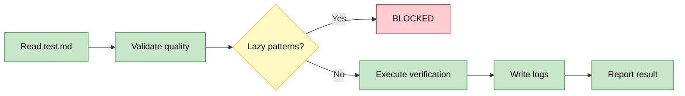

# OpenSpec Test

Generic verification executor for OpenSpec gates. Follows test.md strategy literally — no improvisation.

## checkpoint

**Input**: `$ARGUMENTS` = `change-id section-number` (e.g., `add-feature 3`)

**Workflow**:
1. Read `openspec/changes/{change-id}/tasks.md` → find `## {section-number}. ...`
2. Read `openspec/changes/{change-id}/test.md` → verification strategy. If missing: warn + offer `/openspec-plan tasks {change-id}` or skip (garage only).
3. If test.md has a `**Design**:` header → read `openspec/changes/{change-id}/design.md` for invariants, key flows, and ADRs (informs gate evaluation context)
3. **Validate**: Scan for lazy patterns (`grep "keyword"`, `[ -f file ]`, `wc -l`, `echo`). If found → BLOCKED with suggestion for functional verification.
4. **Init logs**: Create `test-logs/gate-{n}-{yyyyMMddHHmm}.yaml` (raw, append-per-step) + `test-logs/gate-{n}-{yyyyMMddHHmm}.md` (summary). Timestamp = run start time. See reference.md §Log Formats.
5. **Execute** by type tag (default `[auto]`):

| Tag | Action | Evaluator |
|-----|--------|-----------|
| `[auto]` | Run command, assert exit+output | Agent |
| `[smoke]` | Run command, display output | Agent + human glance |
| `[manual]` | Display instructions, AskUserQuestion (PASS/FAIL/SKIP) | Human |

   - Order: `[auto]` + `[smoke]` first, group `[manual]` at end
   - **Per step**: Append YAML step block to raw log immediately after execution (not batched)

6. **Write summary** to `gate-{n}-{ts}.md` — rendered from raw YAML, not memory. See reference.md §Test Log Format.
7. **Display** gate summary inline to user.
8. **Evaluate**:
   - PASS → mark `### GATE {n}: desc [PASS]` in tasks.md
   - PARTIAL → report failures with per-step diagnostics
   - BLOCKED → report blockers, suggest options

## Log Strategy

Two artifacts per gate run in `openspec/changes/{change-id}/test-logs/`:

| File | Format | Purpose |
|------|--------|---------|
| `gate-{n}-{yyyyMMddHHmm}.yaml` | YAML | Source of truth — append-per-step, full stdout/stderr (mask secrets) |
| `gate-{n}-{yyyyMMddHHmm}.md` | Markdown | Human summary — rendered from raw YAML after all steps |

- **Timestamped filenames**: Each run = new file pair. No overwriting, no array append gymnastics.
- **Append-per-step**: Raw YAML grows incrementally — each step appended immediately after execution.
- Markdown truncation: stdout >50 lines → first 30 + last 10; stderr >20 lines → first 15

See reference.md §Raw Log Format for YAML schema, §Test Log Format for markdown template.

## Mode Behavior

Read `openspec/project.md` → `mode`:
- **garage**: Warn if test.md missing, allow skip
- **scale/maintenance**: Block until test.md exists + passes

## References

See reference.md for: log format templates, YAML schema, test progression strategy, framework-specific patterns, execution tracing, failure diagnostics.
