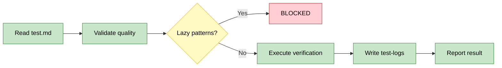
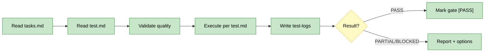

# OpenSpec Test

Generic verification executor for OpenSpec gates. Follows test.md strategy literally - no improvisation.

## Workflow: Read test.md → Validate → Execute → Log → Report



**Critical**: test.md is source of truth. Checkpoint executes what test.md says, nothing more.

## Commands

### checkpoint

Run scoped verification for a single section after gate pause.

**Input**: `$ARGUMENTS` = `change-id section-number` (e.g., `add-feature 3`)

**Workflow**:
1. Read `openspec/changes/{change-id}/tasks.md`, find section `## {section-number}. ...`
2. Read `openspec/changes/{change-id}/test.md` for verification strategy (see Missing test.md section if not found)
3. **Validate test.md quality**: Check for lazy patterns (grep "keyword", [ -f file ], wc -l, echo). If found → BLOCKED with suggestion to use functional verification
4. For each task in section, execute verification per test.md strategy
5. Write results to `test-logs/gate-{n}.md` (see Test Log Format section)
6. Evaluate result:
   - **PASS**: Mark `### GATE {n}: desc` → `### GATE {n}: desc [PASS]` in tasks.md
   - **PARTIAL**: Report failures, suggest fixes
   - **BLOCKED**: Report blockers, suggest options



**Output**: PASS/PARTIAL/BLOCKED with status and next actions (see reference.md for formats)

### Missing test.md

If `test.md` not found, warn and provide options — never improvise verification:

```
⚠️ No test.md found for {change-id}
Cannot verify gate without test strategy.

Options:
→ Generate test.md: /openspec-plan tasks {change-id}
→ Skip gate: /openspec-develop section {change-id} {n+1}
```

**Mode-specific behavior**:
- **garage**: Warn but allow skip if change is simple/obvious
- **scale/maintenance**: Block until test.md exists

### Lazy Pattern Detection

Before executing test.md, scan verification steps for lazy patterns:

**Lazy patterns** (structural checks):
- `grep "keyword" file` - checks word exists, not behavior
- `[ -f file ]` or `ls file` - checks file exists, not content
- `wc -l > 0` - checks non-empty, not correctness
- `echo "looks good"` - no actual verification

**If detected** → BLOCKED:
```
🚫 GATE {n}: [BLOCKED]
Reason: Lazy verification in test.md

Task {x}: Uses grep "keyword" - checks word exists, not behavior
Suggestion: Read file section, verify specific content/structure

→ Update test.md with functional verification
→ Re-run: /openspec-test checkpoint {change-id} {n}
```

**Functional alternatives** (see openspec-plan/reference.md anti-pattern table)

### Test Log Format

Write verification results to `openspec/changes/{change-id}/test-logs/gate-{n}.md`:

```markdown
# Test Log: GATE {n} — {description}
**Run**: {timestamp}
**Mode**: {mode} ({layers})
**Result**: ✅ PASS / ⚠️ PARTIAL / ❌ FAIL

## {task-number} {task outcome}
- **Action**: {what agent actually did}
- **Output**: {raw output, truncated if large}
- **Result**: ✅ / ❌ {brief}

## {task-number} {task outcome}
...

---
Duration: {time}
```

**On re-run**: Append new timestamped entry to same file, don't overwrite. Enables retry audit trail.

## Mode-Specific Behavior

Read `openspec/project.md` → Execution Philosophy → `mode` for gate requirements:

- **garage**: Warn if test.md missing, allow skip for simple changes
- **scale/maintenance**: Block until test.md exists, require passing verification

## Test Progression Strategy

**Mandatory first**: Smoke tests - basic sanity checks that change didn't break fundamentals (must pass before proceeding).

After smoke, consider **risk-based progression** from fast/cheap to slow/expensive:

**Typical progression** (context-dependent):
1. **Smoke** - Basic sanity: app starts, endpoints respond, no crashes (mandatory, < 5s)
2. **Unit** - Functions work in isolation (< 10s)
3. **Integration** - Components interact correctly (< 30s)
4. **E2E** - Full user flows work end-to-end (> 30s)

**Benefits**: Fail fast - smoke catches obvious breaks before expensive tests. Garage mode can stop after smoke, scale mode runs all.

**Implementation**: test.md MUST start with smoke tests. Order remaining tests fast→slow. Future optimization: add `[quick]` / `[expensive]` tags for automated ordering.

## Future: Framework-Specific Skills

For projects with test frameworks (pytest/jest/cargo), create specialized skills:
- `/test-pytest {change-id}` - Run pytest with framework detection
- `/test-jest {change-id}` - Run jest with framework detection
- `/test-cargo {change-id}` - Run cargo test with framework detection

These can be referenced in test.md: "Run: /test-pytest --grep smoke"

See reference.md for framework detection patterns, test layers, command examples.
