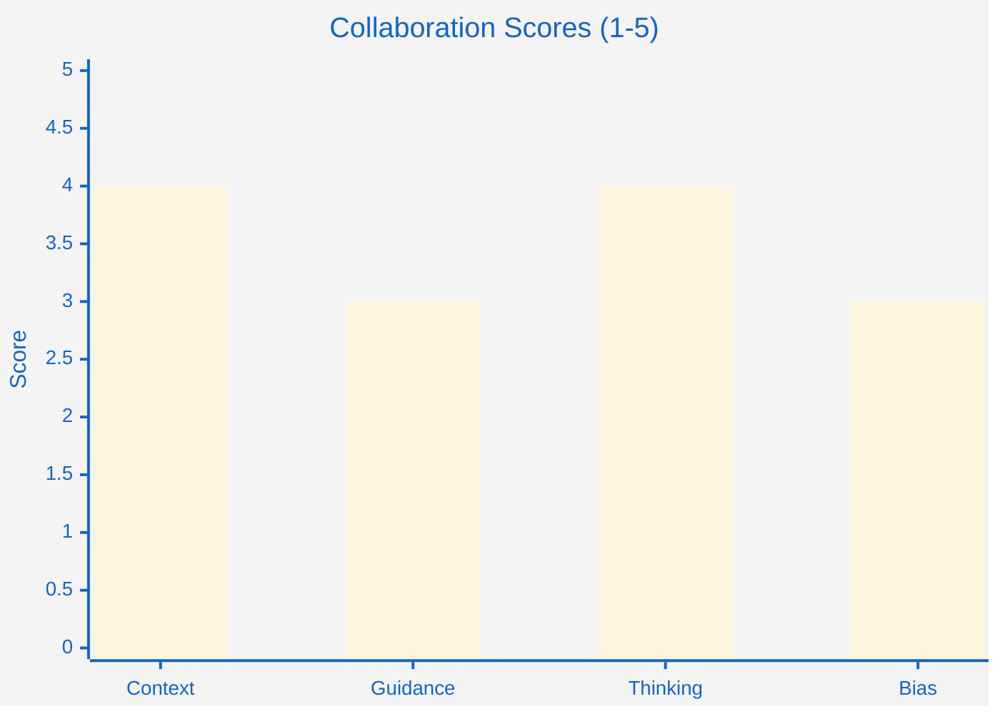

# retrospect-report Reference

## Arguments

- `--last Nd` - Last N days (e.g., `--last 7d`)
- `--week` - Current week (Monday-Sunday)
- `--month` - Current month
- `--from DATE --to DATE` - Specific date range
- No args - All sessions

## Report Template

```markdown
# Retrospective Report: YYYY-MM-DD to YYYY-MM-DD

## Summary
**Period:** [start date] to [end date]
**Sessions:** N total
**Total time:** Xh Ym

## Activity Metrics

**Computed from raw session data:**
- **Total prompts**: X (avg: Y per session)
- **Total tool calls**: X (avg: Y per session)
- **Subagents spawned**: X
- **Duration**: Xh Ym (avg: Ys per session)

## Collaboration Effectiveness

[Mermaid bar chart if scores available]

**Latest collaboration metrics** (from most recent collab insight):
- **Context quality**: X/5
- **Guidance clarity**: X/5
- **Critical thinking**: X/5
- **Bias awareness**: X/5

[Or: "*No collaboration insights available. Run `/retrospect collab` to generate scores.*"]

## Session Breakdown

- **[timestamp]** (`session-id`) - Xm, Y prompts, Z tools
  - [First user prompt excerpt...]

## Recommendations

### Activity Patterns
- Average session duration: Xm
- Average prompts per session: Y

### Next Steps
- [ ] Review domain insights in `.retro/insights/domain/`
- [ ] Review collaboration insights in `.retro/insights/collab/`
- [ ] Implement action items from Start/Stop/Continue frameworks
- [ ] Run retrospective again next week/month to track trends

---
Generated: [timestamp]
Data source: N sessions from [start] to [end]
```

## Mermaid Collaboration Chart



## Key Principles

- **Aggregate accurately**: Compute totals and averages correctly from session data
- **Visualize trends**: Use Mermaid charts when data is available
- **Identify patterns**: Look for high-level trends across sessions
- **Actionable recommendations**: Suggest concrete next steps based on patterns
- **Data integrity**: Only include metrics that can be computed from session files
