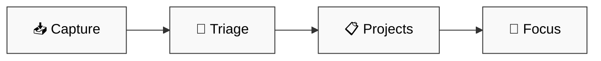

# 🎯 GTD Plugin

> GTD workflow automation for Obsidian vaults

## ✨ What


```mermaid
flowchart LR
    A["📥 Capture"] --> B["🔄 Triage"]
    B --> C["📋 Projects"]
    C --> D["🎯 Focus"]

    classDef default fill:#f9f9f9,stroke:#333,color:#000
```

| # | Skill | Purpose |
|---|-------|---------|
| 1 | 📥 **capture** | Quick inbox add from CLI/voice |
| 2 | 🔄 **triage** | Classify & route inbox items |
| 3 | 🎯 **focus** | Daily top 3-5 ranked tasks |

## 🚀 Quick Start

```bash
# Capture item to inbox
/gtd:capture buy milk

# Natural language (auto-invoked)
"add buy milk to inbox"

# Process inbox
/gtd:triage

# Daily focus list
/gtd:focus
```

## 📦 Version

`0.2.1`

## 🎯 Skills

### capture

Fast append to inbox `### New` section. No priority, no routing — just capture.

- **Model**: haiku (cost-optimized)
- **Tools**: Read, Edit
- **Invocation**: `/gtd:capture <item>` or natural language

### triage

Two-pass inline triage with `//` comment flow for async Obsidian review.

- **Model**: sonnet (reasoning-capable)
- **Tools**: Read, Edit, Glob, Grep
- **Invocation**: `/gtd:triage`

Workflow:
1. **Pass 1**: Annotate each `### New` item with `// → target #tags`
2. Human reviews in Obsidian, appends `// ok` / `// delete` / `// override`
3. **Pass 2**: Route all double-`//` lines, leave single-`//` untouched

### focus

Daily focus list — scan all projects, rank tasks, return top 3-5 for today.

- **Model**: sonnet (reasoning for ranking)
- **Tools**: Glob, Read (read-only)
- **Invocation**: `/gtd:focus`

Workflow:
1. Glob all `03-projects/*/01-*.md`
2. Read all in parallel, parse unchecked tasks
3. Score: project_priority × section_weight × tag_weight
4. Optional: energy filter from coaching pulse
5. Output ranked top 3-5 with scores and staleness flags

## 🏗️ Requirements

- Obsidian vault at `/home/mat/dev/gtd-pcm/`
- Inbox file: `01-inbox.md` with `### New` section
- Projects in `03-projects/`
