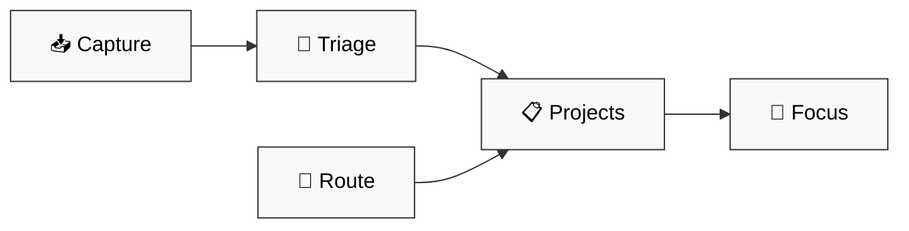

# 🎯 GTD Plugin

> GTD workflow automation for Obsidian vaults

## ✨ What


```mermaid
flowchart LR
    A["📥 Capture"] --> B["🔄 Triage"]
    B --> C["📋 Projects"]
    R["🚀 Route"] --> C
    C --> D["🎯 Focus"]

    classDef default fill:#f9f9f9,stroke:#333,color:#000
```

| # | Skill | Purpose |
|---|-------|---------|
| 1 | 📥 **capture** | Quick inbox add from CLI/voice |
| 2 | 🔄 **triage** | Classify & route inbox items |
| 3 | 🚀 **route** | Direct-to-project when target is known |
| 4 | 🎯 **focus** | Daily top 3-5 ranked tasks |
| 5 | 📎 **clip** | Archive a web article into the anti-library |

## 🚀 Quick Start

```bash
# Capture item to inbox
/gtd:capture buy milk

# Natural language (auto-invoked)
"add buy milk to inbox"

# Route directly to project (known target)
/gtd:route Read Citi report https://example.com/r.pdf → 35-read #read-deep

# Process inbox (unknown targets)
/gtd:triage

# Daily focus list
/gtd:focus

# Archive an article (TLDR + verbatim backup)
/gtd:clip https://example.com/post
```

## 📦 Version

`0.5.1`

## 🎯 Skills

### capture

Fast append to inbox `### New` section. No priority, no routing — just capture.

- **Model**: haiku (cost-optimized)
- **Tools**: Read, Edit
- **Invocation**: `/gtd:capture <item>` or natural language

### triage

Two-pass inline triage with `//` comment flow for async Obsidian review.

- **Model**: sonnet (reasoning-capable)
- **Tools**: Read, Edit, Glob, Grep
- **Invocation**: `/gtd:triage`

Workflow:
1. **Pass 1**: Annotate each `### New` item with `// → target #tags`
2. Human reviews in Obsidian, appends `// ok` / `// delete` / `// override`
3. **Pass 2**: Route all double-`//` lines, leave single-`//` untouched

### route

Direct-to-project routing. Skip inbox when you know the target.

- **Model**: haiku (simple file operation)
- **Tools**: Read, Edit, Glob
- **Invocation**: `/gtd:route <item> → <target> #tags`

Workflow:
1. Parse item, target shorthand, and tags from arguments
2. Resolve target project file via Glob
3. Find standard section by tag (`#next`→⚡ Next, `#waiting`→👥 Waiting For, default→📋 Backlog)
4. Append task with `[created:: date]`

### focus

Daily focus list — scan all projects, rank tasks, return top 3-5 for today.

- **Model**: sonnet (reasoning for ranking)
- **Tools**: Glob, Read (read-only)
- **Invocation**: `/gtd:focus`

Workflow:
1. Glob all `03-projects/*/01-*.md`
2. Read all in parallel, parse unchecked tasks
3. Score: project_priority × section_weight × tag_weight
4. Optional: energy filter from coaching pulse
5. Output ranked top 3-5 with scores and staleness flags

### clip

One URL → one note in the anti-library: frontmatter, a TLDR under `# Notes`, and a verbatim
copy of the page under `# Dump` so the note survives the article going offline.

- **Model**: sonnet (writes the TLDR) · **Context**: subagent (the article body never hits main context)
- **Tools**: Read, Write, Edit, Bash, Glob, Grep
- **Invocation**: `/gtd:clip <url> [angle]` or "save this article"

Workflow:
1. `scripts/fetch-article.py` — curl + Substack JSON preloads → JSON-LD → `<article>` → densest container
2. pandoc `gfm-raw_html`, strip inline-SVG icons and lightbox duplicates, demote headings under `# Dump`
3. Read the body, harvest existing tags, write the note (flat folder, no `status:`)
4. Count the article's images — **zero bytes downloaded, ever** — and say so in one line

Assets are opt-in by URL — images, but pdf, svg or csv just as well. `clip` never downloads;
`scripts/attach.py` is the only code that fetches bytes, and its argument is the address the human
copied from the article — the selection *is* the URL, so there is no inventory to arbitrate and no
index to mistype:

```bash
/gtd:clip --attach "<note.md>" https://…/diagram.png https://…/report.pdf
```

It unwraps CDN wrappers (full resolution, never downscaled), names files `<slug>-NN.ext`, and
re-points the reference in `# Dump` — an image line becomes `![[…]]` with the source URL in a
comment, an inline link becomes `[[nom|label]]`. Cap: 25 MB per file, as a runaway guard.

Deps: `pandoc`, `python3-bs4`, `curl`.

## 🏗️ Requirements

- Obsidian vault at `/home/mat/dev/gtd-pcm/`
- Inbox file: `01-inbox.md` with `### New` section
- Projects in `03-projects/`
