# 🎯 GTD Plugin

> GTD workflow automation for Obsidian vaults

## ✨ What

```mermaid
flowchart LR
    A["📥 Capture"] --> B["🔄 Triage"]
    B --> C["📋 Projects"]

    classDef default fill:#f9f9f9,stroke:#333,color:#000
```



| # | Skill | Purpose |
|---|-------|---------|
| 1 | 📥 **capture** | Quick inbox add from CLI/voice |
| 2 | 🔄 **triage** | Classify & route inbox items |

## 🚀 Quick Start

```bash
# Capture item to inbox
/gtd:capture buy milk

# Natural language (auto-invoked)
"add buy milk to inbox"

# Process inbox
/gtd:triage
```

## 📦 Version

`0.1.0`

## 🎯 Skills

### capture

Fast append to inbox `### New` section. No priority, no routing — just capture.

- **Model**: haiku (cost-optimized)
- **Tools**: Read, Edit
- **Invocation**: `/gtd:capture <item>` or natural language

### triage

Intelligent inbox processing with human-in-the-loop approval.

- **Model**: sonnet (reasoning-capable)
- **Tools**: Read, Edit, Glob, Grep, AskUserQuestion
- **Invocation**: `/gtd:triage`

Workflow:
1. Read items from `### New`
2. Classify (task/reference/waiting/someday/trash/project-seed)
3. Propose routing table
4. User approves
5. Move to projects

## 🏗️ Requirements

- Obsidian vault at `/home/mat/dev/gtd-pcm/`
- Inbox file: `01-inbox.md` with `### New` section
- Projects in `03-projects/`
