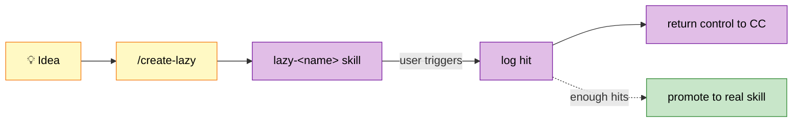

# 💤 lazy Plugin — Demand Capture for Skill Ideas

> Declare skills now, build them when demand justifies it.

## ✨ What

Mid-work skill ideas hit a dilemma: build now (meta-work eats task time), add to TODO (graveyard), ignore (lose the signal). Lazy skills fix this: declare the skill in ~15 lines, let it intercept real trigger keywords, log each hit. Promote to a real skill only when hit count justifies the build.



## 🚀 Usage

```bash
# Declare a lazy skill
/create-lazy convert-xlsx "Convert Excel files to markdown for LLM context. Triggers: convert xlsx, excel to markdown, spreadsheet."

# Later, when user says "convert this xlsx", CC routes to lazy-convert-xlsx:
# → logs hit to /praxis/thinking/lazy/convert-xlsx.jsonl
# → prints: ⚠️ lazy:convert-xlsx [hit #3] — under consideration, proceeding manually
# → returns control so CC handles it manually

# Inspect demand
wc -l /praxis/thinking/lazy/*.jsonl
```

## 📦 Toggle Off

Disable this plugin to pause both lazy skill generation and hit capture. Existing `.jsonl` logs persist.

## 📍 Log Location

`/praxis/thinking/lazy/<name>.jsonl` — long-term signal, survives across sessions.

## 🔄 Promotion Path

When hit count justifies building:

1. `mv lazy/skills/lazy-<name> dstoic/skills/<name>` (or wherever the real skill belongs)
2. Rewrite `SKILL.md` body with real implementation
3. Keep the `.jsonl` log as historical record of time-from-declaration-to-promotion

## 📦 Version

`0.1.1` · 1 skill (`/create-lazy`) + generated lazy placeholders
