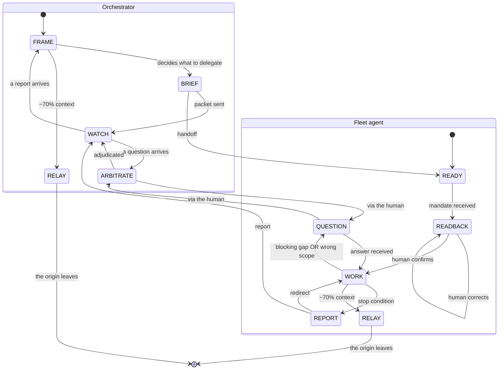

# Team coordination protocol

Canonical source of the coordination contract used by the `team` plugin. The skills cite this file rather than restate it: a contract restated in four places drifts silently, and here the contract *is* the product.

## The setting

A human runs a fleet of Claude Code agents — one terminal window per agent, one orchestrator, several fleet agents that each spawn their own sub-agents, all reachable by name. Agent Teams is assumed enabled; the protocol never checks for it and never sets it up.

Two properties drive every rule below. First, the work is almost always **discovery**: the scope moves by construction, which is exactly why a fleet exists rather than one deep call — a fleet agent is interruptible and redirectable in flight, a sub-agent is not. Second, the human's scarce resource is their **attention**, not a context window. Every rule here exists to spend that attention only where it decides something.

## THE RULE

> **If it is not an arrow on the state diagram, it is not a message.**

An agent emits only on a state transition; the rest of the time it is silent. This is a finite list of permitted emissions, not a threshold the agent judges for itself, and that is precisely what stops agentic ping-pong and message inflation. A model asked to "message when useful" will always find it useful.

## States

**Fleet agent** — READY (booted, no mandate yet) · READBACK (a mandate arrived; the agent reads it back to the human and waits) · WORK (confirmed, working) · QUESTION (a blocking gap, or the discovery that the given scope is wrong) · REPORT (a stop condition was met). Plus RELAY, entered at roughly 70% context, from which the agent emits one relay packet and leaves.

**Orchestrator** — FRAME · BRIEF (delegating) · WATCH · ARBITRATE. It also enters RELAY at ~70% context: the orchestrator is a peer, not a special case.

**Transitions.** Fleet agent: READY→READBACK (mandate received) · READBACK→READBACK (human corrects) · READBACK→WORK (human confirms) · WORK→QUESTION (blocking gap OR wrong scope) · QUESTION→WORK (answer received) · WORK→REPORT (stop condition) · REPORT→WORK (redirect) · WORK→RELAY (~70% context). Orchestrator: FRAME→BRIEF (decides what to delegate) · BRIEF→WATCH (packet sent) · WATCH→ARBITRATE (a question arrives) · ARBITRATE→WATCH (adjudicated) · WATCH→FRAME (a report arrives) · FRAME→RELAY (~70% context). Across: BRIEF→READY (handoff) · REPORT→WATCH · QUESTION→ARBITRATE · ARBITRATE→QUESTION. RELAY→[*]: the origin leaves.

| State | Emission |
|---|---|
| FRAME | none |
| BRIEF | one packet |
| WATCH | none |
| ARBITRATE | one answer |
| READY | none |
| READBACK | three lines to the human |
| WORK | none |
| QUESTION | one message to the human |
| REPORT | one report |
| RELAY | one packet |

**WORK→QUESTION on "the scope I was given is wrong."** In discovery this is the most valuable thing an agent can report and the hardest for it to decide to send: a model biased toward completing its mandate will grind on a false scope rather than challenge it, and will look productive doing so. Raising it takes priority over the task — stop, switch to QUESTION, say what is wrong about the scope, wait.

**REPORT→WORK, the redirect.** A report does not end the agent. The human reads it, learns something, and sends the agent back in with a corrected mandate while it keeps everything it already established. That loop is discovery itself, and it is the thing a fleet agent can do that a sub-agent structurally cannot, a sub-agent's only output being its final report.

**A question is always addressed to the human.** An agent is not given a roster of its peers, so it cannot address one: during discovery the cast changes, so a roster frozen into a mandate goes stale in silence. A single possible recipient is also what keeps ping-pong closed.

**Which transport carries which arrow.** Where the harness has `SendMessage`, it carries everything. Where it does not — Bedrock, other third-party providers — `team:send-tmux-message` deposits a packet in a named agent's pane, and three arrows travel that way: BRIEF→READY, RELAY to the successor, and REPORT→WATCH. That last one is why the diagram annotates both QUESTION arrows "via the human" and leaves `REPORT --> WATCH` bare: a report is addressed to the orchestrator, so it may go by machine, whereas a question and a readback are addressed to the human, are printed in the agent's own window, and have no machine path at all. Do not open one. The absence of a peer roster is a safety property, not an oversight, and it is what closes ping-pong and forces every arbitration through the human — the orchestrator is reachable only because it is the one recipient the agent already had, never because it is a peer. Nothing about the emissions themselves changes: the table above fixes what may be sent, and the tube it travels down does not alter it. Nor does a deposit submit anything. A report lands in the orchestrator's input box and waits there until the human presses Enter, so the machine path is still gated on a keystroke, and that gate is what makes it safe.

## The four role lines

Every fleet agent's mandate carries these lines verbatim.

```
Announce your state on a single line at every change: [READY] [READBACK] [WORK] [QUESTION] [REPORT].
In READBACK: three lines — mission as I understand it / assumptions I filled in / blocking gaps — then wait for my confirmation.
If you discover that the scope you were given is wrong, switch to QUESTION immediately. That takes priority over the task.
You emit a message only on a state transition. The rest of the time you are silent.
```

## Template: MANDATE

Emitted in BRIEF. It is a mandate, not a spec, because the scope will move.

```
scope:               what is yours / what is explicitly not yours
orchestrator:        the name of the agent sending this mandate — your only machine recipient
owned_paths:         [ABSOLUTE paths; a trailing / means the whole subtree]
hands_off:           [shared, high-blast-radius files — a reminder, not the boundary]
knowledge_state:     established / hypothesis / to_discover
stop_conditions:     ... (must include "you discover the scope is wrong")
cadence:             when you are expected to report
what_i_do_not_know:  ...
```

- `scope` — states the negative half explicitly, because an unstated boundary is one an agent will cross.
- `orchestrator` — the single name a mandate carries, and the address a REPORT goes back to where `team:send-tmux-message` is the transport. Without it the delegate has no address for the one arrow permitted to travel by machine, and reporting silently becomes a thing only the human can relay by hand. It is not a roster and does not become one: one name, already that agent's sole authorised recipient, and questions and readbacks still go to the human in the agent's own window.
- `owned_paths` — absolute, so no agent resolves a path against its own working directory. An entry is either a precise file, when that file already exists, or a directory with a trailing `/` standing for the whole subtree, inside which the agent creates whatever it needs. One field carries both granularities because a single fleet plan mixes both situations: agents each editing an existing file in a shared directory, where a prefix would partition nothing, and an agent producing a tree it discovers as it goes, where only a prefix works. A subtree is owned exclusively, never shared — the rule is stated under Ownership.
- `hands_off` — a short list of shared, high-blast-radius files the agent is statistically likely to reach for: a manifest, a lockfile, a shared config, the fleet plan itself. It is a reminder and not the boundary, and it is explicitly not exhaustive; the boundary is the default-deny rule under Ownership. Never read it as "everything absent from this list is fair game".
- `knowledge_state` — separates proven from believed from open, so the agent neither re-derives the first nor trusts the second.
- `stop_conditions` — the list that ends WORK; always includes "you discover the scope is wrong".
- `cadence` — how often a report is expected, which is what keeps silence readable as work.
- `what_i_do_not_know` — mandatory; see below.

## Template: RELAY PACKET

Emitted in RELAY, addressed to the fresh agent taking over.

```
role:                the scope this name designates
orchestrator:        carried over — the successor's only machine recipient
owned_paths:         [ABSOLUTE paths; a trailing / means the whole subtree]
hands_off:           [shared, high-blast-radius files — a reminder, not the boundary]
established:         each fact with the command that proves it
discarded:           what I tried and rejected, WITH the reason
in_progress:         what is half-done, and where it stands
open:                what has not been touched
gates:               what the human has already decided — do not reopen
what_i_do_not_know:  ...
```

- `role` — the scope the inherited name designates.
- `orchestrator` — carried over from the mandate. The successor inherits nothing but this packet, so a name left out here is a name gone for good, and the agent that replaces you loses the machine path for its reports while keeping every duty that produces them.
- `owned_paths` — the partition, carried over intact: absolute, each entry either a precise existing file or a directory with a trailing `/` standing for the whole subtree, and a subtree belongs to one agent only.
- `hands_off` — carried over as well: shared, high-blast-radius files the successor is likely to reach for. It is a reminder and not the boundary, and it is not exhaustive; the boundary remains default deny.
- `established` — every fact paired with its proving command, since a fact without one is a claim.
- `discarded` — **justifies the relay on its own**: without it the fresh agent walks straight back into its predecessor's dead ends.
- `in_progress` — what is half-done and where it stands; with `open`, the difference between resuming and restarting.
- `open` — what has not been touched at all.
- `gates` — decisions the human already made; reopening one spends the resource this protocol exists to protect.
- `what_i_do_not_know` — mandatory; see below.

**`what_i_do_not_know` is mandatory in both templates.** Without that line a model fills empty fields by plausibility, and `established` quietly starts holding guesses.

## Relay

An agent at roughly 70% context hands its state to a fresh one rather than being compacted. It beats compaction on three counts: the packet is written by the agent that actually knows what mattered rather than by a summariser working from a transcript; there is no prompt-prefix cache break, since the target starts clean; and the origin stays alive during the overlap, which makes it a repair channel. It needs no artifact — the packet is already in the target's transcript.

**The target takes over the origin's name.** A name designates a scope, not a memory, so the rest of the fleet's address book stays valid and the relay is invisible to everyone else.

> **Never relay, and never shard, in the middle of a cross-item step** — a synthesis, a deduplication, a global arbitration. Split one and the result becomes wrong silently.

## Ownership

**Default deny.** Outside its `owned_paths`, an agent reads and does not write. That one rule already covers every path there is, which is why no exhaustive list of forbidden paths is needed — or possible.

Any fan-out that writes must be partitioned owner-unique: exactly one agent per path. Concurrent writes to one file lose updates with no error at all, which makes a collision both silent and unrepairable — nothing records what was overwritten.

**A subtree is exclusively owned, never shared.** Telling two agents "you both write in `X/`, just use different filenames" partitions nothing: filenames are not coordinated between agents, and two agents each asked to write up their notes will both create `notes.md`. The collision comes from convergent plausibility rather than from carelessness, and it happens silently.

An explicit forbidden-list is a trap rather than a safeguard, because it inverts the default: listing three forbidden files makes the fourth one look permitted. `hands_off` survives only as a reminder layered on top of default deny, never as the frontier itself.

This is why the partition is the one decision that must be made before the work starts, in a setting where by construction almost nothing else can be.

## Annex — state diagram


