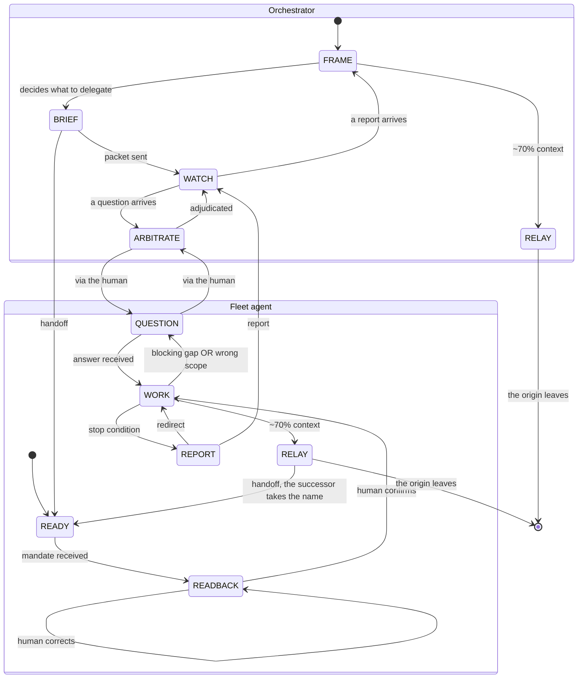

# Team coordination protocol

Canonical source of the coordination contract used by the `team` plugin. The skills cite this file rather than restate it: a contract restated in four places drifts silently, and here the contract *is* the product.

## The setting

A human runs a fleet of Claude Code agents — one terminal window per agent, one orchestrator, several fleet agents that each spawn their own sub-agents, all reachable by name. Agent Teams is assumed enabled; the protocol never checks for it and never sets it up.

Two properties drive every rule below. First, the work is almost always **discovery**: the scope moves by construction, which is exactly why a fleet exists rather than one deep call — a fleet agent is interruptible and redirectable in flight, a sub-agent is not. Second, the human's scarce resource is their **attention**, not a context window. Every rule here exists to spend that attention only where it decides something.

## THE RULE

> **If it is not an arrow on the state diagram, it is not a message.**

An agent emits only on a state transition; the rest of the time it is silent. This is a finite list of permitted emissions, not a threshold the agent judges for itself, and that is precisely what stops agentic ping-pong and message inflation. A model asked to "message when useful" will always find it useful.

## States

**Fleet agent** — READY (booted, no mandate yet — or freshly arrived by relay, holding a packet and waiting) · READBACK (a mandate arrived; the agent reads it back to the human and waits) · WORK (confirmed, working) · QUESTION (a blocking gap, or the discovery that the given scope is wrong) · REPORT (a stop condition was met). Plus RELAY, entered at roughly 70% context, from which the agent emits one relay packet and leaves.

**Orchestrator** — FRAME · BRIEF (delegating) · WATCH · ARBITRATE. It also enters RELAY at ~70% context: the orchestrator is a peer, not a special case.

**Transitions.** Fleet agent: READY→READBACK (mandate received) · READBACK→READBACK (human corrects) · READBACK→WORK (human confirms) · WORK→QUESTION (blocking gap OR wrong scope) · QUESTION→WORK (answer received) · WORK→REPORT (stop condition) · REPORT→WORK (redirect) · WORK→RELAY (~70% context). Orchestrator: FRAME→BRIEF (decides what to delegate) · BRIEF→WATCH (packet sent) · WATCH→ARBITRATE (a question arrives) · ARBITRATE→WATCH (adjudicated) · WATCH→FRAME (a report arrives) · FRAME→RELAY (~70% context). Across: BRIEF→READY (handoff) · RELAY→READY (handoff to the successor, which takes over the name) · REPORT→WATCH · QUESTION→ARBITRATE · ARBITRATE→QUESTION. RELAY→[*]: the origin leaves.

**RELAY→READY.** A packet arrives in a fresh window and lands that agent in READY, exactly where a mandate would have: it announces the state, acknowledges in one line, and waits. There are therefore two ways into READY and no way to skip it — a successor that starts working on its inherited `in_progress` has taken a transition the diagram does not have.

| State | Emission |
|---|---|
| FRAME | none |
| BRIEF | one packet |
| WATCH | none |
| ARBITRATE | one answer |
| READY | none |
| READBACK | three lines to the human |
| WORK | none |
| QUESTION | one message to the human |
| REPORT | one report |
| RELAY | one packet |

**WORK→QUESTION on "the scope I was given is wrong."** In discovery this is the most valuable thing an agent can report and the hardest for it to decide to send: a model biased toward completing its mandate will grind on a false scope rather than challenge it, and will look productive doing so. Raising it takes priority over the task — stop, switch to QUESTION, say what is wrong about the scope, wait.

**REPORT→WORK, the redirect.** A report does not end the agent. The human reads it, learns something, and sends the agent back in with a corrected mandate while it keeps everything it already established. That loop is discovery itself, and it is the thing a fleet agent can do that a sub-agent structurally cannot, a sub-agent's only output being its final report.

**A question is always addressed to the human.** An agent is not given a roster of its peers, so it cannot address one: during discovery the cast changes, so a roster frozen into a mandate goes stale in silence. A single possible recipient is also what keeps ping-pong closed.

**Which arrows travel by machine.** `SendMessage` carries every one of them, and there are exactly three: BRIEF→READY, RELAY to the successor, and REPORT→WATCH. Nothing else has a machine path and none is to be opened. That last arrow is why the diagram annotates both QUESTION arrows "via the human" and leaves `REPORT --> WATCH` bare: a report is addressed to the orchestrator, so it may go by machine, whereas a **question** and a **readback** are addressed to the human, are printed in the agent's own window, and go nowhere. An **arbitration** comes back the same way — the human types it into that agent's window themselves. The absence of a peer roster is a safety property, not an oversight: it closes ping-pong and forces every arbitration through the person running the fleet, the orchestrator being reachable only because it is the one recipient the agent already had, never because it is a peer. What bounds the traffic is this list of three arrows and the missing roster behind it.

## The five role lines

Every fleet agent's mandate carries these lines verbatim.

```
Announce your state on a single line at every change: [READY] [READBACK] [WORK] [QUESTION] [REPORT].
In READBACK: three lines — mission as I understand it / assumptions I filled in / blocking gaps — then wait for my confirmation.
If you discover that the scope you were given is wrong, switch to QUESTION immediately. That takes priority over the task.
You emit a message only on a state transition. The rest of the time you are silent.
When a stop condition or a cadence checkpoint fires, run team:report. It is the only message you send by machine.
```

> **The MANDATE, RELAY PACKET and REPORT skeletons are mirrored verbatim inside `skills/brief/SKILL.md`, `skills/relay/SKILL.md` and `skills/report/SKILL.md`.** That duplication is deliberate: those two skills run in the window with the least context to spare — an orchestrator mid-session, an agent at 70% — and reading this file there costs more than the packet it is meant to fill. Only the field lists are copied; the reasoning stays here, for whoever amends the contract. Assume no agent reads this file at runtime — whatever a delegate must know has to travel in the packet. **Change a field name here and change it in the mirroring skill in the same edit.**

## Template: MANDATE

Emitted in BRIEF. It is a mandate, not a spec, because the scope will move.

```
scope:               what is yours / what is explicitly not yours
orchestrator:        the name of the agent sending this mandate — your only machine recipient
owned_paths:         [ABSOLUTE paths; trailing / = whole subtree — outside them you read, you do not write]
hands_off:           [shared, high-blast-radius files — a reminder on top of that rule, never the boundary]
read_first:          [ABSOLUTE paths, in order — a closed list. Anything else, ask me before opening it]
deliverable:         ABSOLUTE path you own — your findings land there, not in your report
knowledge_state:     established / hypothesis / to_discover
stop_conditions:     ... (must include "you discover the scope is wrong")
cadence:             when you are expected to report
what_i_do_not_know:  ...
```

- `scope` — states the negative half explicitly, because an unstated boundary is one an agent will cross.
- `orchestrator` — the single name a mandate carries, and the address a REPORT goes back to. Without it the delegate has no address for the one arrow permitted to travel by machine, and reporting silently becomes a thing only the human can relay by hand. It is not a roster and does not become one: one name, already that agent's sole authorised recipient, and questions and readbacks still go to the human in the agent's own window.
- `owned_paths` — absolute, so no agent resolves a path against its own working directory. An entry is either a precise file, when that file already exists, or a directory with a trailing `/` standing for the whole subtree, inside which the agent creates whatever it needs. One field carries both granularities because a single partition mixes both situations: agents each editing an existing file in a shared directory, where a prefix would partition nothing, and an agent producing a tree it discovers as it goes, where only a prefix works. A subtree is owned exclusively, never shared — the rule is stated under Ownership.
- `hands_off` — a short list of shared, high-blast-radius files the agent is statistically likely to reach for: a manifest, a lockfile, a shared config, a session's steering document. It is a reminder and not the boundary, and it is explicitly not exhaustive; the boundary is the default-deny rule under Ownership. Never read it as "everything absent from this list is fair game".
- `read_first` — the reading partition, and the symmetric half of `owned_paths`. Ownership governs writing in exhaustive detail and says nothing at all about reading, which leaves the delegate's incoming context to its own judgement — and a model handed a plan, an audit and a journal opens all three plus a few neighbours "to be sure", saturating before its first useful move. The list is closed and ordered, and it ends on *anything else, ask me before opening it*, which turns an unbounded read into one question the human can answer in a word. It does not contradict "no skill reads this file at runtime": that rule governs the contract, never the project's own documents.
- `deliverable` — one absolute path, inside `owned_paths`, where the agent's findings accumulate while it works. It is what lets a REPORT be ten lines and a pointer instead of its own content, and it is the only field that makes knowledge outlive the window that produced it. Without it every fact exists solely inside messages: transcribed into the report, transcribed again into the relay packet, and gone when the fleet ends. Prose in a tube is not a journal, it is N copies of one.
- `knowledge_state` — separates proven from believed from open, so the agent neither re-derives the first nor trusts the second. It names the state; it does not restate the content, which lives in the documents `read_first` points at.
- `stop_conditions` — the list that ends WORK; always includes "you discover the scope is wrong".
- `cadence` — how often a report is expected, which is what keeps silence readable as work.
- `what_i_do_not_know` — mandatory; see below.

## Template: RELAY PACKET

Emitted in RELAY, addressed to the fresh agent taking over.

```
role:                the scope this name designates
orchestrator:        carried over — the successor's only machine recipient
owned_paths:         [ABSOLUTE paths; trailing / = whole subtree — outside them you read, you do not write]
hands_off:           [shared, high-blast-radius files — a reminder on top of that rule, never the boundary]
read_first:          [carried over — the closed list. Anything else, the successor asks the human]
deliverable:         ABSOLUTE path carried over — where the work already written lives
established:         each fact with the command that proves it, or the path where it is written
discarded:           what I tried and rejected, WITH the reason
in_progress:         what is half-done, and where it stands
open:                what has not been touched
gates:               what the human has already decided — do not reopen
what_i_do_not_know:  ...
next_action:         none — wait for the human
```

- `role` — the scope the inherited name designates.
- `orchestrator` — carried over from the mandate. The successor inherits nothing but this packet, so a name left out here is a name gone for good, and the agent that replaces you loses the machine path for its reports while keeping every duty that produces them.
- `owned_paths` — the partition, carried over intact: absolute, each entry either a precise existing file or a directory with a trailing `/` standing for the whole subtree, and a subtree belongs to one agent only.
- `hands_off` — carried over as well: shared, high-blast-radius files the successor is likely to reach for. It is a reminder and not the boundary, and it is not exhaustive; the boundary remains default deny.
- `read_first` / `deliverable` — carried over from the mandate. The read list stays closed, or the successor reopens the whole project to rebuild what its predecessor already knew, which is the cost the relay exists to avoid; the `deliverable` path is where the work already written lives, and a successor that loses it starts that file over.
- `established` — every fact paired with its proving command, or with the path where it is already written; the path is preferred, since a relay that transcribes the journal rather than pointing at it is doing compaction's work at compaction's price. A fact with neither is a claim.
- `discarded` — **justifies the relay on its own**: without it the fresh agent walks straight back into its predecessor's dead ends.
- `in_progress` — what is half-done and where it stands; with `open`, the difference between resuming and restarting.
- `open` — what has not been touched at all.
- `gates` — decisions the human already made; reopening one spends the resource this protocol exists to protect.
- `what_i_do_not_know` — mandatory; see below.
- `next_action` — the literal line `none — wait for the human`. The fields above hand the successor a rich state and no instruction to stay put, and a model reading `in_progress` without this one resumes the work by itself.

**Every field above is one line, and none of them argues.** A pointer — a path, a `path:line`, a command — stands in for the sentence that would explain it. `discarded` is the single exception, because there the reason *is* the content. Prose in the other fields is reasoning already done, retyped into the context the relay exists to free.

**A relay packet carries the role lines too.** A mandate installs the state machine through the five lines appended in BRIEF; a packet that carries only the scope leaves its successor with a role and no regime, which is an agent that takes the initiative on arrival. `skills/relay/SKILL.md` holds the block, adapted: announce READY and stop, nothing without the human's explicit go, one line of acknowledgement rather than a readback, silence outside a transition, one machine recipient. Its purpose is to put the arriving agent in READY, the state a mandate would have given it.

**`what_i_do_not_know` is mandatory in every template.** Without that line a model fills empty fields by plausibility, and `established` quietly starts holding guesses.

## Template: REPORT

Emitted in REPORT, addressed to the orchestrator named in the mandate. It is what turns a stop condition into the orchestrator's next turn.

```
from:                your own name
state:               REPORT
stop_condition:      which one of them fired
deliverable:         the path from the mandate — written and up to date before this is sent
established:         each fact with the command that proves it
in_progress:         what is half-done, and where it stands
next:                what you would do if sent back in — a proposal, not a decision
what_i_do_not_know:  ...
```

- `from` — your own name, stated in the packet rather than left to the transport, because the packet outlives it: quoted into a plan, carried into a relay, or read back later, an unattributed report belongs to nobody.
- `stop_condition` — which one fired, quoted from the mandate. "The scope is wrong" is not one of them: that is a QUESTION, it goes to the human, and it does not travel down this tube.
- `deliverable` — written before the report is sent, and pointed at rather than quoted. This is what keeps a report ten lines: the orchestrator's window is the scarcest in the fleet, since every report in flight lands in it, and a report that carries its own content spends that window once per delegate.
- `established` — same rule as the relay packet: every fact paired with the command that proves it, one line each. A fact without one is a claim, and the orchestrator will act on it. The detail belongs in the `deliverable`; what travels here is the change in knowledge state.
- `next` — a proposal. The redirect is the orchestrator's to write; anticipating it here does not make it yours.
- `what_i_do_not_know` — mandatory, for the same reason it is mandatory everywhere else.

**A report does not end you.** You are back in WORK's waiting room: stay alive, stay silent, and take the redirect when it comes.

## Relay

An agent at roughly 70% context hands its state to a fresh one rather than being compacted. It beats compaction on three counts: the packet is written by the agent that actually knows what mattered rather than by a summariser working from a transcript; there is no prompt-prefix cache break, since the target starts clean; and the origin stays alive during the overlap, which makes it a repair channel. It needs no artifact — the packet is already in the target's transcript.

**The target takes over the origin's name.** A name designates a scope, not a memory, so the rest of the fleet's address book stays valid and the relay is invisible to everyone else.

> **Never relay, and never shard, in the middle of a cross-item step** — a synthesis, a deduplication, a global arbitration. Split one and the result becomes wrong silently.

## Ownership

**Writing is partitioned; reading is budgeted.** The two rules below govern who may write where, and they deliberately leave reading unrestricted — a fleet agent must be able to look anywhere to discover anything. What is bounded instead is what it opens *by default*: `read_first` is a closed, ordered list, and everything outside it costs one question to the human. That question is the control point, since an agent that quietly opens six documents has spent a context nobody decided to spend, and nothing in the fleet records that it happened.

**Default deny.** Outside its `owned_paths`, an agent reads and does not write. That one rule already covers every path there is, which is why no exhaustive list of forbidden paths is needed — or possible.

Any fan-out that writes must be partitioned owner-unique: exactly one agent per path. Concurrent writes to one file lose updates with no error at all, which makes a collision both silent and unrepairable — nothing records what was overwritten.

**A subtree is exclusively owned, never shared.** Telling two agents "you both write in `X/`, just use different filenames" partitions nothing: filenames are not coordinated between agents, and two agents each asked to write up their notes will both create `notes.md`. The collision comes from convergent plausibility rather than from carelessness, and it happens silently.

An explicit forbidden-list is a trap rather than a safeguard, because it inverts the default: listing three forbidden files makes the fourth one look permitted. `hands_off` survives only as a reminder layered on top of default deny, never as the frontier itself.

This is why the partition is the one decision that must be made before the work starts, in a setting where by construction almost nothing else can be.

## Annex — state diagram


