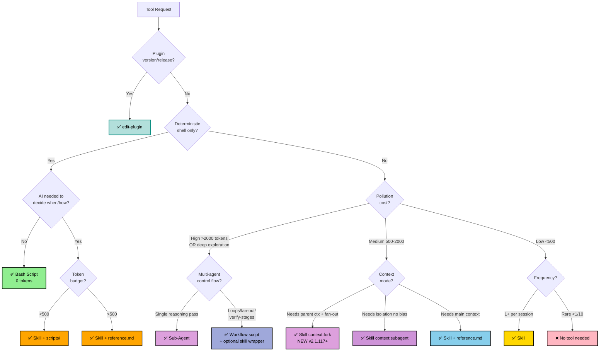

# Edit Tool — Unified Skill/Agent/Script Editor

## Triage first — because the type decides everything downstream

Pick the tool type *before* writing anything. The wrong type is expensive to unwind later (a skill that should have been a 0-token bash script pollutes every session; an agent that should have been a skill loses main-context access). Triaging first is what makes this skill worth more than "just write the file".

1. **Analyze request** against the decision tree
2. **Explain the call** to the user so they can catch a bad fit early: `✅ [TYPE] because: pollution cost (~X tokens × Yfreq), context mode (main|fork), key factor`
3. **Branch to the matching guide** or give direct guidance

**Workflow leaf**: when the task needs deterministic multi-agent orchestration — pipeline/parallel/fan-out with loops, judge panels, verify-stages, loop-until-dry — author a `Workflow` script (optionally a thin skill wrapper that invokes it), not a single sub-agent. A sub-agent is *one* spawn; a Workflow choreographs many under control flow.

**Default**: All skills are dual-invocable (both `/name` and model auto-invoke). `disable-model-invocation: true` is opt-out for rare edge cases.

**When the verdict is "skill" and correctness matters more than speed** → this skill gets you a well-architected *draft*. To know whether that draft actually beats baseline, hand off to Anthropic's official **`skill-creator`** skill, which owns the empirical loop `edit-tool` deliberately does not: draft → test on real prompts → eval with/without the skill → improve → repeat, plus a script that auto-optimizes the description for triggering. Reach for it when the skill is non-trivial, will run many times, or you can't eyeball whether it works. `edit-tool` decides *what to build and how to structure it*; `skill-creator` proves *that it works*.

## Modifying Existing Tools

1. Locate and read existing file (SKILL.md or agent .md)
2. **Enumerate functional outputs** — every behavior/capability = **preservation contract**
3. Make **surgical edits** using Edit tool (not Write/overwrite)
4. **Regression check**: verify each output from step 2 is retained
5. Update description if changing triggers
6. Validate: YAML valid, triggers clear, instructions actionable

## Creating New Tools

💡 **Before creating:** consider running `/search-skill` to discover existing solutions.

1. Ask for details if missing: purpose, triggers, tools needed
2. Determine type via triage decision tree above
3. Use `pick-model` skill for model **and effort** selection
4. Branch to appropriate guide:

| Type | Guide | Location |
|------|-------|----------|
| **Skill** | `references/skill-guide.md` | `skills/name/SKILL.md` |
| **Agent** | `references/agent-guide.md` | `.claude/agents/name.md` or plugin `agents/` |
| **Plugin** | `edit-plugin` skill | `plugin.json` + `marketplace.json` |
| **Bash** | Direct guidance (scripts/, chmod +x) | Project scripts dir |

**Frontmatter:** Skill core = `name` (lowercase-hyphens) + `description` (triggers, max 1024) + `context` (`main`|`fork`|`subagent`) + `model`. Agent core = `name` + `description` + `tools`/`model`. Full field tables in the type guides above.

## Sanity check before creating

These aren't gates to satisfy — they're the failure modes that make a new tool a net negative. Each one, and what goes wrong if you ignore it:

| Check | Why it matters — the failure it prevents |
|-------|------------------------------------------|
| **Pollution acceptable?** (skill: ~tokens × freq) | A skill's body loads on every trigger. Heavy + frequent = it crowds out the actual work every session, forever. |
| **SKILL.md fits ~500 tokens?** (overflow → reference.md) | Past that, the always-loaded cost outweighs the value; progressive disclosure keeps the hot path lean. |
| **One capability, not a workflow bundle?** (skill & agent) | Bundles violate single-responsibility — they under-trigger (description can't cover everything) and are impossible to eval. |
| **Needs multi-step reasoning with isolation?** (→ agent) | If yes, a skill in main context will either pollute or bias the reasoning; that's the signal to make it an agent. |

If a skill trips the first three, it usually wants a different shape — `context:fork`/`subagent`, an agent, or just a direct request. Say which, and why, rather than forcing the skill.

## Key Principles

- **Preserve function**: an edit that silently drops a capability is a regression, not an improvement — enumerate outputs first, keep them unless the user asked to remove one
- **~500 tokens** ideal for SKILL.md; past that the always-loaded cost starts to outweigh the value — push detail into a reference file
- **Single responsibility**: one focused purpose per tool, so its description can actually describe it and it can be evaluated
- **Token-efficient**: tables, bullets, Mermaid over prose — the context window is a shared budget
- **Context-aware**: main when the tool needs conversation state, fork for parallel fan-out on a shared base, subagent/agent when isolation avoids pollution or bias

## Fork vs Subagent & Proactive Audit

- **Choosing `fork` vs `subagent`**, fork invocation rules, "keep subagent when ANY" criteria → `references/frameworks.md § Fork vs Subagent`.
- **On every create/edit, run the Proactive Audit** (frontmatter compliance + fit check, incl. legacy `context: fork` rename) → `references/frameworks.md § Proactive Audit`.

## Parallelization

| Operation | Guidance |
|-----------|----------|
| ✅ Read-only | Parallelize freely — no conflict possible |
| ⚠️ Writes (independent files) | Sequential, or Plan Mode first — concurrent writes race |
| ❌ Destructive / >3 files | Plan Mode first — the cost of a wrong parallel destructive op is unrecoverable |

See `references/frameworks.md` for edge cases, conversion guide, and extended examples.
